<!-- AUTO-GENERATED MERMAID START -->
<!-- This Mermaid diagram is auto-generated. Do not edit directly. -->

## Directory structure

```mermaid
graph TD
	root["scripts-public"]:::root --> n1("python"):::folder
	root["scripts-public"]:::root --> n2("bash"):::folder
	root["scripts-public"]:::root --> n3("web"):::folder
	root["scripts-public"]:::root --> n4("markdown"):::folder
	root["scripts-public"]:::root --> n5("wordpress"):::folder
	root["scripts-public"]:::root --> n6("powershell"):::folder
	root["scripts-public"]:::root --> n7("projects"):::folder
	root["scripts-public"]:::root --> n8("markup"):::folder
	root["scripts-public"]:::root --> n9[".agents"]:::file-other
	root["scripts-public"]:::root --> n10["README.md"]:::file-md
	root["scripts-public"]:::root --> n11["scripts-public.code-workspace"]:::file-other
	root["scripts-public"]:::root --> n12[".agent.md"]:::file-md
	root["scripts-public"]:::root --> n13[".env.example"]:::file-other
	root["scripts-public"]:::root --> n14[".gitattributes"]:::file-git
	root["scripts-public"]:::root --> n15["my-antigravity-experience.md"]:::file-md
	root["scripts-public"]:::root --> n16["SECURITY.md"]:::file-md
	root["scripts-public"]:::root --> n17[".gitignore"]:::file-git
	root["scripts-public"]:::root --> n18[".env"]:::file-other
	n2 --> n2_1("script-public-merge"):::folder
	n2 --> n2_2("user_manager"):::folder
	n2 --> n2_3("apache-proxy-wizard"):::folder
	n2 --> n2_4("openssl-certtool"):::folder
	n2 --> n2_5("remove_user"):::folder
	n1 --> n1_16["suggest_aliases.py<br>publish_wordpress_post.py<br>README.md<br>update_commit_log.py<br>test_suggest_aliases.py<br>fetch_agent.py<br>search_scripts.py<br>... +9 more"]:::file-bundle
	n3 --> n3_1("apache-reverse-proxy"):::folder
	n2 --> n2_10["README.md<br>setup_ssh_key.sh<br>apt-get-tui.sh<br>setup_ssh_key.md<br>virtualbox-install-guest-addtions-enable-bidrectional-clipboard.sh"]:::file-bundle
	n3 --> n3_2["README.md"]:::file-md
	n5 --> n5_1("mermaid-examples"):::folder
	n4 --> n4_2["README.md<br>suggest_aliases.md"]:::file-md
	n6 --> n6_1("recovery-partition"):::folder
	n5 --> n5_32["extremely-sarcastic-mcp-docker.md<br>jira-csv-import-atlassian-mcp.md<br>ai-web-app-development-process.md<br>README.md<br>ultimate-guide-to-bitwarden-securing-your-digital-life-across-every-device.md<br>linux-distros-package-managers-part-2.md<br>gmail-labeling-blog.md<br>... +24 more"]:::file-md
	n7 --> n7_1("openssl-output-generator"):::folder
	n7 --> n7_2("kvm-provisioning"):::folder
	n7 --> n7_3("stftp"):::folder
	n7 --> n7_4("Wedge-400-Switch-API"):::folder
	n7 --> n7_5("terminus"):::folder
	n7 --> n7_6("antigravity-export-html5"):::folder
	n7 --> n7_7("BMC-API-Crawler"):::folder
	n6 --> n6_6["README.md<br>Publish-WordPressPost.ps1<br>check_mtu.ps1<br>openssl-certtool.ps1<br>Calculate-FolderStats.ps1"]:::file-bundle
	n8 --> n8_1("html"):::folder
	n7 --> n7_10["README.md<br>deploy-mailserver-debian.md<br>deploy-mailserver-debian.sh"]:::file-bundle
	n9 --> n9_1("skills"):::folder
	n8 --> n8_2["README.md"]:::file-md
	n9 --> n9_3["README.md<br>AGENTS.md"]:::file-md
	n2_1 --> n2_1_2["README.md<br>script-public-merge.sh"]:::file-bundle
	n2_2 --> n2_2_2["README.md<br>user_manager.sh"]:::file-bundle
	n2_3 --> n2_3_2["README.md<br>apache-proxy-wizard.sh"]:::file-bundle
	n2_4 --> n2_4_2["openssl-certtool.sh<br>README.md"]:::file-bundle
	n2_5 --> n2_5_3["remove_user.md<br>README.md<br>remove_user.sh"]:::file-bundle
	n3_1 --> n3_1_2["README.md<br>disclaimer.html"]:::file-bundle
	n5_1 --> n5_1_5["README.md<br>sequence.md<br>flowchart.md<br>state.md<br>gantt.md"]:::file-md
	n6_1 --> n6_1_6["README.md<br>Create-RecoveryPartition2.ps1<br>Remove-RecoveryPartition.ps1<br>Create-RecoveryPartition.ps1<br>Create-RecoveryPartition3.ps1<br>RecoveryPartitionManager.ps1"]:::file-bundle
	n7_1 --> n7_1_1["README.md"]:::file-md
	n7_3 --> n7_3_1("data"):::folder
	n7_2 --> n7_2_2["README.md<br>provision_vms.sh"]:::file-bundle
	n7_4 --> n7_4_1("tests"):::folder
	n7_3 --> n7_3_8["client.py<br>README.md<br>test.txt<br>server2.py<br>server.py<br>client2.py<br>.gitignore"]:::file-bundle
	n7_4 --> n7_4_3("src"):::folder
	n7_5 --> n7_5_1("build-from-scratch"):::folder
	n7_4 --> n7_4_10[".pytest_cache<br>context_bootstrap.md<br>build.sh<br>README.md<br>implementation_plan.md<br>deploy.sh<br>walkthrough.md<br>pyproject.toml"]:::file-bundle
	n7_6 --> n7_6_1("dist"):::folder
	n7_5 --> n7_5_6["DEPLOYMENT.md<br>build.sh<br>README.md<br>terminus.py<br>deploy.sh"]:::file-bundle
	n7_7 --> n7_7_1("tests"):::folder
	n7_6 --> n7_6_4["README.md<br>export.py<br>index.html"]:::file-bundle
	n7_7 --> n7_7_3("src"):::folder
	n7_7 --> n7_7_8[".pytest_cache<br>context_bootstrap.md<br>build.sh<br>README.md<br>deploy.sh<br>pyproject.toml"]:::file-bundle
	n9_1 --> n9_1_1("wordpress-taxonomy"):::folder
	n9_1 --> n9_1_2("dashboard"):::folder
	n9_1 --> n9_1_3("social-publish"):::folder
	n9_1 --> n9_1_4("wordpress-publish"):::folder
	n9_1 --> n9_1_5("projects"):::folder
	n9_1 --> n9_1_6("post-to-pastebin"):::folder
	n9_1 --> n9_1_7("wikipedia-fact-check"):::folder
	n8_1 --> n8_1_2["README.md<br>bash-readme.html"]:::file-bundle
	n9_1 --> n9_1_8["README.md"]:::file-md
	n7_3_1 --> n7_3_1_1("stftpupload"):::folder
	n7_3_1 --> n7_3_1_2["README.md"]:::file-md
	n7_4_2 --> n7_4_2_1("v"):::folder
	n7_4_1 --> n7_4_1_2["README.md<br>test_api.py"]:::file-bundle
	n7_4_2 --> n7_4_2_4["README.md<br>CACHEDIR.TAG<br>.gitignore"]:::file-bundle
	n7_4_3 --> n7_4_3_2("fastapi_starter"):::folder
	n7_5_1 --> n7_5_1_1("images"):::folder
	n7_4_3 --> n7_4_3_3["wedge_400_switch_api.egg-info<br>README.md"]:::file-bundle
	n7_6_1 --> n7_6_1_1("markdown"):::folder
	n7_5_1 --> n7_5_1_8["dev_workflow_guide.mp3<br>README.md<br>implementation_plan.md<br>generate_voiceover.py<br>dev_workflow_guide.md<br>walkthrough.md<br>master_prompt.md"]:::file-bundle
	n7_6_1 --> n7_6_1_2["index.html"]:::file-html
	n7_4_2 --> n7_4_2_1("v"):::folder
	n7_4_1 --> n7_4_1_2["test_crawler.py"]:::file-py
	n7_4_3 --> n7_4_3_1("crawler"):::folder
	n7_4_2 --> n7_4_2_4["CACHEDIR.TAG<br>.gitignore"]:::file-bundle
	n7_4_3 --> n7_4_3_2["bmc_api_crawler.egg-info"]:::file-other
	n9_1_1 --> n9_1_1_2["README.md<br>SKILL.md"]:::file-md
	n9_1_2 --> n9_1_2_2["README.md<br>SKILL.md"]:::file-md
	n9_1_3 --> n9_1_3_2["README.md<br>SKILL.md"]:::file-md
	n9_1_4 --> n9_1_4_2["README.md<br>SKILL.md"]:::file-md
	n9_1_5 --> n9_1_5_2["README.md<br>SKILL.md"]:::file-md
	n9_1_6 --> n9_1_6_2["README.md<br>SKILL.md"]:::file-md
	n9_1_7 --> n9_1_7_2["README.md<br>SKILL.md"]:::file-md
	n7_4_2_1 --> n7_4_2_1_1("cache"):::folder
	n7_3_1_1 --> n7_3_1_1_2["README.md<br>test.txt"]:::file-bundle
	n7_4_2_1 --> n7_4_2_1_2["README.md"]:::file-md
	n7_4_3_1 --> n7_4_3_1_4("PKG-INFO"):::folder
	n7_4_3_2 --> n7_4_3_2_1("templates"):::folder
	n7_4_3_1 --> n7_4_3_1_6["dependency_links.txt<br>README.md<br>requires.txt<br>SOURCES.txt<br>top_level.txt"]:::file-bundle
	n7_4_3_2 --> n7_4_3_2_7["README.md<br>main.py<br>api.py<br>__init__.py<br>models.py<br>database.py"]:::file-bundle
	n7_6_1_1 --> n7_6_1_1_1("skills"):::folder
	n7_5_1_1 --> n7_5_1_1_3["README.md<br>terminus_tui_mockup.jpg<br>terminus_web_mockup.jpg"]:::file-bundle
	n7_4_2_1 --> n7_4_2_1_1("cache"):::folder
	n7_4_3_1 --> n7_4_3_1_1("templates"):::folder
	n7_6_1_1 --> n7_6_1_1_6["general_settings.md<br>global_skills.md<br>mcp_servers.md<br>workspace_rules.md<br>workspace_skills.md"]:::file-md
	n7_4_3_1 --> n7_4_3_1_4["main.py<br>__init__.py"]:::file-py
	n7_4_3_2 --> n7_4_3_2_4("PKG-INFO"):::folder
	n7_4_3_2 --> n7_4_3_2_6["dependency_links.txt<br>requires.txt<br>SOURCES.txt<br>top_level.txt"]:::file-text
	n7_4_2_1_1 --> n7_4_2_1_1_2("nodeids"):::folder
	n7_4_2_1_1 --> n7_4_2_1_1_3("lastfailed"):::folder
	n7_4_2_1_1 --> n7_4_2_1_1_1["README.md"]:::file-md
	n7_4_3_2_1 --> n7_4_3_2_1_2["README.md<br>index.html"]:::file-bundle
	n7_6_1_1_1 --> n7_6_1_1_1_36["workspace_wordpress-taxonomy.md<br>global_building-data-apps.md<br>global_accidental-data-loss-prevention.md<br>global_gcloud-auth-verification.md<br>global_gcp-composer-troubleshooting.md<br>global_gcp-pipeline-resource-provisioning.md<br>global_managing-python-dependencies.md<br>... +29 more"]:::file-md
	n7_4_2_1_1 --> n7_4_2_1_1_2("nodeids"):::folder
	n7_4_2_1_1 --> n7_4_2_1_1_3("lastfailed"):::folder
	n7_4_2_1_1 --> n7_4_2_1_1_1["README.md"]:::file-md
	n7_4_3_2_1 --> n7_4_3_2_1_2["index.html"]:::file-html
classDef root fill:#2563eb,stroke:#1e40af,stroke-width:2px,color:#ffffff;
classDef folder fill:#fbbf24,stroke:#d97706,stroke-width:1px,color:#451a03;
classDef file-bundle fill:#e2e8f0,stroke:#64748b,stroke-width:1px,color:#334155;
classDef file-git fill:#fee2e2,stroke:#ef4444,stroke-width:1px,color:#7f1d1d;
classDef file-html fill:#ffedd5,stroke:#ea580c,stroke-width:1px,color:#7c2d12;
classDef file-md fill:#dbeafe,stroke:#3b82f6,stroke-width:1px,color:#1e3a8a;
classDef file-other fill:#f2f2f2,stroke:#9ca3af,stroke-width:1px,color:#374151;
classDef file-py fill:#dcfce7,stroke:#16a34a,stroke-width:1px,color:#14532d;
classDef file-text fill:#fafafa,stroke:#a3a3a3,stroke-width:1px,color:#404040;
```

<details>
<summary>Show directory tree diagram for `scripts-public`</summary>



</details>

<!-- AUTO-GENERATED MERMAID END -->

# Public Scripts (`scripts-public`)

A curated collection of utility scripts, automation tools, and applications for various environments.

All of these scripts along with detailed writeups on their usage and configuration can be found on my WordPress blog: [Extreme Sarcasm](https://extremesarcasm.org).


The [scripts_catalog.md](wordpress/scripts_catalog.md) in this repository was generated using [Google Antigravity](https://antigravity.google/).

For more information about Google Antigravity, check out the [Official Documentation](https://antigravity.google/docs) or download the platform for your operating system:
* 🪟 [Windows Download](https://antigravity.google/download/windows)
* 🍎 [macOS Download](https://antigravity.google/download/macos)
* 🐧 [Linux Download](https://antigravity.google/download/linux)


## Repository Structure

The repository is organized by environment and runtime type:

```text
scripts-public/
├── .agents/            # Workspace agent rules and guidelines
├── bash/               # Linux Bash utility scripts
├── powershell/         # Windows PowerShell utility scripts
├── python/             # Python-based tools and CLI programs
├── projects/           # Various complete projects and scripts
├── web/                # Web configuration utilities and server scripts
└── wordpress/          # WordPress blog posts, catalogs, and guides
```

---

<!-- AUTO-GENERATED CATALOG START -->
<!-- This catalog is auto-generated. Do not edit directly. -->

## Catalog of Tools

### 📄 Repository Root (`/`)
* [.agents/](.agents/): .agents
* [bash/](bash/): This folder contains Bash-based administration and automation scripts.
* [markdown/](markdown/): markdown
* [markup/](markup/): markup
* [powershell/](powershell/): A Windows PowerShell version of the OpenSSL certificate utility.
* [projects/](projects/): projects
* [python/](python/): python
* [web/](web/): web
* [wordpress/](wordpress/): wordpress
* [.agent.md](.agent.md): name: readme-tree-diagram
* [.env](.env): file (167 bytes)
* [.env.example](.env.example): file (904 bytes)
* [.gitattributes](.gitattributes): file (170 bytes)
* [.gitignore](.gitignore): file (327 bytes)
* [my-antigravity-experience.md](my-antigravity-experience.md): My Experience Using Antigravity to Set Up Automated SSH Keys & Fix MCP Issues
* [README.md](README.md): Public Scripts (`scripts-public`)
* [scripts-public.code-workspace](scripts-public.code-workspace): file (43 bytes)
* [SECURITY.md](SECURITY.md): Security Policy

### ⚙️ Agent Guidelines (`/.agents`)
* [skills/](.agents/skills/): skills
  * [dashboard/](.agents/skills/dashboard/): dashboard
    * [README.md](.agents/skills/dashboard/README.md): dashboard
    * [SKILL.md](.agents/skills/dashboard/SKILL.md): Project Status Dashboard
  * [post-to-pastebin/](.agents/skills/post-to-pastebin/): post-to-pastebin
    * [README.md](.agents/skills/post-to-pastebin/README.md): post-to-pastebin
    * [SKILL.md](.agents/skills/post-to-pastebin/SKILL.md): Post to Pastebin
  * [projects/](.agents/skills/projects/): projects
    * [README.md](.agents/skills/projects/README.md): projects
    * [SKILL.md](.agents/skills/projects/SKILL.md): Project Status Dashboard
  * [social-publish/](.agents/skills/social-publish/): social-publish
    * [README.md](.agents/skills/social-publish/README.md): social-publish
    * [SKILL.md](.agents/skills/social-publish/SKILL.md): Social Media Publishing Automation
  * [wikipedia-fact-check/](.agents/skills/wikipedia-fact-check/): wikipedia-fact-check
    * [README.md](.agents/skills/wikipedia-fact-check/README.md): wikipedia-fact-check
    * [SKILL.md](.agents/skills/wikipedia-fact-check/SKILL.md): Wikipedia Fact-Check
  * [wordpress-publish/](.agents/skills/wordpress-publish/): wordpress-publish
    * [README.md](.agents/skills/wordpress-publish/README.md): wordpress-publish
    * [SKILL.md](.agents/skills/wordpress-publish/SKILL.md): WordPress Publishing Automation
  * [wordpress-taxonomy/](.agents/skills/wordpress-taxonomy/): wordpress-taxonomy
    * [README.md](.agents/skills/wordpress-taxonomy/README.md): wordpress-taxonomy
    * [SKILL.md](.agents/skills/wordpress-taxonomy/SKILL.md): WordPress Taxonomy Suggester
  * [README.md](.agents/skills/README.md): skills
* [AGENTS.md](.agents/AGENTS.md): Agent Guidelines for `scripts-public` Workspace
* [README.md](.agents/README.md): .agents

### 🐚 Linux Bash (`/bash`)
* [apache-proxy-wizard/](bash/apache-proxy-wizard/): apache-proxy-wizard.sh
  * [apache-proxy-wizard.sh](bash/apache-proxy-wizard/apache-proxy-wizard.sh): Check Port 80
  * [README.md](bash/apache-proxy-wizard/README.md): apache-proxy-wizard.sh
* [openssl-certtool/](bash/openssl-certtool/): openssl-certtool.sh
  * [openssl-certtool.sh](bash/openssl-certtool/openssl-certtool.sh): 1. Initialization & Security Setup Color codes for readable output
  * [README.md](bash/openssl-certtool/README.md): openssl-certtool.sh
* [remove_user/](bash/remove_user/): remove_user.sh
  * [README.md](bash/remove_user/README.md): remove_user.sh
  * [remove_user.md](bash/remove_user/remove_user.md): User Account Decommissioning Utility (`remove_user.sh`)
  * [remove_user.sh](bash/remove_user/remove_user.sh): Completely remove a user account from an Ubuntu system. This script terminates the user's active processes, stops user services, removes crontabs, deletes user-specific sudo rules, removes the user
* [script-public-merge/](bash/script-public-merge/): script-public-merge.sh
  * [README.md](bash/script-public-merge/README.md): script-public-merge.sh
  * [script-public-merge.sh](bash/script-public-merge/script-public-merge.sh): Ensure we are in the root of the existing repo
* [user_manager/](bash/user_manager/): user_manager.sh
  * [README.md](bash/user_manager/README.md): user_manager.sh
  * [user_manager.sh](bash/user_manager/user_manager.sh): Script Name: user_manager.sh Description: Advanced Linux user account manager for Ubuntu. Supports interactive and CLI mode, audit logging, and dry-runs.
* [apt-get-tui.sh](bash/apt-get-tui.sh): apt-get-tui.sh - A Text User Interface (TUI) for apt / apt-get on Ubuntu/Debian. Every common apt-get / apt-cache / apt-mark function is reachable from a menu. Package name fields for install/remove/etc. support TAB auto-completion:
* [README.md](bash/README.md): bash
* [setup_ssh_key.md](bash/setup_ssh_key.md): SSH Key Generator & Remote Deployment Tool (`setup_ssh_key.sh`)
* [setup_ssh_key.sh](bash/setup_ssh_key.sh): Interactive SSH Key Generator & Remote Installer (Modern Theme) This script guides the user through the process of: 1. Prompting for remote server details (username, host, port).
* [virtualbox-install-guest-addtions-enable-bidrectional-clipboard.sh](bash/virtualbox-install-guest-addtions-enable-bidrectional-clipboard.sh): UNIFIED VIRTUALBOX GUEST ADDITIONS AUTOMATION SCRIPT

### 📝 Markdown (`/markdown`)
* [README.md](markdown/README.md): markdown
* [suggest_aliases.md](markdown/suggest_aliases.md): Shell Alias & Function Suggester

### 📄 Markup (`/markup`)
* [html/](markup/html/): html
  * [bash-readme.html](markup/html/bash-readme.html): bash README
  * [README.md](markup/html/README.md): html
* [README.md](markup/README.md): markup

### 🔷 Windows PowerShell (`/powershell`)
* [recovery-partition/](powershell/recovery-partition/): recovery-partition
  * [Create-RecoveryPartition.ps1](powershell/recovery-partition/Create-RecoveryPartition.ps1): text/config file (2821 bytes)
  * [Create-RecoveryPartition2.ps1](powershell/recovery-partition/Create-RecoveryPartition2.ps1): text/config file (1141 bytes)
  * [Create-RecoveryPartition3.ps1](powershell/recovery-partition/Create-RecoveryPartition3.ps1): text/config file (2015 bytes)
  * [README.md](powershell/recovery-partition/README.md): recovery-partition
  * [RecoveryPartitionManager.ps1](powershell/recovery-partition/RecoveryPartitionManager.ps1): text/config file (9398 bytes)
  * [Remove-RecoveryPartition.ps1](powershell/recovery-partition/Remove-RecoveryPartition.ps1): text/config file (1351 bytes)
* [Calculate-FolderStats.ps1](powershell/Calculate-FolderStats.ps1): text/config file (2425 bytes)
* [check_mtu.ps1](powershell/check_mtu.ps1): Performs MTU validation testing using ICMP.
* [openssl-certtool.ps1](powershell/openssl-certtool.ps1): Extract certificates, CA chains, private keys, PEM bundles, and CSRs from
* [Publish-WordPressPost.ps1](powershell/Publish-WordPressPost.ps1): text/config file (1560 bytes)
* [README.md](powershell/README.md): PowerShell

### 📁 Projects (`/projects`)
* [antigravity-export-html5/](projects/antigravity-export-html5/): antigravity-export-html5
  * [dist/](projects/antigravity-export-html5/dist/): dist
    * [markdown/](projects/antigravity-export-html5/dist/markdown/): markdown
      * [skills/](projects/antigravity-export-html5/dist/markdown/skills/): skills
        * [global_accidental-data-loss-prevention.md](projects/antigravity-export-html5/dist/markdown/skills/global_accidental-data-loss-prevention.md): Accidental Data Loss Prevention
        * [global_bigquery-data-transfer-service.md](projects/antigravity-export-html5/dist/markdown/skills/global_bigquery-data-transfer-service.md): BigQuery Data Transfer Service (DTS)
        * [global_building-data-apps.md](projects/antigravity-export-html5/dist/markdown/skills/global_building-data-apps.md): Building Data Applications
        * [global_confluence-publisher.md](projects/antigravity-export-html5/dist/markdown/skills/global_confluence-publisher.md): Confluence Page Publishing Automation
        * [global_data-autocleaning.md](projects/antigravity-export-html5/dist/markdown/skills/global_data-autocleaning.md): Data Autocleaning Skill
        * [global_dataform-bigquery.md](projects/antigravity-export-html5/dist/markdown/skills/global_dataform-bigquery.md): Dataform Expert Skill for BigQuery
        * [global_dbt-bigquery.md](projects/antigravity-export-html5/dist/markdown/skills/global_dbt-bigquery.md): dbt Expert Skill for BigQuery
        * [global_developing-with-bigquery.md](projects/antigravity-export-html5/dist/markdown/skills/global_developing-with-bigquery.md): name: developing-with-bigquery
        * [global_discovering-gcp-data-assets.md](projects/antigravity-export-html5/dist/markdown/skills/global_discovering-gcp-data-assets.md): Instructions
        * [global_federate-lakehouse-catalog.md](projects/antigravity-export-html5/dist/markdown/skills/global_federate-lakehouse-catalog.md): Federate Lakehouse Catalog via Cross-cloud Lakehouse
        * [global_gcloud-auth-verification.md](projects/antigravity-export-html5/dist/markdown/skills/global_gcloud-auth-verification.md): Handling Authentication Issues
        * [global_gcp-composer-troubleshooting.md](projects/antigravity-export-html5/dist/markdown/skills/global_gcp-composer-troubleshooting.md): Composer Troubleshooting Expert Skill
        * [global_gcp-data-pipelines.md](projects/antigravity-export-html5/dist/markdown/skills/global_gcp-data-pipelines.md): GCP Data Pipelines Skill
        * [global_gcp-dataflow.md](projects/antigravity-export-html5/dist/markdown/skills/global_gcp-dataflow.md): Apache Beam Pipelines on Cloud Dataflow
        * [global_gcp-pipeline-orchestration.md](projects/antigravity-export-html5/dist/markdown/skills/global_gcp-pipeline-orchestration.md): Replace <ORCHESTRATION_PIPELINE_NAME> with the actual name
        * [global_gcp-pipeline-resource-provisioning.md](projects/antigravity-export-html5/dist/markdown/skills/global_gcp-pipeline-resource-provisioning.md): name: gcp-pipeline-resource-provisioning
        * [global_gcp-spark.md](projects/antigravity-export-html5/dist/markdown/skills/global_gcp-spark.md): Spark on Dataproc
        * [global_jira-attachments.md](projects/antigravity-export-html5/dist/markdown/skills/global_jira-attachments.md): Jira Attachments Uploader Skill
        * [global_jira-uploader.md](projects/antigravity-export-html5/dist/markdown/skills/global_jira-uploader.md): Jira Backlog Uploader
        * [global_managing-python-dependencies.md](projects/antigravity-export-html5/dist/markdown/skills/global_managing-python-dependencies.md): Python Dependency Management Rule
        * [global_ml-best-practices.md](projects/antigravity-export-html5/dist/markdown/skills/global_ml-best-practices.md): ML Best Practices
        * [global_notebook-guidance.md](projects/antigravity-export-html5/dist/markdown/skills/global_notebook-guidance.md): Notebook Guidance
        * [global_post-to-pastebin.md](projects/antigravity-export-html5/dist/markdown/skills/global_post-to-pastebin.md): Post to Pastebin
        * [global_skill-repair.md](projects/antigravity-export-html5/dist/markdown/skills/global_skill-repair.md): Skill Repair Assistant
        * [global_social-publish.md](projects/antigravity-export-html5/dist/markdown/skills/global_social-publish.md): Social Media Publishing Automation
        * [global_suggest-skills.md](projects/antigravity-export-html5/dist/markdown/skills/global_suggest-skills.md): IgniteAi Skill Suggester
        * [global_wikipedia-fact-check.md](projects/antigravity-export-html5/dist/markdown/skills/global_wikipedia-fact-check.md): Wikipedia Fact-Check
        * [global_wordpress-publish.md](projects/antigravity-export-html5/dist/markdown/skills/global_wordpress-publish.md): WordPress Publishing Automation
        * [global_wordpress-taxonomy.md](projects/antigravity-export-html5/dist/markdown/skills/global_wordpress-taxonomy.md): WordPress Taxonomy Suggester
        * [README.md](projects/antigravity-export-html5/dist/markdown/skills/README.md): skills
        * [workspace_dashboard.md](projects/antigravity-export-html5/dist/markdown/skills/workspace_dashboard.md): Project Status Dashboard
        * [workspace_post-to-pastebin.md](projects/antigravity-export-html5/dist/markdown/skills/workspace_post-to-pastebin.md): Post to Pastebin
        * [workspace_projects.md](projects/antigravity-export-html5/dist/markdown/skills/workspace_projects.md): Project Status Dashboard
        * [workspace_social-publish.md](projects/antigravity-export-html5/dist/markdown/skills/workspace_social-publish.md): Social Media Publishing Automation
        * [workspace_wikipedia-fact-check.md](projects/antigravity-export-html5/dist/markdown/skills/workspace_wikipedia-fact-check.md): Wikipedia Fact-Check
        * [workspace_wordpress-publish.md](projects/antigravity-export-html5/dist/markdown/skills/workspace_wordpress-publish.md): WordPress Publishing Automation
        * [workspace_wordpress-taxonomy.md](projects/antigravity-export-html5/dist/markdown/skills/workspace_wordpress-taxonomy.md): WordPress Taxonomy Suggester
      * [general_settings.md](projects/antigravity-export-html5/dist/markdown/general_settings.md): General Settings Configuration
      * [global_skills.md](projects/antigravity-export-html5/dist/markdown/global_skills.md): Global Skills Registry
      * [mcp_servers.md](projects/antigravity-export-html5/dist/markdown/mcp_servers.md): Model Context Protocol (MCP) Configuration
      * [README.md](projects/antigravity-export-html5/dist/markdown/README.md): markdown
      * [workspace_rules.md](projects/antigravity-export-html5/dist/markdown/workspace_rules.md): Workspace Guidelines and Rules
      * [workspace_skills.md](projects/antigravity-export-html5/dist/markdown/workspace_skills.md): Workspace Skills Registry
    * [index.html](projects/antigravity-export-html5/dist/index.html): Antigravity Config Exporter & Viewer
    * [README.md](projects/antigravity-export-html5/dist/README.md): dist
  * [export.py](projects/antigravity-export-html5/export.py): # General Settings Configuration *Exported on: {now_str}* This file contains the general configuration settings for the Antigravity CLI and the Gemini helper environments. ## Antigravity CLI Settings (`settings.json`)
  * [index.html](projects/antigravity-export-html5/index.html): Antigravity Config Exporter & Viewer
  * [README.md](projects/antigravity-export-html5/README.md): antigravity-export-html5
* [BMC-API-Crawler/](projects/BMC-API-Crawler/): BMC-API-Crawler
  * [.pytest_cache/](projects/BMC-API-Crawler/.pytest_cache/): pytest cache directory #
    * [v/](projects/BMC-API-Crawler/.pytest_cache/v/): v
      * [cache/](projects/BMC-API-Crawler/.pytest_cache/v/cache/): cache
        * [lastfailed](projects/BMC-API-Crawler/.pytest_cache/v/cache/lastfailed): file (2 bytes)
        * [nodeids](projects/BMC-API-Crawler/.pytest_cache/v/cache/nodeids): file (225 bytes)
        * [README.md](projects/BMC-API-Crawler/.pytest_cache/v/cache/README.md): cache
      * [README.md](projects/BMC-API-Crawler/.pytest_cache/v/README.md): v
    * [.gitignore](projects/BMC-API-Crawler/.pytest_cache/.gitignore): file (37 bytes)
    * [CACHEDIR.TAG](projects/BMC-API-Crawler/.pytest_cache/CACHEDIR.TAG): file (191 bytes)
    * [README.md](projects/BMC-API-Crawler/.pytest_cache/README.md): pytest cache directory #
  * [src/](projects/BMC-API-Crawler/src/): src
    * [bmc_api_crawler.egg-info/](projects/BMC-API-Crawler/src/bmc_api_crawler.egg-info/): bmc_api_crawler.egg-info
      * [dependency_links.txt](projects/BMC-API-Crawler/src/bmc_api_crawler.egg-info/dependency_links.txt): text/config file (1 bytes)
      * [PKG-INFO](projects/BMC-API-Crawler/src/bmc_api_crawler.egg-info/PKG-INFO): file (347 bytes)
      * [README.md](projects/BMC-API-Crawler/src/bmc_api_crawler.egg-info/README.md): bmc_api_crawler.egg-info
      * [requires.txt](projects/BMC-API-Crawler/src/bmc_api_crawler.egg-info/requires.txt): text/config file (80 bytes)
      * [SOURCES.txt](projects/BMC-API-Crawler/src/bmc_api_crawler.egg-info/SOURCES.txt): text/config file (327 bytes)
      * [top_level.txt](projects/BMC-API-Crawler/src/bmc_api_crawler.egg-info/top_level.txt): text/config file (8 bytes)
    * [crawler/](projects/BMC-API-Crawler/src/crawler/): crawler
      * [templates/](projects/BMC-API-Crawler/src/crawler/templates/): templates
        * [index.html](projects/BMC-API-Crawler/src/crawler/templates/index.html): BMC API Crawler Console
        * [README.md](projects/BMC-API-Crawler/src/crawler/templates/README.md): templates
      * [__init__.py](projects/BMC-API-Crawler/src/crawler/__init__.py): text/config file (26 bytes)
      * [main.py](projects/BMC-API-Crawler/src/crawler/main.py): text/config file (5275 bytes)
      * [README.md](projects/BMC-API-Crawler/src/crawler/README.md): crawler
    * [README.md](projects/BMC-API-Crawler/src/README.md): src
  * [tests/](projects/BMC-API-Crawler/tests/): tests
    * [README.md](projects/BMC-API-Crawler/tests/README.md): tests
    * [test_crawler.py](projects/BMC-API-Crawler/tests/test_crawler.py): text/config file (1919 bytes)
  * [build.sh](projects/BMC-API-Crawler/build.sh): BMC API Crawler compile check script
  * [context_bootstrap.md](projects/BMC-API-Crawler/context_bootstrap.md): Context Bootstrap: Standalone API Crawler Ingest Engine
  * [deploy.sh](projects/BMC-API-Crawler/deploy.sh): Standalone BMC API Crawler Automated Deployment Script
  * [pyproject.toml](projects/BMC-API-Crawler/pyproject.toml): text/config file (470 bytes)
  * [README.md](projects/BMC-API-Crawler/README.md): BMC-API-Crawler
* [kvm-provisioning/](projects/kvm-provisioning/): kvm-provisioning
  * [provision_vms.sh](projects/kvm-provisioning/provision_vms.sh): Ensure the script is run with sufficient privileges
  * [README.md](projects/kvm-provisioning/README.md): kvm-provisioning
* [openssl-output-generator/](projects/openssl-output-generator/): OpenSSL Output Generator (Bash)
  * [README.md](projects/openssl-output-generator/README.md): OpenSSL Output Generator (Bash)
* [stftp/](projects/stftp/): stftp
  * [data/](projects/stftp/data/): data
    * [stftpupload/](projects/stftp/data/stftpupload/): stftpupload
      * [README.md](projects/stftp/data/stftpupload/README.md): stftpupload
      * [test.txt](projects/stftp/data/stftpupload/test.txt): text/config file (25165824 bytes)
    * [README.md](projects/stftp/data/README.md): data
  * [.gitignore](projects/stftp/.gitignore): file (18 bytes)
  * [client.py](projects/stftp/client.py): text/config file (1122 bytes)
  * [client2.py](projects/stftp/client2.py): Creates an SSL context that trusts our self-signed cert for local testing.
  * [README.md](projects/stftp/README.md): stftp
  * [server.py](projects/stftp/server.py): text/config file (2429 bytes)
  * [server2.py](projects/stftp/server2.py): Handles an individual client connection, wrapped in TLS.
  * [test.txt](projects/stftp/test.txt): text/config file (25165824 bytes)
* [terminus/](projects/terminus/): terminus
  * [build-from-scratch/](projects/terminus/build-from-scratch/): build-from-scratch
    * [images/](projects/terminus/build-from-scratch/images/): images
      * [README.md](projects/terminus/build-from-scratch/images/README.md): images
      * [terminus_tui_mockup.jpg](projects/terminus/build-from-scratch/images/terminus_tui_mockup.jpg): binary asset (719717 bytes)
      * [terminus_web_mockup.jpg](projects/terminus/build-from-scratch/images/terminus_web_mockup.jpg): binary asset (518265 bytes)
    * [dev_workflow_guide.md](projects/terminus/build-from-scratch/dev_workflow_guide.md): Cross-Platform Development Workflow Guide: Idea to Production Deployment
    * [dev_workflow_guide.mp3](projects/terminus/build-from-scratch/dev_workflow_guide.mp3): file (8623839 bytes)
    * [generate_voiceover.py](projects/terminus/build-from-scratch/generate_voiceover.py): text/config file (5406 bytes)
    * [implementation_plan.md](projects/terminus/build-from-scratch/implementation_plan.md): Implementation Plan - Terminus Master Prompt Generation
    * [master_prompt.md](projects/terminus/build-from-scratch/master_prompt.md): Terminus Network Operations Monitor Rebuilder - Master Prompt
    * [README.md](projects/terminus/build-from-scratch/README.md): build-from-scratch
    * [walkthrough.md](projects/terminus/build-from-scratch/walkthrough.md): Walkthrough - Terminus Master Prompt, IDE Workflow Guide, Blog Post & Voiceover
  * [build.sh](projects/terminus/build.sh): TERMINUS Build/Validation Helper Script Strict shell options for safety and reliability
  * [deploy.sh](projects/terminus/deploy.sh): TERMINUS Automated Deployment Script (Pure Python 3) Strict shell options for safety and reliability
  * [DEPLOYMENT.md](projects/terminus/DEPLOYMENT.md): Netmon V3 Deployment & Architecture Guide
  * [README.md](projects/terminus/README.md): terminus
  * [terminus.py](projects/terminus/terminus.py): <tr> <td>{nid}</td> <td>{dtype}</td> <td><strong>{name}</strong></td> <td>{addr_html}</td> <td>{status_badge}</td> <td>{detail_str}</td> <td style="white-space: nowrap;">{spark_html}</td> </tr>
* [Wedge-400-Switch-API/](projects/Wedge-400-Switch-API/): Wedge-400-Switch-API
  * [.pytest_cache/](projects/Wedge-400-Switch-API/.pytest_cache/): pytest cache directory #
    * [v/](projects/Wedge-400-Switch-API/.pytest_cache/v/): v
      * [cache/](projects/Wedge-400-Switch-API/.pytest_cache/v/cache/): cache
        * [lastfailed](projects/Wedge-400-Switch-API/.pytest_cache/v/cache/lastfailed): file (2 bytes)
        * [nodeids](projects/Wedge-400-Switch-API/.pytest_cache/v/cache/nodeids): file (493 bytes)
        * [README.md](projects/Wedge-400-Switch-API/.pytest_cache/v/cache/README.md): cache
      * [README.md](projects/Wedge-400-Switch-API/.pytest_cache/v/README.md): v
    * [.gitignore](projects/Wedge-400-Switch-API/.pytest_cache/.gitignore): file (37 bytes)
    * [CACHEDIR.TAG](projects/Wedge-400-Switch-API/.pytest_cache/CACHEDIR.TAG): file (191 bytes)
    * [README.md](projects/Wedge-400-Switch-API/.pytest_cache/README.md): pytest cache directory #
  * [src/](projects/Wedge-400-Switch-API/src/): src
    * [fastapi_starter/](projects/Wedge-400-Switch-API/src/fastapi_starter/): fastapi_starter
      * [templates/](projects/Wedge-400-Switch-API/src/fastapi_starter/templates/): templates
        * [index.html](projects/Wedge-400-Switch-API/src/fastapi_starter/templates/index.html): Wedge 400 OpenNetwork Switch Console
        * [README.md](projects/Wedge-400-Switch-API/src/fastapi_starter/templates/README.md): templates
      * [__init__.py](projects/Wedge-400-Switch-API/src/fastapi_starter/__init__.py): text/config file (31 bytes)
      * [api.py](projects/Wedge-400-Switch-API/src/fastapi_starter/api.py): text/config file (7238 bytes)
      * [database.py](projects/Wedge-400-Switch-API/src/fastapi_starter/database.py): CREATE TABLE IF NOT EXISTS ports ( port_id TEXT PRIMARY KEY, name TEXT, admin_state TEXT, oper_state TEXT, speed_gbps INTEGER, mtu INTEGER, transceiver_present INTEGER, rx_power_dbm REAL, tx_power_dbm REAL, errors_in INTEGER, errors_out...
      * [main.py](projects/Wedge-400-Switch-API/src/fastapi_starter/main.py): text/config file (1120 bytes)
      * [models.py](projects/Wedge-400-Switch-API/src/fastapi_starter/models.py): text/config file (2596 bytes)
      * [README.md](projects/Wedge-400-Switch-API/src/fastapi_starter/README.md): fastapi_starter
    * [wedge_400_switch_api.egg-info/](projects/Wedge-400-Switch-API/src/wedge_400_switch_api.egg-info/): wedge_400_switch_api.egg-info
      * [dependency_links.txt](projects/Wedge-400-Switch-API/src/wedge_400_switch_api.egg-info/dependency_links.txt): text/config file (1 bytes)
      * [PKG-INFO](projects/Wedge-400-Switch-API/src/wedge_400_switch_api.egg-info/PKG-INFO): file (366 bytes)
      * [README.md](projects/Wedge-400-Switch-API/src/wedge_400_switch_api.egg-info/README.md): wedge_400_switch_api.egg-info
      * [requires.txt](projects/Wedge-400-Switch-API/src/wedge_400_switch_api.egg-info/requires.txt): text/config file (80 bytes)
      * [SOURCES.txt](projects/Wedge-400-Switch-API/src/wedge_400_switch_api.egg-info/SOURCES.txt): text/config file (388 bytes)
      * [top_level.txt](projects/Wedge-400-Switch-API/src/wedge_400_switch_api.egg-info/top_level.txt): text/config file (16 bytes)
    * [README.md](projects/Wedge-400-Switch-API/src/README.md): src
  * [tests/](projects/Wedge-400-Switch-API/tests/): tests
    * [README.md](projects/Wedge-400-Switch-API/tests/README.md): tests
    * [test_api.py](projects/Wedge-400-Switch-API/tests/test_api.py): text/config file (4667 bytes)
  * [build.sh](projects/Wedge-400-Switch-API/build.sh): Wedge 400 Switch API Build Validation Script
  * [context_bootstrap.md](projects/Wedge-400-Switch-API/context_bootstrap.md): Context Bootstrap: Wedge 400 Switch API Mock Agent
  * [deploy.sh](projects/Wedge-400-Switch-API/deploy.sh): Wedge 400 Switch API Automated Deployment Script Strict shell options for safety and reliability
  * [implementation_plan.md](projects/Wedge-400-Switch-API/implementation_plan.md): Implementation Plan - Decoupling Wedge 400 Switch API & BMC API Crawler
  * [pyproject.toml](projects/Wedge-400-Switch-API/pyproject.toml): text/config file (481 bytes)
  * [README.md](projects/Wedge-400-Switch-API/README.md): Wedge-400-Switch-API
  * [walkthrough.md](projects/Wedge-400-Switch-API/walkthrough.md): Walkthrough - Wedge 400 Switch API & Standalone Crawler Ingestion Engine
* [deploy-mailserver-debian.md](projects/deploy-mailserver-debian.md): Debian 13 (Trixie) Mail Server Deployment Script
* [deploy-mailserver-debian.sh](projects/deploy-mailserver-debian.sh): deploy-postfix-mailserver.sh Automates deployment of a Postfix-based mail server on Debian 13 (trixie), using Dovecot for SASL auth and IMAP. Also sets up TLS (self-signed or
* [README.md](projects/README.md): projects

### 🐍 Python (`/python`)
* [extract_conv.py](python/extract_conv.py): text/config file (1763 bytes)
* [fetch_agent.py](python/fetch_agent.py): text/config file (1602 bytes)
* [generate_mermaid_readmes.py](python/generate_mermaid_readmes.py): Find the git repository root by searching for .git directory.
* [list_keys.py](python/list_keys.py): text/config file (767 bytes)
* [manage_credentials.py](python/manage_credentials.py): text/config file (3389 bytes)
* [publish_social.py](python/publish_social.py): Loads environment variables from the parent directory's .env file.
* [publish_wordpress_post.py](python/publish_wordpress_post.py): text/config file (3423 bytes)
* [README.md](python/README.md): python
* [requirements.txt](python/requirements.txt): text/config file (358 bytes)
* [search_scripts.py](python/search_scripts.py): text/config file (566 bytes)
* [suggest_aliases.py](python/suggest_aliases.py): suggest_aliases.py Suggests aliases and shell functions to add to your .bashrc / .bash_aliases based on command history. Features: - Service Suite Detection: Proposes complete systemd/journalctl service aliases (e.g. apache-start). - Rec...
* [test_suggest_aliases.py](python/test_suggest_aliases.py): test_suggest_aliases.py Unit tests for suggest_aliases.py using the standard unittest library.
* [update_commit_log.py](python/update_commit_log.py): text/config file (1573 bytes)
* [verify_credentials.py](python/verify_credentials.py): text/config file (3602 bytes)
* [wikipedia_fact_checker.py](python/wikipedia_fact_checker.py): text/config file (5974 bytes)
* [wordpress_taxonomy_suggest.py](python/wordpress_taxonomy_suggest.py): text/config file (4700 bytes)

### 🌐 Web (`/web`)
* [apache-reverse-proxy/](web/apache-reverse-proxy/): apache-reverse-proxy
  * [disclaimer.html](web/apache-reverse-proxy/disclaimer.html): Disclaimer & Safety Warning | Richie's Scripts
  * [README.md](web/apache-reverse-proxy/README.md): apache-reverse-proxy
* [README.md](web/README.md): web

### 📝 WordPress (`/wordpress`)
* [mermaid-examples/](wordpress/mermaid-examples/): mermaid-examples
  * [flowchart.md](wordpress/mermaid-examples/flowchart.md): Mermaid JS Flowchart Example
  * [gantt.md](wordpress/mermaid-examples/gantt.md): Mermaid JS Gantt Chart Example
  * [README.md](wordpress/mermaid-examples/README.md): mermaid-examples
  * [sequence.md](wordpress/mermaid-examples/sequence.md): Mermaid JS Sequence Diagram Example
  * [state.md](wordpress/mermaid-examples/state.md): Mermaid JS State Diagram Example
* [about.md](wordpress/about.md): Hi, I’m Richard. I’m an IT professional and network engineer with over two decades of experience designing, building, and securing enterprise networks and server infrastructure.
* [ai-automation.md](wordpress/ai-automation.md): Embracing the Future: Why AI and Gemini Are Game-Changers in IT
* [ai-web-app-development-process.md](wordpress/ai-web-app-development-process.md): Implementation Plan - Project Name
* [alias-suggester-blog.md](wordpress/alias-suggester-blog.md): Stop Typing the Same Command 50 Times: Introducing the Alias & Function Suggester
* [antigravity_blog_post.md](wordpress/antigravity_blog_post.md): Agent Guidelines for `scripts-public` Workspace
* [automated-aws-free-tier-nginx-ssl-deployment.md](wordpress/automated-aws-free-tier-nginx-ssl-deployment.md): deploy.sh — stand up exit-code.net on a free-tier EC2 instance
* [automating-wordpress-antigravity.md](wordpress/automating-wordpress-antigravity.md): Automating WordPress Workflows with Google Antigravity: A Practical DevOps Use Case
* [aws-ec2-antigravity-blog.md](wordpress/aws-ec2-antigravity-blog.md): Welcome to the future of AI-first development! Google Antigravity (AGY) is a powerful platform that supercharges your coding workflows. Sure, you *could* try running it locally on that machine Microsoft insists on updating right when you...
* [blog_post_wordpress.md](wordpress/blog_post_wordpress.md): Automating My GitHub Scripts Catalog with an AI Agent (And Preventing "Dumb" Commits)
* [conquering-docker-permissions-and-antigravity-ui-crashes.md](wordpress/conquering-docker-permissions-and-antigravity-ui-crashes.md): How I Conquered Docker Permissions and Antigravity UI Crashes for MCP Servers
* [deploy-mailserver-debian-blog.md](wordpress/deploy-mailserver-debian-blog.md): This utility script came about due to someone posting on Facebook asking if anyone out there could help build out a Debian 13 system with Postfix, Dovecot, Let's Encrypt, a firewall—everything you will need to get a mail server up and ru...
* [directory_stats.md](wordpress/directory_stats.md): Directory Statistics Report
* [extremely-sarcastic-mcp-docker.md](wordpress/extremely-sarcastic-mcp-docker.md): The Absolute Joy of Modern Dev Tools: How I Spent My Weekend Begging Docker and Antigravity to Talk to Each Other
* [gmail-labeling-blog.md](wordpress/gmail-labeling-blog.md): Managing a busy Gmail inbox is a chore that hasn't changed much in twenty years. Standard email filters are still stuck in the early 2000s: they rely on rigid, keyword-based rules or sender matches. If an email from a coworker changes su...
* [how-to-fix-duplicate-widgets-in-terminal-wordpress-theme.md](wordpress/how-to-fix-duplicate-widgets-in-terminal-wordpress-theme.md): 
* [how-to-update-rust-desk-pro-self-hosted-docker.md](wordpress/how-to-update-rust-desk-pro-self-hosted-docker.md): How to Update Rust Desk Pro Self Hosted - Docker
* [how_to_use_antigravity.md](wordpress/how_to_use_antigravity.md): Getting Started with Google Antigravity
* [install-terraform-ubuntu.md](wordpress/install-terraform-ubuntu.md): Define the required Terraform version and provider source
* [installing-vscode.html](wordpress/installing-vscode.html): Installing Visual Studio Code
* [installing-vscode.md](wordpress/installing-vscode.md): Visual Studio Code (VSCode) has become the go-to code editor for developers worldwide. It's lightweight, incredibly customizable, and supports a massive ecosystem of extensions. Whether you are a seasoned software engineer or just starti...
* [jira-csv-import-atlassian-mcp.md](wordpress/jira-csv-import-atlassian-mcp.md): When Jira’s CSV Importer Fails, Paste the Spreadsheet Into Chat and Walk Away
* [linux-distros-package-managers-part-2.md](wordpress/linux-distros-package-managers-part-2.md): Part 2: Distributions and Package Managers (Beyond the Wikipedia Page)
* [linux-history-part-1.md](wordpress/linux-history-part-1.md): Part 1: History (Wikipedia-Shaped, Sarcasm-Seasoned)
* [mermaid-markup-language-guide.md](wordpress/mermaid-markup-language-guide.md): If you’ve ever found yourself struggling to maintain diagrams alongside your code, you’re not alone. Visio, Lucidchart, and other drag-and-drop tools are great, but they decouple your architecture from your repository. Enter **Mermaid**...
* [openssl-bash-wrapper.md](wordpress/openssl-bash-wrapper.md): The Ultimate OpenSSL Output Generator
* [README.md](wordpress/README.md): wordpress
* [reduce-cursor-credits-blog.md](wordpress/reduce-cursor-credits-blog.md): **If your agent chats feel slow, expensive, or mysteriously "full," the culprit is usually not your latest prompt—it's everything else riding along with it.**
* [scripts_catalog.md](wordpress/scripts_catalog.md): Workspace Catalog: `scripts-public`
* [technical-writing.md](wordpress/technical-writing.md): **From Troubleshooting to Technical Writing**
* [test_post.md](wordpress/test_post.md): Antigravity WordPress Integration Test
* [ultimate-guide-to-bitwarden-securing-your-digital-life-across-every-device.md](wordpress/ultimate-guide-to-bitwarden-securing-your-digital-life-across-every-device.md): If you are still relying on a single, easy-to-guess password for all your accounts, or if your browser's built-in password manager is holding the keys to your entire digital kingdom, it is time for a serious upgrade. Today, we are diving...

<!-- AUTO-GENERATED CATALOG END -->
---

## ⚠️ Disclaimer

Running executable scripts from the internet without checking the contents is generally a bad idea. Please inspect any code prior to execution. See our [Disclaimer & Terms of Use](file:///home/rtroiano/scripts-public/scripts-public/web/apache-reverse-proxy/disclaimer.html) for more details.

<!-- AUTO-GENERATED COMMITS START -->
## Recent Commits

- **27b2e8e** - 2026-07-16 08:08:41 - feat: implement Wedge 400 API, BMC Crawler, dashboard TUI skills, and config exporter web app
- **57df54a** - 2026-07-15 12:53:40 - Update guide description for clarity
- **0ac8928** - 2026-07-15 12:52:55 - Revise title for clarity on guide's content
- **0f70b67** - 2026-07-15 12:51:43 - Revise subtitle in development workflow guide
- **129c016** - 2026-07-15 11:16:17 - docs(terminus): Emphasize /plan, /grill-me, and AI self-documentation in dev guide
<!-- AUTO-GENERATED COMMITS END -->
