<!-- AUTO-GENERATED MERMAID START -->
<!-- This Mermaid diagram is auto-generated. Do not edit directly. -->



<!-- AUTO-GENERATED MERMAID END -->

```mermaid
graph TD
n0["scripts-public"]
n1[".agents/"]
n2["AGENTS.md"]
n3[".gitattributes"]
n4[".gitignore"]
n5["bash/"]
n6["apache-proxy-wizard.sh"]
n7["openssl-certtool.sh"]
n8["remove_user.md"]
n9["remove_user.sh"]
n10["script-public-merge.sh"]
n11["user_manager.sh"]
n12["extract_conv.py"]
n13["fetch_agent.py"]
n14["generate_mermaid_readmes.py"]
n15["list_keys.py"]
n16["markdown/"]
n17["PowerShell/"]
n18["powershell/"]
n19["Calculate-FolderStats.ps1"]
n20["check_mtu.ps1"]
n21["openssl-certtool.ps1"]
n22["Publish-WordPressPost.ps1"]
n23["README.md"]
n24["recovery-partition/"]
n25["Create-RecoveryPartition.ps1"]
n26["Create-RecoveryPartition2.ps1"]
n27["Create-RecoveryPartition3.ps1"]
n28["RecoveryPartitionManager.ps1"]
n29["Remove-RecoveryPartition.ps1"]
n30["projects/"]
n31["kvm-provisioning/"]
n32["provision_vms.sh"]
n33["openssl-output-generator/"]
n34["README.md"]
n35["stftp/"]
n36[".gitignore"]
n37["client.py"]
n38["client2.py"]
n39["data/"]
n40["stftpupload/"]
n41["test.txt"]
n42["server.py"]
n43["server2.py"]
n44["test.txt"]
n45["python/"]
n46["README.md"]
n47["search_scripts.py"]
n48["SECURITY.md"]
n49["web/"]
n50["apache-reverse-proxy/"]
n51["disclaimer.html"]
n52["wordpress/"]
n53["about.md"]
n54["ai-automation.md"]
n55["antigravity_blog_post.md"]
n56["automating-wordpress-antigravity.md"]
n57["aws-ec2-antigravity-blog.md"]
n58["blog_post_wordpress.md"]
n59["directory_stats.md"]
n60["how-to-fix-duplicate-widgets-in-terminal-wordpress-theme.md"]
n61["how-to-update-rust-desk-pro-self-hosted-docker.md"]
n62["how_to_use_antigravity.md"]
n63["installing-vscode.md"]
n64["mermaid-examples/"]
n65["flowchart.md"]
n66["gantt.md"]
n67["sequence.md"]
n68["state.md"]
n69["mermaid-markup-language-guide.md"]
n70["openssl-bash-wrapper.md"]
n71["scripts_catalog.md"]
n72["technical-writing.md"]
n73["test_post.md"]
n74["ultimate-guide-to-bitwarden-securing-your-digital-life-across-every-device.md"]
n0 --> n1
n1 --> n2
n0 --> n3
n0 --> n4
n0 --> n5
n5 --> n6
n5 --> n7
n5 --> n8
n5 --> n9
n5 --> n10
n5 --> n11
n0 --> n12
n0 --> n13
n0 --> n14
n0 --> n15
n0 --> n16
n0 --> n17
n0 --> n18
n18 --> n19
n18 --> n20
n18 --> n21
n18 --> n22
n18 --> n23
n18 --> n24
n24 --> n25
n24 --> n26
n24 --> n27
n24 --> n28
n24 --> n29
n0 --> n30
n30 --> n31
n31 --> n32
n30 --> n33
n33 --> n34
n30 --> n35
n35 --> n36
n35 --> n37
n35 --> n38
n35 --> n39
n39 --> n40
n40 --> n41
n35 --> n42
n35 --> n43
n35 --> n44
n0 --> n45
n0 --> n46
n0 --> n47
n0 --> n48
n0 --> n49
n49 --> n50
n50 --> n51
n0 --> n52
n52 --> n53
n52 --> n54
n52 --> n55
n52 --> n56
n52 --> n57
n52 --> n58
n52 --> n59
n52 --> n60
n52 --> n61
n52 --> n62
n52 --> n63
n52 --> n64
n64 --> n65
n64 --> n66
n64 --> n67
n64 --> n68
n52 --> n69
n52 --> n70
n52 --> n71
n52 --> n72
n52 --> n73
n52 --> n74
```

# Public Scripts (`scripts-public`)

A curated collection of utility scripts, automation tools, and applications for various environments.

All of these scripts along with detailed writeups on their usage and configuration can be found on my WordPress blog: [Extreme Sarcasm](https://extremesarcasm.org).


The [scripts_catalog.md](wordpress/scripts_catalog.md) in this repository was generated using [Google Antigravity](https://antigravity.google/).

For more information about Google Antigravity, check out the [Official Documentation](https://antigravity.google/docs) or download the platform for your operating system:
* 🪟 [Windows Download](https://antigravity.google/download/windows)
* 🍎 [macOS Download](https://antigravity.google/download/macos)
* 🐧 [Linux Download](https://antigravity.google/download/linux)


## Repository Structure

The repository is organized by environment and runtime type:

```text
scripts-public/
├── .agents/            # Workspace agent rules and guidelines
├── bash/               # Linux Bash utility scripts
├── powershell/         # Windows PowerShell utility scripts
├── python/             # Python-based tools and CLI programs
├── projects/           # Various complete projects and scripts
├── web/                # Web configuration utilities and server scripts
└── wordpress/          # WordPress blog posts, catalogs, and guides
```

---

## Catalog of Tools

### 🐚 Linux Bash (`/bash`)
* [apache-proxy-wizard.sh](bash/apache-proxy-wizard.sh): An interactive bash wizard for configuring Apache reverse proxy setups with manual SSL or automated Let's Encrypt integration.
* [openssl-certtool.sh](bash/openssl-certtool.sh): A bash script for generating and managing OpenSSL certificates.
* [script-public-merge.sh](bash/script-public-merge.sh): A utility script to merge public scripts into a repository.
* [user_manager.sh](bash/user_manager.sh): Menu-driven Linux user account manager for Ubuntu.

### 🔷 Windows PowerShell (`/powershell`)
* [Calculate-FolderStats.ps1](powershell/Calculate-FolderStats.ps1): Recursively calculates and reports total files, folders, and sizes in a directory.
* [check_mtu.ps1](powershell/check_mtu.ps1): Checks and reports the Maximum Transmission Unit (MTU) size for network interfaces.
* [openssl-certtool.ps1](powershell/openssl-certtool.ps1): A PowerShell utility to extract certificates, CA chains, private keys, PEM bundles, and CSRs.
* [Create-RecoveryPartition.ps1](powershell/recovery-partition/Create-RecoveryPartition.ps1): Automates shrinking the C: drive and creating a Windows recovery partition.
* [Create-RecoveryPartition2.ps1](powershell/recovery-partition/Create-RecoveryPartition2.ps1): Alternative script for detecting and configuring a Windows recovery partition.
* [Create-RecoveryPartition3.ps1](powershell/recovery-partition/Create-RecoveryPartition3.ps1): Advanced script for disabling current mappings and creating a new recovery environment.
* [RecoveryPartitionManager.ps1](powershell/recovery-partition/RecoveryPartitionManager.ps1): A comprehensive menu-driven utility for managing Windows recovery partitions.
* [Remove-RecoveryPartition.ps1](powershell/recovery-partition/Remove-RecoveryPartition.ps1): Automates the safe detection and removal of a Windows recovery partition.


### 📝 WordPress Blog Posts (`/wordpress`)
* [about.md](wordpress/about.md): The About page biography from Extreme Sarcasm.
* [antigravity_blog_post.md](wordpress/antigravity_blog_post.md): A comprehensive guide on Google Antigravity and generating PowerShell scripts.
* [mermaid-markup-language-guide.md](wordpress/mermaid-markup-language-guide.md): A complete guide to using Mermaid JS in VS Code.
* [aws-ec2-antigravity-blog.md](wordpress/aws-ec2-antigravity-blog.md): A sarcastic, humorous guide on provisioning an AWS EC2 instance for Google Antigravity.
* [how-to-update-rust-desk-pro-self-hosted-docker.md](wordpress/how-to-update-rust-desk-pro-self-hosted-docker.md): A guide on how to update Rust Desk Pro Self Hosted using Docker.
* [technical-writing.md](wordpress/technical-writing.md): A markdown rewrite of the Technical Writing page from Extreme Sarcasm.
* [ultimate-guide-to-bitwarden-securing-your-digital-life-across-every-device.md](wordpress/ultimate-guide-to-bitwarden-securing-your-digital-life-across-every-device.md): Ultimate Guide to Bitwarden: Securing Your Digital Life Across Every Device.

### 📊 Mermaid JS Examples (`/wordpress/mermaid-examples`)
* [flowchart.md](wordpress/mermaid-examples/flowchart.md): An example of a basic user registration flowchart.
* [gantt.md](wordpress/mermaid-examples/gantt.md): An example of a software development sprint Gantt chart.
* [sequence.md](wordpress/mermaid-examples/sequence.md): An example of an OAuth authentication sequence diagram.
* [state.md](wordpress/mermaid-examples/state.md): An example of an e-commerce shopping cart state diagram.

### 📁 Projects (`/projects`)
* [provision_vms.sh](projects/kvm-provisioning/provision_vms.sh): A bash script to automatically provision Windows 11 and Ubuntu VMs using virt-install (KVM/QEMU).
* [client.py](projects/stftp/client.py): A Python client script implementing STFTP (Simple Trivial File Transfer Protocol).
* [client2.py](projects/stftp/client2.py): An alternative Python STFTP client with modified configuration options.
* [server.py](projects/stftp/server.py): A Python STFTP server script to receive and store incoming files.
* [server2.py](projects/stftp/server2.py): An alternative Python STFTP server with modified configuration options.

---

## ⚠️ Disclaimer

Running executable scripts from the internet without checking the contents is generally a bad idea. Please inspect any code prior to execution. See our [Disclaimer & Terms of Use](file:///home/rtroiano/scripts-public/scripts-public/web/apache-reverse-proxy/disclaimer.html) for more details.
