<!-- AUTO-GENERATED MERMAID START -->
<!-- This Mermaid diagram is auto-generated. Do not edit directly. -->

## Directory structure

```mermaid
graph TD
	root["scripts-public"]:::root --> n1("python"):::folder
	root["scripts-public"]:::root --> n2("bash"):::folder
	root["scripts-public"]:::root --> n3("web"):::folder
	root["scripts-public"]:::root --> n4("markdown"):::folder
	root["scripts-public"]:::root --> n5("wordpress"):::folder
	root["scripts-public"]:::root --> n6("powershell"):::folder
	root["scripts-public"]:::root --> n7("projects"):::folder
	root["scripts-public"]:::root --> n8("markup"):::folder
	root["scripts-public"]:::root --> n9[".agents"]:::file-other
	root["scripts-public"]:::root --> n10["README.md"]:::file-md
	root["scripts-public"]:::root --> n11["scripts-public.code-workspace"]:::file-other
	root["scripts-public"]:::root --> n12[".agent.md"]:::file-md
	root["scripts-public"]:::root --> n13[".gitattributes"]:::file-git
	root["scripts-public"]:::root --> n14["my-antigravity-experience.md"]:::file-md
	root["scripts-public"]:::root --> n15["SECURITY.md"]:::file-md
	root["scripts-public"]:::root --> n16[".gitignore"]:::file-git
	n2 --> n2_1("script-public-merge"):::folder
	n2 --> n2_2("user_manager"):::folder
	n2 --> n2_3("apache-proxy-wizard"):::folder
	n2 --> n2_4("openssl-certtool"):::folder
	n2 --> n2_5("remove_user"):::folder
	n1 --> n1_11["suggest_aliases.py<br>publish_wordpress_post.py<br>README.md<br>update_commit_log.py<br>test_suggest_aliases.py<br>fetch_agent.py<br>search_scripts.py<br>... +4 more"]:::file-bundle
	n3 --> n3_1("apache-reverse-proxy"):::folder
	n2 --> n2_9["README.md<br>setup_ssh_key.sh<br>apt-get-tui.sh<br>setup_ssh_key.md"]:::file-bundle
	n3 --> n3_2["README.md"]:::file-md
	n5 --> n5_1("mermaid-examples"):::folder
	n4 --> n4_2["README.md<br>suggest_aliases.md"]:::file-md
	n6 --> n6_1("recovery-partition"):::folder
	n5 --> n5_26["extremely-sarcastic-mcp-docker.md<br>README.md<br>ultimate-guide-to-bitwarden-securing-your-digital-life-across-every-device.md<br>gmail-labeling-blog.md<br>how-to-fix-duplicate-widgets-in-terminal-wordpress-theme.md<br>aws-ec2-antigravity-blog.md<br>how_to_use_antigravity.md<br>... +18 more"]:::file-md
	n7 --> n7_1("openssl-output-generator"):::folder
	n7 --> n7_2("kvm-provisioning"):::folder
	n7 --> n7_3("stftp"):::folder
	n6 --> n6_6["README.md<br>Publish-WordPressPost.ps1<br>check_mtu.ps1<br>openssl-certtool.ps1<br>Calculate-FolderStats.ps1"]:::file-bundle
	n8 --> n8_1("html"):::folder
	n7 --> n7_6["README.md<br>deploy-mailserver-debian.md<br>deploy-mailserver-debian.sh"]:::file-bundle
	n9 --> n9_1("skills"):::folder
	n8 --> n8_2["README.md"]:::file-md
	n9 --> n9_3["README.md<br>AGENTS.md"]:::file-md
	n2_1 --> n2_1_2["README.md<br>script-public-merge.sh"]:::file-bundle
	n2_2 --> n2_2_2["README.md<br>user_manager.sh"]:::file-bundle
	n2_3 --> n2_3_2["README.md<br>apache-proxy-wizard.sh"]:::file-bundle
	n2_4 --> n2_4_2["openssl-certtool.sh<br>README.md"]:::file-bundle
	n2_5 --> n2_5_3["remove_user.md<br>README.md<br>remove_user.sh"]:::file-bundle
	n3_1 --> n3_1_2["README.md<br>disclaimer.html"]:::file-bundle
	n5_1 --> n5_1_5["README.md<br>sequence.md<br>flowchart.md<br>state.md<br>gantt.md"]:::file-md
	n6_1 --> n6_1_6["README.md<br>Create-RecoveryPartition2.ps1<br>Remove-RecoveryPartition.ps1<br>Create-RecoveryPartition.ps1<br>Create-RecoveryPartition3.ps1<br>RecoveryPartitionManager.ps1"]:::file-bundle
	n7_1 --> n7_1_1["README.md"]:::file-md
	n7_3 --> n7_3_1("data"):::folder
	n7_2 --> n7_2_2["README.md<br>provision_vms.sh"]:::file-bundle
	n7_3 --> n7_3_8["client.py<br>README.md<br>test.txt<br>server2.py<br>server.py<br>client2.py<br>.gitignore"]:::file-bundle
	n9_1 --> n9_1_1("post-to-pastebin"):::folder
	n7_3_1 --> n7_3_1_1("stftpupload"):::folder
	n7_3_1 --> n7_3_1_2["README.md"]:::file-md
	n9_1_1 --> n9_1_1_1["SKILL.md"]:::file-md
	n7_3_1_1 --> n7_3_1_1_2["README.md<br>test.txt"]:::file-bundle
classDef root fill:#2563eb,stroke:#1e40af,stroke-width:2px,color:#ffffff;
classDef folder fill:#fbbf24,stroke:#d97706,stroke-width:1px,color:#451a03;
classDef file-bundle fill:#e2e8f0,stroke:#64748b,stroke-width:1px,color:#334155;
classDef file-git fill:#fee2e2,stroke:#ef4444,stroke-width:1px,color:#7f1d1d;
classDef file-md fill:#dbeafe,stroke:#3b82f6,stroke-width:1px,color:#1e3a8a;
classDef file-other fill:#f2f2f2,stroke:#9ca3af,stroke-width:1px,color:#374151;
```

<details>
<summary>Show directory tree diagram for `scripts-public`</summary>



</details>

<!-- AUTO-GENERATED MERMAID END -->

# Public Scripts (`scripts-public`)

A curated collection of utility scripts, automation tools, and applications for various environments.

All of these scripts along with detailed writeups on their usage and configuration can be found on my WordPress blog: [Extreme Sarcasm](https://extremesarcasm.org).


The [scripts_catalog.md](wordpress/scripts_catalog.md) in this repository was generated using [Google Antigravity](https://antigravity.google/).

For more information about Google Antigravity, check out the [Official Documentation](https://antigravity.google/docs) or download the platform for your operating system:
* 🪟 [Windows Download](https://antigravity.google/download/windows)
* 🍎 [macOS Download](https://antigravity.google/download/macos)
* 🐧 [Linux Download](https://antigravity.google/download/linux)


## Repository Structure

The repository is organized by environment and runtime type:

```text
scripts-public/
├── .agents/            # Workspace agent rules and guidelines
├── bash/               # Linux Bash utility scripts
├── powershell/         # Windows PowerShell utility scripts
├── python/             # Python-based tools and CLI programs
├── projects/           # Various complete projects and scripts
├── web/                # Web configuration utilities and server scripts
└── wordpress/          # WordPress blog posts, catalogs, and guides
```

---

<!-- AUTO-GENERATED CATALOG START -->
<!-- This catalog is auto-generated. Do not edit directly. -->

## Catalog of Tools

### 📄 Repository Root (`/`)
* [.agents/](.agents/): .agents
* [bash/](bash/): This folder contains Bash-based administration and automation scripts.
* [markdown/](markdown/): markdown
* [markup/](markup/): markup
* [powershell/](powershell/): A Windows PowerShell version of the OpenSSL certificate utility.
* [projects/](projects/): projects
* [python/](python/): python
* [web/](web/): web
* [wordpress/](wordpress/): wordpress
* [.agent.md](.agent.md): name: readme-tree-diagram
* [.gitattributes](.gitattributes): file (170 bytes)
* [.gitignore](.gitignore): file (256 bytes)
* [my-antigravity-experience.md](my-antigravity-experience.md): My Experience Using Antigravity to Set Up Automated SSH Keys & Fix MCP Issues
* [README.md](README.md): Public Scripts (`scripts-public`)
* [scripts-public.code-workspace](scripts-public.code-workspace): file (43 bytes)
* [SECURITY.md](SECURITY.md): Security Policy

### ⚙️ Agent Guidelines (`/.agents`)
* [skills/](.agents/skills/): skills
  * [post-to-pastebin/](.agents/skills/post-to-pastebin/): post-to-pastebin
    * [README.md](.agents/skills/post-to-pastebin/README.md): post-to-pastebin
    * [SKILL.md](.agents/skills/post-to-pastebin/SKILL.md): Post to Pastebin
  * [README.md](.agents/skills/README.md): skills
* [AGENTS.md](.agents/AGENTS.md): Agent Guidelines for `scripts-public` Workspace
* [README.md](.agents/README.md): .agents

### 🐚 Linux Bash (`/bash`)
* [apache-proxy-wizard/](bash/apache-proxy-wizard/): apache-proxy-wizard.sh
  * [apache-proxy-wizard.sh](bash/apache-proxy-wizard/apache-proxy-wizard.sh): Check Port 80
  * [README.md](bash/apache-proxy-wizard/README.md): apache-proxy-wizard.sh
* [openssl-certtool/](bash/openssl-certtool/): openssl-certtool.sh
  * [openssl-certtool.sh](bash/openssl-certtool/openssl-certtool.sh): 1. Initialization & Security Setup Color codes for readable output
  * [README.md](bash/openssl-certtool/README.md): openssl-certtool.sh
* [remove_user/](bash/remove_user/): remove_user.sh
  * [README.md](bash/remove_user/README.md): remove_user.sh
  * [remove_user.md](bash/remove_user/remove_user.md): User Account Decommissioning Utility (`remove_user.sh`)
  * [remove_user.sh](bash/remove_user/remove_user.sh): Completely remove a user account from an Ubuntu system. This script terminates the user's active processes, stops user services, removes crontabs, deletes user-specific sudo rules, removes the user
* [script-public-merge/](bash/script-public-merge/): script-public-merge.sh
  * [README.md](bash/script-public-merge/README.md): script-public-merge.sh
  * [script-public-merge.sh](bash/script-public-merge/script-public-merge.sh): Ensure we are in the root of the existing repo
* [user_manager/](bash/user_manager/): user_manager.sh
  * [README.md](bash/user_manager/README.md): user_manager.sh
  * [user_manager.sh](bash/user_manager/user_manager.sh): Script Name: user_manager.sh Description: Advanced Linux user account manager for Ubuntu. Supports interactive and CLI mode, audit logging, and dry-runs.
* [apt-get-tui.sh](bash/apt-get-tui.sh): apt-get-tui.sh - A Text User Interface (TUI) for apt / apt-get on Ubuntu/Debian. Every common apt-get / apt-cache / apt-mark function is reachable from a menu. Package name fields for install/remove/etc. support TAB auto-completion:
* [README.md](bash/README.md): bash
* [setup_ssh_key.md](bash/setup_ssh_key.md): SSH Key Generator & Remote Deployment Tool (`setup_ssh_key.sh`)
* [setup_ssh_key.sh](bash/setup_ssh_key.sh): Interactive SSH Key Generator & Remote Installer (Modern Theme) This script guides the user through the process of: 1. Prompting for remote server details (username, host, port).

### 📝 Markdown (`/markdown`)
* [README.md](markdown/README.md): markdown
* [suggest_aliases.md](markdown/suggest_aliases.md): Shell Alias & Function Suggester

### 📄 Markup (`/markup`)
* [html/](markup/html/): html
  * [bash-readme.html](markup/html/bash-readme.html): bash README
  * [README.md](markup/html/README.md): html
* [README.md](markup/README.md): markup

### 🔷 Windows PowerShell (`/powershell`)
* [recovery-partition/](powershell/recovery-partition/): recovery-partition
  * [Create-RecoveryPartition.ps1](powershell/recovery-partition/Create-RecoveryPartition.ps1): text/config file (2821 bytes)
  * [Create-RecoveryPartition2.ps1](powershell/recovery-partition/Create-RecoveryPartition2.ps1): text/config file (1141 bytes)
  * [Create-RecoveryPartition3.ps1](powershell/recovery-partition/Create-RecoveryPartition3.ps1): text/config file (2015 bytes)
  * [README.md](powershell/recovery-partition/README.md): recovery-partition
  * [RecoveryPartitionManager.ps1](powershell/recovery-partition/RecoveryPartitionManager.ps1): text/config file (9398 bytes)
  * [Remove-RecoveryPartition.ps1](powershell/recovery-partition/Remove-RecoveryPartition.ps1): text/config file (1351 bytes)
* [Calculate-FolderStats.ps1](powershell/Calculate-FolderStats.ps1): text/config file (2425 bytes)
* [check_mtu.ps1](powershell/check_mtu.ps1): Performs MTU validation testing using ICMP.
* [openssl-certtool.ps1](powershell/openssl-certtool.ps1): Extract certificates, CA chains, private keys, PEM bundles, and CSRs from
* [Publish-WordPressPost.ps1](powershell/Publish-WordPressPost.ps1): text/config file (1560 bytes)
* [README.md](powershell/README.md): PowerShell

### 📁 Projects (`/projects`)
* [kvm-provisioning/](projects/kvm-provisioning/): kvm-provisioning
  * [provision_vms.sh](projects/kvm-provisioning/provision_vms.sh): Ensure the script is run with sufficient privileges
  * [README.md](projects/kvm-provisioning/README.md): kvm-provisioning
* [openssl-output-generator/](projects/openssl-output-generator/): OpenSSL Output Generator (Bash)
  * [README.md](projects/openssl-output-generator/README.md): OpenSSL Output Generator (Bash)
* [stftp/](projects/stftp/): stftp
  * [data/](projects/stftp/data/): data
    * [stftpupload/](projects/stftp/data/stftpupload/): stftpupload
      * [README.md](projects/stftp/data/stftpupload/README.md): stftpupload
      * [test.txt](projects/stftp/data/stftpupload/test.txt): text/config file (25165824 bytes)
    * [README.md](projects/stftp/data/README.md): data
  * [.gitignore](projects/stftp/.gitignore): file (18 bytes)
  * [client.py](projects/stftp/client.py): text/config file (1122 bytes)
  * [client2.py](projects/stftp/client2.py): Creates an SSL context that trusts our self-signed cert for local testing.
  * [README.md](projects/stftp/README.md): stftp
  * [server.py](projects/stftp/server.py): text/config file (2429 bytes)
  * [server2.py](projects/stftp/server2.py): Handles an individual client connection, wrapped in TLS.
  * [test.txt](projects/stftp/test.txt): text/config file (25165824 bytes)
* [deploy-mailserver-debian.md](projects/deploy-mailserver-debian.md): Debian 13 (Trixie) Mail Server Deployment Script
* [deploy-mailserver-debian.sh](projects/deploy-mailserver-debian.sh): deploy-postfix-mailserver.sh Automates deployment of a Postfix-based mail server on Debian 13 (trixie), using Dovecot for SASL auth and IMAP. Also sets up TLS (self-signed or
* [README.md](projects/README.md): projects

### 🐍 Python (`/python`)
* [extract_conv.py](python/extract_conv.py): text/config file (1763 bytes)
* [fetch_agent.py](python/fetch_agent.py): text/config file (1602 bytes)
* [generate_mermaid_readmes.py](python/generate_mermaid_readmes.py): Find the git repository root by searching for .git directory.
* [list_keys.py](python/list_keys.py): text/config file (767 bytes)
* [publish_wordpress_post.py](python/publish_wordpress_post.py): text/config file (2062 bytes)
* [README.md](python/README.md): python
* [requirements.txt](python/requirements.txt): text/config file (126 bytes)
* [search_scripts.py](python/search_scripts.py): text/config file (566 bytes)
* [suggest_aliases.py](python/suggest_aliases.py): suggest_aliases.py Suggests aliases and shell functions to add to your .bashrc / .bash_aliases based on command history. Features: - Service Suite Detection: Proposes complete systemd/journalctl service aliases (e.g. apache-start). - Rec...
* [test_suggest_aliases.py](python/test_suggest_aliases.py): test_suggest_aliases.py Unit tests for suggest_aliases.py using the standard unittest library.
* [update_commit_log.py](python/update_commit_log.py): text/config file (1573 bytes)

### 🌐 Web (`/web`)
* [apache-reverse-proxy/](web/apache-reverse-proxy/): apache-reverse-proxy
  * [disclaimer.html](web/apache-reverse-proxy/disclaimer.html): Disclaimer & Safety Warning | Richie's Scripts
  * [README.md](web/apache-reverse-proxy/README.md): apache-reverse-proxy
* [README.md](web/README.md): web

### 📝 WordPress (`/wordpress`)
* [mermaid-examples/](wordpress/mermaid-examples/): mermaid-examples
  * [flowchart.md](wordpress/mermaid-examples/flowchart.md): Mermaid JS Flowchart Example
  * [gantt.md](wordpress/mermaid-examples/gantt.md): Mermaid JS Gantt Chart Example
  * [README.md](wordpress/mermaid-examples/README.md): mermaid-examples
  * [sequence.md](wordpress/mermaid-examples/sequence.md): Mermaid JS Sequence Diagram Example
  * [state.md](wordpress/mermaid-examples/state.md): Mermaid JS State Diagram Example
* [about.md](wordpress/about.md): Hi, I’m Richard. I’m an IT professional and network engineer with over two decades of experience designing, building, and securing enterprise networks and server infrastructure.
* [ai-automation.md](wordpress/ai-automation.md): Embracing the Future: Why AI and Gemini Are Game-Changers in IT
* [alias-suggester-blog.md](wordpress/alias-suggester-blog.md): Stop Typing the Same Command 50 Times: Introducing the Alias & Function Suggester
* [antigravity_blog_post.md](wordpress/antigravity_blog_post.md): Agent Guidelines for `scripts-public` Workspace
* [automating-wordpress-antigravity.md](wordpress/automating-wordpress-antigravity.md): Automating WordPress Workflows with Google Antigravity: A Practical DevOps Use Case
* [aws-ec2-antigravity-blog.md](wordpress/aws-ec2-antigravity-blog.md): Welcome to the future of AI-first development! Google Antigravity (AGY) is a powerful platform that supercharges your coding workflows. Sure, you *could* try running it locally on that machine Microsoft insists on updating right when you...
* [blog_post_wordpress.md](wordpress/blog_post_wordpress.md): Automating My GitHub Scripts Catalog with an AI Agent (And Preventing "Dumb" Commits)
* [conquering-docker-permissions-and-antigravity-ui-crashes.md](wordpress/conquering-docker-permissions-and-antigravity-ui-crashes.md): How I Conquered Docker Permissions and Antigravity UI Crashes for MCP Servers
* [deploy-mailserver-debian-blog.md](wordpress/deploy-mailserver-debian-blog.md): This utility script came about due to someone posting on Facebook asking if anyone out there could help build out a Debian 13 system with Postfix, Dovecot, Let's Encrypt, a firewall—everything you will need to get a mail server up and ru...
* [directory_stats.md](wordpress/directory_stats.md): Directory Statistics Report
* [extremely-sarcastic-mcp-docker.md](wordpress/extremely-sarcastic-mcp-docker.md): The Absolute Joy of Modern Dev Tools: How I Spent My Weekend Begging Docker and Antigravity to Talk to Each Other
* [gmail-labeling-blog.md](wordpress/gmail-labeling-blog.md): Managing a busy Gmail inbox is a chore that hasn't changed much in twenty years. Standard email filters are still stuck in the early 2000s: they rely on rigid, keyword-based rules or sender matches. If an email from a coworker changes su...
* [how-to-fix-duplicate-widgets-in-terminal-wordpress-theme.md](wordpress/how-to-fix-duplicate-widgets-in-terminal-wordpress-theme.md): 
* [how-to-update-rust-desk-pro-self-hosted-docker.md](wordpress/how-to-update-rust-desk-pro-self-hosted-docker.md): How to Update Rust Desk Pro Self Hosted - Docker
* [how_to_use_antigravity.md](wordpress/how_to_use_antigravity.md): Getting Started with Google Antigravity
* [installing-vscode.html](wordpress/installing-vscode.html): Installing Visual Studio Code
* [installing-vscode.md](wordpress/installing-vscode.md): Visual Studio Code (VSCode) has become the go-to code editor for developers worldwide. It's lightweight, incredibly customizable, and supports a massive ecosystem of extensions. Whether you are a seasoned software engineer or just starti...
* [linux-history-distros-and-package-managers.md](wordpress/linux-history-distros-and-package-managers.md): Linux: A Love Story Featuring Finns, Free Software Zealots, and Package Managers That Will Ruin Your Weekend
* [mermaid-markup-language-guide.md](wordpress/mermaid-markup-language-guide.md): If you’ve ever found yourself struggling to maintain diagrams alongside your code, you’re not alone. Visio, Lucidchart, and other drag-and-drop tools are great, but they decouple your architecture from your repository. Enter **Mermaid**...
* [openssl-bash-wrapper.md](wordpress/openssl-bash-wrapper.md): The Ultimate OpenSSL Output Generator
* [README.md](wordpress/README.md): wordpress
* [scripts_catalog.md](wordpress/scripts_catalog.md): Workspace Catalog: `scripts-public`
* [technical-writing.md](wordpress/technical-writing.md): **From Troubleshooting to Technical Writing**
* [test_post.md](wordpress/test_post.md): Antigravity WordPress Integration Test
* [ultimate-guide-to-bitwarden-securing-your-digital-life-across-every-device.md](wordpress/ultimate-guide-to-bitwarden-securing-your-digital-life-across-every-device.md): If you are still relying on a single, easy-to-guess password for all your accounts, or if your browser's built-in password manager is holding the keys to your entire digital kingdom, it is time for a serious upgrade. Today, we are diving...

<!-- AUTO-GENERATED CATALOG END -->
---

## ⚠️ Disclaimer

Running executable scripts from the internet without checking the contents is generally a bad idea. Please inspect any code prior to execution. See our [Disclaimer & Terms of Use](file:///home/rtroiano/scripts-public/scripts-public/web/apache-reverse-proxy/disclaimer.html) for more details.

<!-- AUTO-GENERATED COMMITS START -->
## Recent Commits

- **592cb6a** - 2026-07-16 06:44:08 - feat: add /dashboard and /projects custom slash commands for Antigravity TUI
- **13fccd5** - 2026-07-16 06:40:49 - Merge branch 'BMC-API-Crawler'
- **023c224** - 2026-07-16 06:40:33 - feat: implement standalone API Crawler ingestion engine
- **8473d4a** - 2026-07-16 06:40:23 - feat: implement Wedge 400 Switch API with SQLite persistence and glassy theme
- **57df54a** - 2026-07-15 12:53:40 - Update guide description for clarity
<!-- AUTO-GENERATED COMMITS END -->
