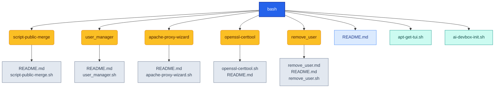

<!-- AUTO-GENERATED MERMAID START -->
<!-- This Mermaid diagram is auto-generated. Do not edit directly. -->

## Directory structure

<details>
<summary>Show directory tree diagram for `bash`</summary>



</details>

<!-- AUTO-GENERATED MERMAID END -->

# AI Devbox Init Script

This directory contains `ai-devbox-init.sh`, an interactive Ubuntu/Debian bootstrap script for building a modern development environment quickly and consistently.

## What This Script Does

`ai-devbox-init.sh` provisions a development workstation or server with selectable tooling for:

- Core development: `git`, `gh`, `docker`, `python`, `nodejs`
- CLI extras: `ollama`, `jq`/`yq`, `btop`, `bat`, `fzf`
- Productivity tools: `ripgrep`, `httpie`, `sqlite3`, `postgresql-client`, `direnv`
- TUI tools: `lazygit`, `eza`, `fd-find`, `delta`, `tldr`, `neovim`
- GUI tools (desktop mode): `dbeaver-ce`, `remmina`, `alacritty`, `kitty`, `inkscape`, `gimp`
- IDEs (desktop mode): VS Code, Cursor, Antigravity IDE
- Python AI environment setup in `~/ai_dev_env`

It uses `gum` to provide a guided, menu-based experience and supports both dry-run and live install modes.

## Why Use It

Use this script when you want:

- Fast and repeatable machine setup
- A single guided flow for server and desktop profiles
- Clear dry-run previews before making changes
- Apt-first install strategy with selective upstream fallback where needed
- Optional alias prompts and lightweight post-install verification output

## How It Works

At a high level, the script runs in these stages:

1. Validates command flags and mode
2. Requests `sudo` (live mode only)
3. Ensures `gum` is available for interactive prompts
4. Collects selections for environment and tool groups
5. Displays a full action plan in dry-run mode, then exits
6. Performs installations in live mode by selected categories
7. Applies selected shell integration (for example `direnv` hook, optional aliases)
8. Prints installed-tool checks and final next steps

## Usage

From repository root:

```bash
./bash/ai-devbox-init.sh --help
./bash/ai-devbox-init.sh --dry-run
./bash/ai-devbox-init.sh --run
```

From the `bash/` directory:

```bash
./ai-devbox-init.sh --help
./ai-devbox-init.sh --dry-run
./ai-devbox-init.sh --run
```

## Flags

- `-h`, `--help`: show usage information and exit
- `-n`, `--dry-run`: show planned actions only, no changes
- `-r`, `--run`: execute full interactive installation

Behavior:

- If no flag is provided, help is shown and the script exits.
- `--run` and `--dry-run` are mutually exclusive.

## Notes and Safety

- Designed for Ubuntu/Debian systems with `apt`.
- Live mode modifies system packages, apt sources, and some user config files.
- Dry-run mode requires `gum` to render the interactive flow and plan output.
- Some GUI packages are large downloads and are intentionally opt-in.
- Alias changes are prompted before being written.

## Typical Workflow

1. Start with dry run:

```bash
./bash/ai-devbox-init.sh --dry-run
```

2. Review the printed plan and selections.
3. Run live install:

```bash
./bash/ai-devbox-init.sh --run
```

4. Reopen terminal session and activate the Python env if selected:

```bash
source ~/ai_dev_env/bin/activate
```
