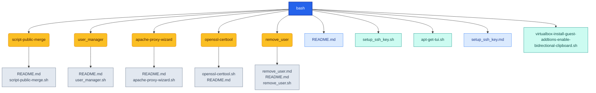

# bash

This folder contains Bash-based administration and automation scripts.
Each script now lives in its own subfolder and includes a local README with:
- What the script is intended to do
- Example usage commands
- Safety warnings for potentially destructive or system-level actions

<!-- AUTO-GENERATED MERMAID START -->
<!-- This Mermaid diagram is auto-generated. Do not edit directly. -->

## Directory structure

Show directory tree diagram for `bash`

<!-- AUTO-GENERATED MERMAID END -->

Auto-generated directory structure for this folder.
