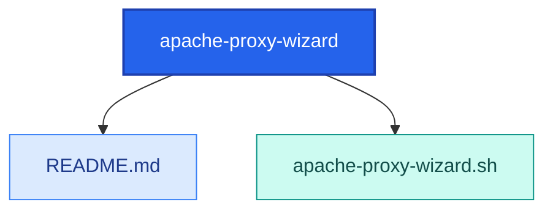

<!-- AUTO-GENERATED MERMAID START -->
<!-- This Mermaid diagram is auto-generated. Do not edit directly. -->

## Directory structure

<details>
<summary>Show directory tree diagram for `apache-proxy-wizard`</summary>



</details>

<!-- AUTO-GENERATED MERMAID END -->

# apache-proxy-wizard.sh

## Intended function
Interactive root-level wizard that creates and deploys an Apache reverse proxy vhost with SSL.

It can:
- Validate/install Apache2 and optionally start service
- Check UFW rules for ports 80/443
- Configure HTTP to HTTPS redirect
- Use either existing cert files or request Let's Encrypt certificates
- Generate, test, and deploy a vhost config in `/etc/apache2/sites-available/`

## How to use
Run as root:

```bash
sudo bash apache-proxy-wizard.sh
```

Typical flow:
- Enter app name, FQDN, backend IP/port, and proxy path
- Choose Let's Encrypt or manual cert/key file paths
- Review generated config
- Approve deployment and restart Apache

## Example
```bash
cd /path/to/scripts-public/bash/apache-proxy-wizard
sudo bash apache-proxy-wizard.sh
```

## Warnings
- Requires root privileges and modifies Apache system config.
- Can install packages (`apache2`, `certbot`) and open firewall ports.
- May restart Apache, which can disrupt existing hosted services if config is wrong.
- Let's Encrypt issuance requires working DNS + reachable HTTP validation path.
- Always review generated config before approving final deployment.
