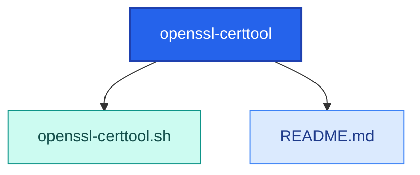

<!-- AUTO-GENERATED MERMAID START -->
<!-- This Mermaid diagram is auto-generated. Do not edit directly. -->

## Directory structure

<details>
<summary>Show directory tree diagram for `openssl-certtool`</summary>



</details>

<!-- AUTO-GENERATED MERMAID END -->

# openssl-certtool.sh

## Intended function
Interactive OpenSSL utility for extracting and validating certificate artifacts from `.pfx`, `.p12`, or `.p7b` inputs.

It can:
- Extract `.cer`, `.key`, `.pem`, and CA chain files
- Build a combined PEM in the order key -> cert -> chain
- Verify cert/key pair matching
- Print SAN/expiration details and generate CSR

## How to use
Required args:
- `--input <path>`: source cert bundle (`.pfx`, `.p12`, or `.p7b`)
- `--output <prefix>`: output base path/name

```bash
bash openssl-certtool.sh --input ./mycert.pfx --output /tmp/mycert
```

Then select menu options `1-13` for extraction and validation tasks.

## Example
```bash
cd /path/to/scripts-public/bash/openssl-certtool
bash openssl-certtool.sh --input ./corp-cert.p12 --output ./corp-cert
```

## Warnings
- Generated private keys/PEM material are sensitive secrets.
- Some operations write unencrypted private keys to disk.
- Protect output files and directories; do not commit cert/key files to Git.
- The script uses OpenSSL legacy flags for compatibility; verify artifacts before production use.
