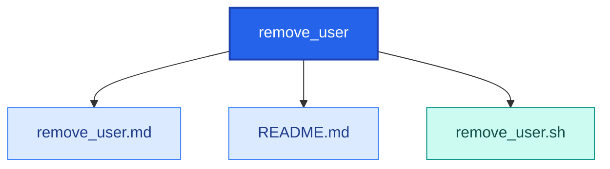

<!-- AUTO-GENERATED MERMAID START -->
<!-- This Mermaid diagram is auto-generated. Do not edit directly. -->

## Directory structure

<details>
<summary>Show directory tree diagram for `remove_user`</summary>



</details>

<!-- AUTO-GENERATED MERMAID END -->

# remove_user.sh

## Intended function
Safely and thoroughly remove a Linux user account and associated artifacts.

It can:
- Validate user input and safety constraints
- Optionally back up the user home directory
- Stop user sessions and processes
- Remove sudoers entries and related account resources
- Run in dry-run mode before applying destructive actions

## How to use
Basic:

```bash
sudo bash remove_user.sh <username>
```

With options:

```bash
sudo bash remove_user.sh -u alice -backup true -d
```

Common flags:
- `-u, --user <name>`: target username
- `-d, --dry-run`: preview changes only
- `-y, --yes`: non-interactive confirmations
- `-backup true|false`: backup home directory before deletion

## Example
```bash
cd /path/to/scripts-public/bash/remove_user
sudo bash remove_user.sh -u olduser -backup true
```

## Warnings
- This is destructive and can permanently remove user data.
- Incorrect username selection can remove the wrong account.
- System user deletion (UID < 1000) can break services.
- Review dry-run output before running without `-d`.
