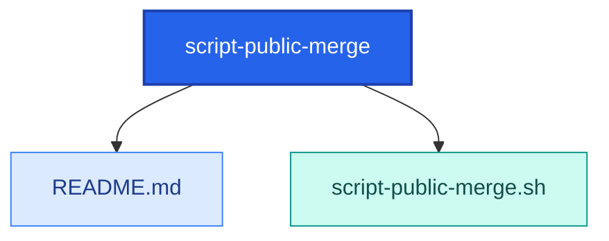

<!-- AUTO-GENERATED MERMAID START -->
<!-- This Mermaid diagram is auto-generated. Do not edit directly. -->

## Directory structure

<details>
<summary>Show directory tree diagram for `script-public-merge`</summary>



</details>

<!-- AUTO-GENERATED MERMAID END -->

# script-public-merge.sh

## Intended function
Bootstrap/restructure helper for this repository that creates directories, appends ignore rules, writes `.gitattributes`, then commits and pushes.

## How to use
Run from repository root (where `.git` exists):

```bash
bash script-public-merge.sh
```

## Example
```bash
cd /path/to/scripts-public
bash bash/script-public-merge/script-public-merge.sh
```

## Warnings
- The script performs `git add .`, `git commit`, and `git push origin main`.
- It can unintentionally stage and push unrelated or sensitive files.
- It appends to `.gitignore` and overwrites `.gitattributes` in current form.
- Review and possibly edit script behavior before use in active branches.
