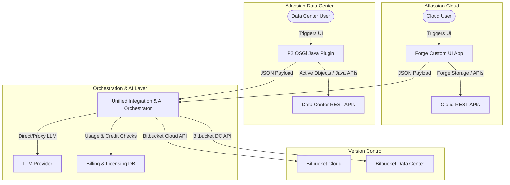

# Implementation Plan: AI Jira, Confluence, & Bitbucket Integration Plugin (Cloud & Data Center)

This plan outlines the architecture, design, and implementation steps for an AI-powered Atlassian plugin that automates the generation and organization of Epics, Tasks, and Subtasks. It integrates with Confluence for automated documentation and Bitbucket as a repository intermediary, supporting both **Atlassian Cloud** and **Atlassian Data Center** environments.

---

## 1. System Architecture Overview

To support both **Cloud** (Atlassian Forge) and **Data Center** (self-managed/on-premise JVM) deployments, the plugin will adopt a hybrid architectural model:



### Key Technical Components:
1. **Cloud Deployment (Forge)**: Native React Custom UI front-end running in Atlassian's secure runtime.
2. **Data Center Deployment (P2 OSGi)**: Standard Java-based P2 plugin running in the Jira/Confluence JVM. Uses Atlassian Active Objects for local database storage and exposes a modern React-based configuration dashboard injected into the Data Center UI.
3. **Unified Integration Orchestrator (Backend Proxy)**: A shared microservice (or serverless backend) that acts as the orchestration middleman. This ensures that the complex LLM logic, Bitbucket interactions, and Confluence page rendering code are shared, rather than rewritten twice for Cloud and Data Center.
4. **AI Engine (Hybrid Model)**: 
   - **BYOK (Bring Your Own Key)**: Customers can input their own Gemini, OpenAI, or Anthropic API key in Settings. The app makes direct, secure calls to their key.
   - **Default/SaaS LLM**: If no key is provided, the app proxies calls to our hosted LLM instance (Gemini Pro/GPT-4o) using their active subscription credits.
5. **Billing & Credit Management**: Enforces a limit of 5 free Epic creation runs. A central subscription server checks for the $5,000/yr plan (giving 100 Epic credits/year) and handles top-up bundles via Stripe.
6. **CLI Tools**: Atlassian Forge CLI (`forge`) for Cloud deployments; Atlassian SDK (`atlas-run`, `maven`) for Data Center compilation and packaging.

---


## 2. User Decisions Applied

### 1. Hybrid LLM Key Model (BYOK + SaaS)
* **Configuration Panel**: Admin settings will feature an optional API Key input field.
* **Fallback**: If empty, requests are routed to our managed API endpoint, which verifies license/credit status before proceeding.
* **Credit Consumption**: Each run consumes 1 "Automated Epic Creation Credit" from their balance, regardless of the LLM key source, to account for the automation and integration orchestration.

### 2. Credit System Logic (1 Credit = 1 Epic Run)
* A single "Epic creation run" deconstructs the request into an Epic, multiple Tasks/Stories, and associated Subtasks.
* Successfully running this import operation deducts exactly **1 credit**.
* This approach keeps budgeting predictable for users.

### 3. Bitbucket Intermediary Integration
* **Repo-Project Mapping**: Project settings screen maps a Jira project to one or more Bitbucket repositories.
* **Auto-Branching**: Moving a Task to "In Progress" automatically invokes a Forge event handler to create a git branch formatted as `feature/<ISSUE-KEY>-<issue-summary>` in the mapped repository.
* **PR and Commit Sync**: The Jira Issue Panel lists all commits matching the issue key and retrieves live Pull Request statuses (e.g. Open, Draft, Approved, Merged, Declined) directly from the Bitbucket API.

### 4. Confluence Documentation Templates
The user will select from a set of structured documentation templates to auto-generate linked Confluence pages:
1. **Blog**: A stakeholder-facing announcement outlining the goals and impact of the Epic.
2. **Wiki**: A collaborative knowledge-base article outlining assumptions and design thoughts.
3. **Procedure (Runbook)**: Actionable, step-by-step instructions for engineers to complete the tasks.
4. **Detailed Overview**: A deep-dive technical specification detailing architecture, endpoints, and schema.
5. **Command Help**: CLI syntax guides, cheat sheets, or parameter descriptions.
6. **Debugging Guide**: Troubleshooting checkpoints, error codes, and recovery procedures.
7. **Issue Creation Record**: A generated list indexing all Jira issues, descriptions, and linked assets created during the run.

---

## 3. Proposed Feature Modules & Implementation

### Module A: Issue Generation & AI Parsing Engine
This module parses the user's high-level project description, breaks it down into structured elements, maps them to Jira Issue Types, and expands the descriptions.

#### 1. AI Prompt Structure (System Instructions)
We feed the LLM a highly structured system prompt requesting JSON output containing Epics, Stories/Tasks, and Subtasks, including auto-suggested labels and issue classification.

#### 2. Description Formatting Compatibility Layer
* **Atlassian Cloud (Jira v3 REST API)**: Requires descriptions to be in Atlassian Document Format (ADF) JSON. The Orchestrator converts LLM-generated Markdown to ADF.
* **Atlassian Data Center (Jira v2 REST API)**: Requires descriptions to be in Atlassian Wiki Markup (or plain text). The Orchestrator converts LLM-generated Markdown to Wiki Markup (e.g., converting headers to `h1.`, bold to `*text*`, lists to `*`).

---

### Module B: Confluence Auto-Documentation
Whenever tasks are created, a corresponding documentation page is created in the linked Confluence instance.

* **Atlassian Cloud (Confluence v2 API)**:
  * **Endpoint**: `POST /wiki/api/v2/pages`
  * **Auth**: OAuth 2.0 (3LO) via Forge.
* **Atlassian Data Center (Confluence v1 API)**:
  * **Endpoint**: `POST /rest/api/content`
  * **Auth**: Personal Access Tokens (PATs) or Basic Auth.
* **Format**: Both versions utilize Confluence XHTML storage format. The Orchestrator renders the documentation into standard HTML/XHTML compatible with both platforms.

---

### Module C: Bitbucket Middleman Integration
The Orchestrator maps project-repo relations and performs version control actions:

* **Branch Autocreation**:
  * **Bitbucket Cloud Endpoint**: `POST /2.0/repositories/{workspace}/{repo_slug}/refs/branches`
  * **Bitbucket Data Center Endpoint**: `POST /rest/api/1.0/projects/{projectKey}/repos/{repositorySlug}/branches`
* **Commit/PR Info**:
  * Displays a tab in the Jira Issue View showing linked commits and PR statuses by querying respective API endpoints.

---

### Module D: Licensing and Credit Management (Billing)

To enforce the monetization logic securely:
1. **5 Free Uses (Trial)**: Checked via tenant-specific storage keys (Forge Storage on Cloud; Active Objects local DB table on Data Center).
2. **Annual License ($5,000/year)**: 
   - **Cloud**: Verified using the Atlassian Marketplace Licensing API.
   - **Data Center**: Verified using the Universal Plugin Manager (UPM) Licensing API.
3. **Credit Verification**: The Orchestrator queries our central billing server on every Epic run request to decrement credits and return remaining credit info.

---

### Module E: VM Deployment Script
To deploy the Orchestrator and files to the remote Ubuntu VM (`192.168.1.80`), we will implement a robust Bash deployment script `bash/deploy-jira-plugin.sh`.
* **Dry-Run by Default**: The script will only display the actions it would take. The user must explicitly pass the `--apply` flag to execute the deployment.
* **No Hardcoded Credentials/IPs**: The target VM destination is configurable via an environment variable with a default fallback:
  ```bash
  DEV_HOST="${DEV_HOST:-rtroiano@192.168.1.80}"
  ```
* **Deployment Process**:
  1. Compiles or bundles the Orchestrator code.
  2. Syncs the orchestrator codebase to the remote VM via `rsync` over SSH.
  3. Establishes node package installs on the remote target directory.
  4. Restarts or launches the Orchestrator daemon on the remote target.

---

## 4. Verification Plan

### Automated Verification
* Unit tests for the AI parser (Markdown to ADF and Markdown to Wiki Markup converters).
* Integration test suite running mock payloads for both Cloud and Data Center API schemas.

### Manual Verification Flow
1. **Developer Installation**: Install the app in both a Jira Cloud Developer instance (`forge install`) and a local Jira Data Center instance using Atlassian SDK (`atlas-run`).
2. **Test Generation**: Verify that 1 Epic run consumes exactly 1 credit on both Cloud and Data Center.
3. **Verify Description Formats**: 
   - On Jira Cloud, verify issue descriptions display correctly in ADF.
   - On Jira Data Center, verify issue descriptions display correctly in Wiki Markup format.
4. **Verify Confluence Pages**: Confirm Confluence pages are successfully created on both Cloud and Data Center instances across all 7 styles.
5. **Verify Bitbucket Sync**: Validate branch creation and PR fetching on both Bitbucket Cloud and Bitbucket Data Center.

### Remote VM Deployment Verification
1. **Dry-Run Test**: Run `./bash/deploy-jira-plugin.sh` without flags. Verify it outputs a preview of actions and does not perform the copy.
2. **Execution Test**: Run `./bash/deploy-jira-plugin.sh --apply` to perform the deployment.
3. **Remote Health Check**: Run a remote curl call to verify the Orchestrator is running and listening:
   ```bash
   curl -I http://192.168.1.80:5060/api/credits?tenantId=local-dev-tenant
   ```
   Verify it returns HTTP 200 with the active subscription details.
