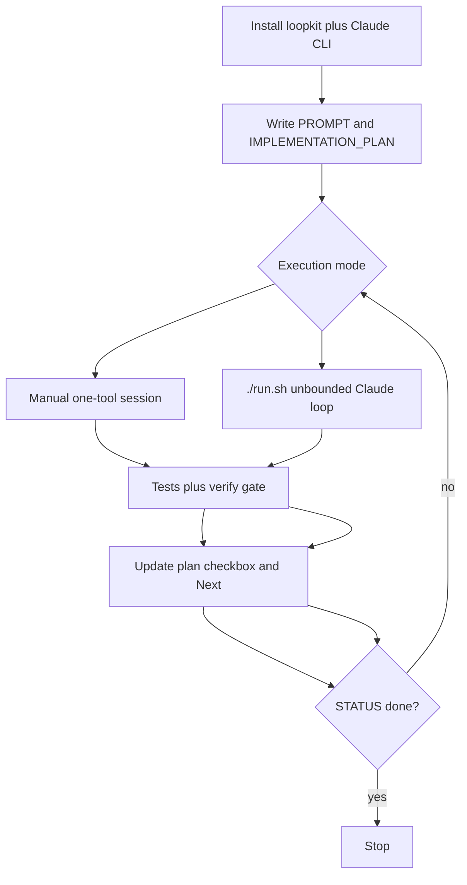

# Loopkit Scripts-Hardening Runbook

Operator guide for running [loopkit](https://github.com/Archive228/loopkit) against the scripts in this workspace: install the loop, write the goal spec, harden one tool per session, and know when you are done.

This runbook reflects the setup and first hardening pass performed in this workspace (July 2026).

---

## What you are doing

You are not building new products. You are making **existing** scripts and web apps:

- Runnable with every documented CLI flag (no unhandled errors)
- Covered by unit/flag tests and accurate help/docs
- Verifiable end-to-end (browser smoke for web apps)

Loopkit enforces **Plan → Act → Verify**, one tool per session, with state kept on disk so each agent turn starts fresh.

---

## Prerequisites

### 1. Install loopkit

From the workspace root:

```bash
curl -fsSL https://raw.githubusercontent.com/Archive228/loopkit/main/install.sh | bash
```

This installs into the current directory:

| Artifact | Purpose |
|----------|---------|
| `.claude/` | Skills, hooks, agents, slash commands |
| `AGENTS.md` | Cross-agent loop contract |
| `run.sh` | Autonomous Claude loop runner |
| `.mcp.json`, `MEMORY.md` | MCP config and session memory index |

### 2. Install Claude Code CLI

`run.sh` calls `claude` on every turn. Install the native CLI:

```bash
curl -fsSL https://claude.ai/install.sh | bash
claude --version   # expect: ~/.local/bin/claude
```

Authenticate once interactively:

```bash
claude
```

### 3. Cursor-only alternative

If you do not want `./run.sh`, you can follow the same contract manually in Cursor (or any agent that reads `AGENTS.md`). The spec files (`PROMPT.md`, `IMPLEMENTATION_PLAN.md`) are the source of truth either way.

---

## Workspace layout (important)

This workspace has **two layers**:

```
/home/rtroiano/repositories/scripts-public/   ← loopkit lives here (not a git repo)
├── PROMPT.md
├── IMPLEMENTATION_PLAN.md
├── AGENTS.md
├── run.sh
├── .claude/
├── bash/                    ← outer scripts (e.g. ai-devbox-init.sh)
├── docs/                    ← this runbook
├── scripts/
└── scripts-public/          ← nested git clone (Richie086/scripts-public)
    ├── .git/
    ├── bash/
    ├── projects/
    ├── python/              ← EXCLUDED from hardening
    └── web/
```

**Git branch for doc work:** `docs/loopkit-scripts-hardening` was created in the nested clone (`scripts-public/`). Loopkit artifacts and outer `bash/` changes live in the parent folder. Decide per session whether commits land in the outer workspace (after `git init`) or in the nested repo.

---

## Spec-first setup

Before hardening anything, write two files at the workspace root.

### `PROMPT.md` — immutable goal

Defines what "done" means. The agent re-reads this every turn. Do **not** edit it after acting to match what you shipped.

Current goal (summary):

- CLI scripts: `--help` works; every documented flag runs without unhandled errors; tests + README match reality
- Web apps: start locally (or remote); core UI is interactive; docs explain how to run
- Verification gate: tool tests green, `/verify` passes, plan updated

**Never touch:** `scripts-public/python/` — explicitly out of scope.

See: [`PROMPT.md`](../PROMPT.md)

### `IMPLEMENTATION_PLAN.md` — mutable state

Tracks inventory, progress, and next item. Line 1 must be exactly:

```
STATUS: not-started
```

or, when every tool is hardened:

```
STATUS: done
```

`run.sh` greps for `^STATUS: done$` to stop the loop.

See: [`IMPLEMENTATION_PLAN.md`](../IMPLEMENTATION_PLAN.md)

### How to scaffold (if starting fresh)

Use `/spec` in Claude Code, or write both files manually following the `spec-first` skill in `.claude/skills/spec-first/SKILL.md`. The goal must be concrete enough to write "Done when" as testable commands.

---

## The loop contract

From [`AGENTS.md`](../AGENTS.md):

1. **Plan** — Read `PROMPT.md`, `IMPLEMENTATION_PLAN.md`, `git log --oneline -20`
2. **Act** — Implement exactly **one** tool (single-feature rule)
3. **Verify** — Run `/verify` before claiming done or committing

If the plan and git log disagree, trust git.

---

## Execution modes



### Recommended: manual one-tool sessions

Safer default. In Cursor or Claude Code:

1. Read `IMPLEMENTATION_PLAN.md` → pick **Next**
2. Harden that one tool (see checklist below)
3. Run tests; `/verify` on the diff
4. Update the plan (checkbox, Done, Next, Open issues)
5. Commit if green (humans push; agents do not push to `main`)

This is how `bash/ai-devbox-init.sh` was hardened in the first pass.

### Optional: `./run.sh` autonomous loop

```bash
./run.sh
```

What it does (from [`run.sh`](../run.sh)):

```bash
while true; do
  claude -p "Read PROMPT.md and IMPLEMENTATION_PLAN.md. Do the next step. Commit on green."
  claude -p "/verify" || echo "verify failed, will retry"
  grep -q "^STATUS: done$" IMPLEMENTATION_PLAN.md && { echo "done"; break; }
  sleep 5
done
```

**Risks:**

- Unbounded commits until `STATUS: done`
- Requires `claude` auth and API access
- Nested-git ambiguity (outer vs inner repo)
- Destructive scripts may run without human review

Use `./run.sh` only when you trust the inventory, exclusions, and stop conditions in `PROMPT.md`.

---

## Per-tool session checklist

Repeat for each unchecked item in `IMPLEMENTATION_PLAN.md`:

| Step | Action |
|------|--------|
| 1 | Pick the next unchecked tool from **Next** |
| 2 | Audit flags/entrypoints; add `--help` if missing |
| 3 | Add unit + flag tests; use dry-run/fixtures for destructive tools |
| 4 | Align README/help with real flags and usage |
| 5 | Run tool-specific tests; `/verify` before claiming done |
| 6 | Check the inventory box; update **Done / Next / Open issues** |
| 7 | When inventory is empty → set line 1 to `STATUS: done` |

### Current inventory (snapshot)

**Root / wrapper**

- [x] `bash/ai-devbox-init.sh`
- [ ] `scripts/apply-cursor-credit-savings.sh`
- [ ] `deploy-mailserver-debian.sh`

**Nested `scripts-public/` bash** — 7 scripts

**Nested `scripts-public/` projects** — mail, KVM, stftp, openssl-output-generator

**Nested `scripts-public/` python** — **SKIP** (never harden)

**Web** — `scripts-public/web/apache-reverse-proxy/`

Full live checklist: [`IMPLEMENTATION_PLAN.md`](../IMPLEMENTATION_PLAN.md)

---

## Worked example: `bash/ai-devbox-init.sh`

First completed hardening pass.

### Problem

Help text referenced the wrong script name (`install-linux-dev-env.sh` instead of `ai-devbox-init.sh`).

### Fix

Updated `show_help()` in [`bash/ai-devbox-init.sh`](../bash/ai-devbox-init.sh) to use the correct name and document mutual exclusion of `--run` and `--dry-run`.

### Tests

Added [`bash/test-ai-devbox-init-flags.sh`](../bash/test-ai-devbox-init-flags.sh):

```bash
./bash/test-ai-devbox-init-flags.sh
# summary: 14 passed, 0 failed
```

Covers: no-args help, `--help` / `-h` / `help`, unknown flags (exit 1), `--run` + `--dry-run` combo (exit 1), no stale script name in help.

### Docs

Updated [`bash/README.md`](../bash/README.md) with flag behavior, exit codes, and the test command.

### Known gap

`--dry-run` and `--run` require interactive `gum` prompts. Full E2E dry-run is not automated; flag-gate tests are.

---

## Repo layout gotchas

| Gotcha | Mitigation |
|--------|------------|
| Outer workspace is not git; nested `scripts-public/` is | Decide commit target per tool before starting |
| `scripts-public/python/` excluded | Never pick as **Next**; listed under **Never touch** in `PROMPT.md` |
| Destructive scripts (mail, SSH, user delete, KVM) | Dry-run, mocks, or documented safe modes only |
| Interactive TUIs (`gum`, `apt-get-tui`) | Flag/help tests first; document interactive limits |
| Web apps | Document start command; browser smoke for primary flow |

---

## Stop conditions

Stop the session (do not claim done) if:

- More than one tool changed in a single session
- A previously green test suite for another tool starts failing
- Destructive ops run against real hosts without fixtures
- Scope targets `scripts-public/python/`
- Scope drifts into unrelated greenfield work

See **Stop if** in [`PROMPT.md`](../PROMPT.md).

---

## Quick reference

```bash
# Install
curl -fsSL https://raw.githubusercontent.com/Archive228/loopkit/main/install.sh | bash
curl -fsSL https://claude.ai/install.sh | bash

# Verify CLI
claude --version

# Example test gate (first hardened tool)
./bash/test-ai-devbox-init-flags.sh

# Optional autonomous loop (requires auth)
./run.sh

# Check loop completion
head -1 IMPLEMENTATION_PLAN.md   # STATUS: done
```

---

## Related files

| File | Role |
|------|------|
| [`PROMPT.md`](../PROMPT.md) | Goal and done-when criteria |
| [`IMPLEMENTATION_PLAN.md`](../IMPLEMENTATION_PLAN.md) | Inventory, progress, next tool |
| [`AGENTS.md`](../AGENTS.md) | Plan → Act → Verify contract |
| [`run.sh`](../run.sh) | Autonomous loop runner |
| [`.claude/commands/spec.md`](../.claude/commands/spec.md) | `/spec` slash command |
| [`.claude/commands/verify.md`](../.claude/commands/verify.md) | `/verify` slash command |
| [loopkit on GitHub](https://github.com/Archive228/loopkit) | Upstream installer and skills |

---

## Typical first-time workflow

1. Install loopkit + Claude CLI (above)
2. Write or review `PROMPT.md` and `IMPLEMENTATION_PLAN.md`
3. Create a feature branch if committing to the nested repo: `git checkout -b docs/loopkit-scripts-hardening`
4. Harden the **Next** tool manually (recommended) or run `./run.sh`
5. Repeat until `STATUS: done`
6. Human reviews and pushes (agents do not push to `main`)
