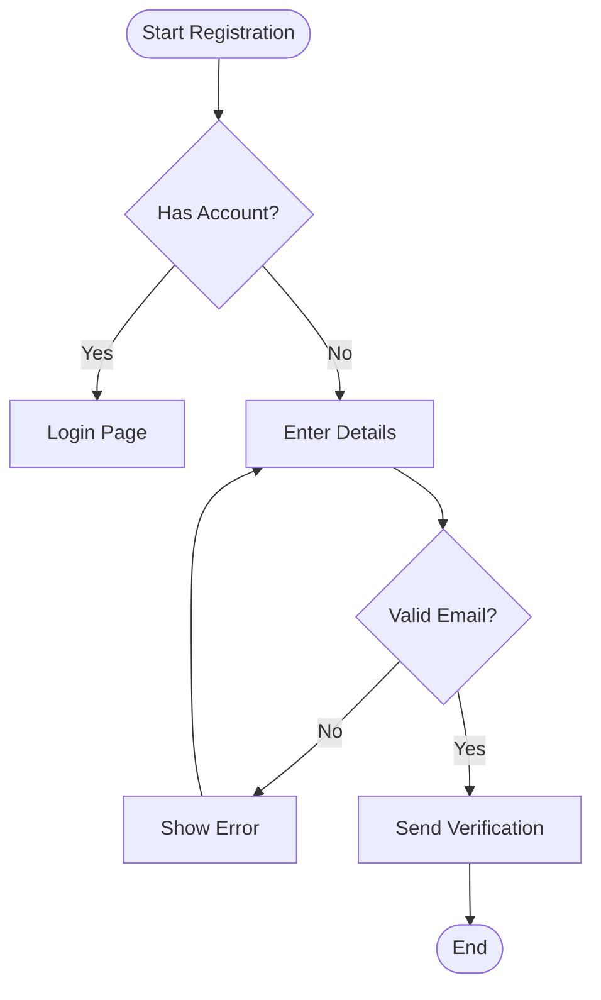

# Mermaid JS Flowchart Example

Open this file in VS Code and use a Mermaid preview extension to see the rendered graph.
This flowchart demonstrates a basic user registration process.

```mermaid
graph TD
    A([Start Registration]) --> B{Has Account?}
    B -- Yes --> C[Login Page]
    B -- No --> D[Enter Details]
    D --> E{Valid Email?}
    E -- No --> F[Show Error]
    F --> D
    E -- Yes --> G[Send Verification]
    G --> H([End])
```
