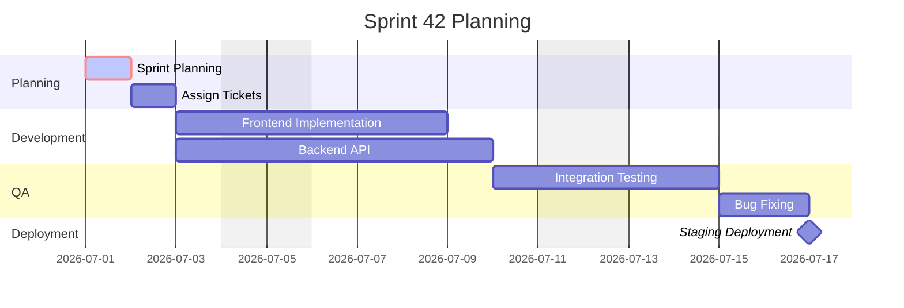

# Mermaid JS Gantt Chart Example

Open this file in VS Code and use a Mermaid preview extension to see the rendered graph.
This Gantt chart shows a simplified software development sprint.

```mermaid
gantt
    title Sprint 42 Planning
    dateFormat  YYYY-MM-DD
    excludes weekends

    section Planning
    Sprint Planning         :crit, active, task1, 2026-07-01, 1d
    Assign Tickets          :task2, after task1, 1d

    section Development
    Frontend Implementation :task3, after task2, 4d
    Backend API             :task4, after task2, 5d

    section QA
    Integration Testing     :task5, after task4, 3d
    Bug Fixing              :task6, after task5, 2d

    section Deployment
    Staging Deployment      :milestone, m1, after task6, 0d
```
