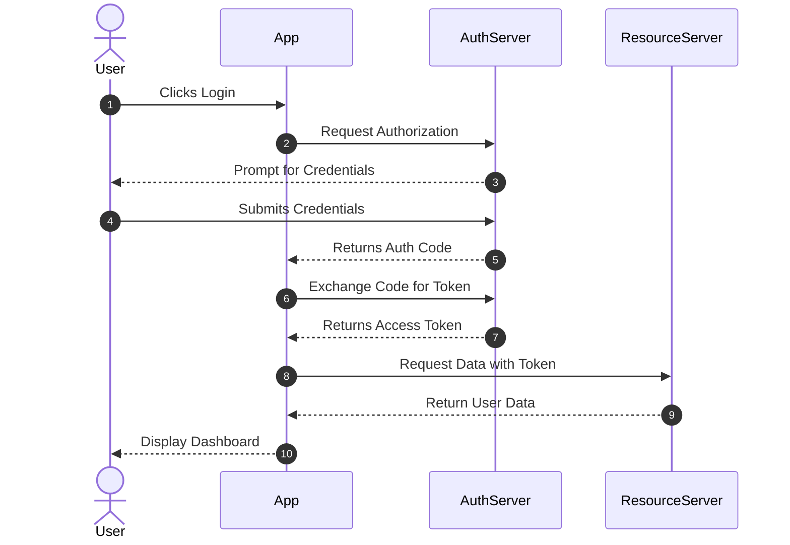

# Mermaid JS Sequence Diagram Example

Open this file in VS Code and use a Mermaid preview extension to see the rendered graph.
This sequence diagram illustrates a simple OAuth authentication flow.

