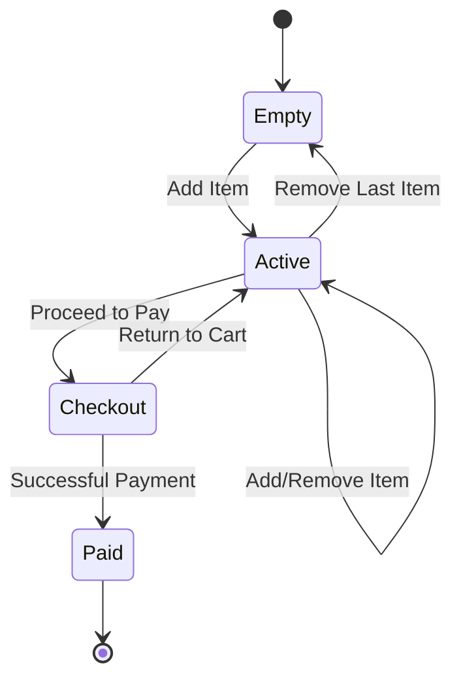

# Mermaid JS State Diagram Example

Open this file in VS Code and use a Mermaid preview extension to see the rendered graph.
This state diagram models a typical e-commerce shopping cart.

```mermaid
stateDiagram-v2
    [*] --> Empty
    Empty --> Active : Add Item
    Active --> Active : Add/Remove Item
    Active --> Empty : Remove Last Item
    Active --> Checkout : Proceed to Pay
    Checkout --> Active : Return to Cart
    Checkout --> Paid : Successful Payment
    Paid --> [*]
```
