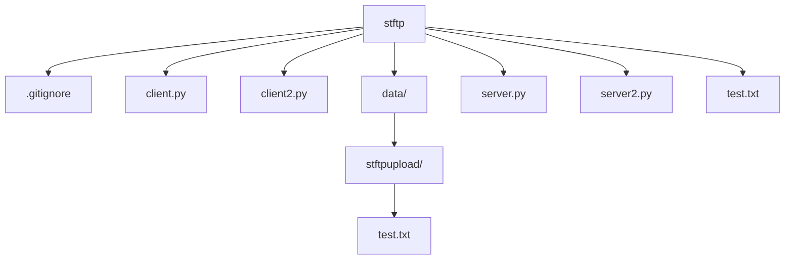

# stftp

<!-- AUTO-GENERATED MERMAID START -->
<!-- This Mermaid diagram is auto-generated. Do not edit directly. -->

<!-- AUTO-GENERATED MERMAID END -->

Auto-generated directory structure for this folder.
