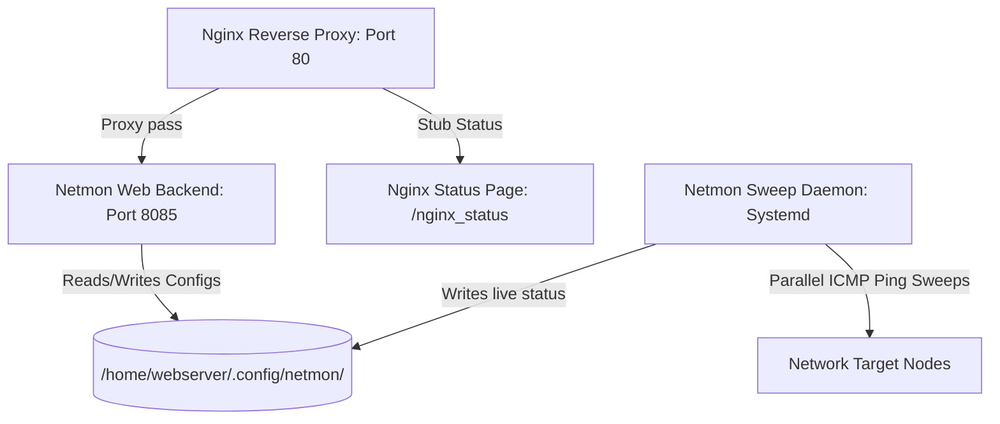

# Netmon V3 Deployment & Architecture Guide

This document describes the deployment architecture, configuration details, and system administration procedures for **Netmon V3** deployed on the remote server `192.168.1.80`.

---

## 1. System Architecture



Netmon V3 is deployed as two decoupled systemd services running under the unprivileged `webserver` user context, proxied through a globally available Nginx reverse-proxy listening on standard port 80.

---

## 2. Remote Security Workaround (ptrace_scope)

When compiling shell scripts to C binary executables via `shc`, the compiler embeds anti-debugging trace features utilizing `ptrace` by default. 
On the remote Ubuntu server, the kernel security configuration `kernel.yama.ptrace_scope` is set to `1` (restricting process tracing). 

### Solution
1. We recompile the binary using `shc -r` (Relaxed security / redistributable). This removes the strict tracing code while keeping the script source compiled inside the binary.
2. The compilation is done locally. The generated C code wrapper (`netmon.sh.x.c`) is copied to the remote server and compiled directly on the target using `gcc` to guarantee architecture/glibc compatibility:
   ```bash
   gcc -O2 /home/webserver/netmon/netmon.sh.x.c -o /home/webserver/netmon/netmon
   ```

---

## 3. Nginx Configuration

Nginx acts as a reverse proxy, forwarding requests on port `80` to the Netmon HTTP server running on port `8085`. It also exposes Nginx's performance metrics page.

The configuration file is located at `/etc/nginx/sites-available/default`:

```nginx
server {
    listen 80 default_server;
    listen [::]:80 default_server;

    server_name _;

    # Netmon V3 Web Control Dashboard Proxy
    location / {
        proxy_pass http://127.0.0.1:8085;
        proxy_set_header Host $host;
        proxy_set_header X-Real-IP $remote_addr;
        proxy_set_header X-Forwarded-For $proxy_add_x_forwarded_for;
        proxy_set_header X-Forwarded-Proto $scheme;
        
        # Disabled buffering to ensure chunked bash named-pipe outputs stream instantly
        proxy_buffering off;
    }

    # Nginx Performance Status Page
    location /nginx_status {
        stub_status on;
        access_log off;
        allow all;
    }
}
```

- **Netmon Web UI Link**: [http://192.168.1.80/](http://192.168.1.80/)
- **Nginx Status Page Link**: [http://192.168.1.80/nginx_status](http://192.168.1.80/nginx_status)

---

## 4. Systemd Service Management

Rather than using volatile background subshell loops (`nohup ... &`), Netmon is registered as standard systemd service units, ensuring automatic boot startup, crash recovery, and journal logging.

### Service Configurations

#### Netmon Daemon (`/etc/systemd/system/netmon-daemon.service`)
```ini
[Unit]
Description=Netmon V3 Parallel Sweep Daemon
After=network.target

[Service]
Type=simple
User=webserver
ExecStart=/home/webserver/netmon/netmon --daemon
Restart=always
RestartSec=10

[Install]
WantedBy=multi-user.target
```

#### Netmon Web Server (`/etc/systemd/system/netmon-web.service`)
```ini
[Unit]
Description=Netmon V3 HTTP Configuration Server
After=network.target

[Service]
Type=simple
User=webserver
Environment="NETMON_PORT=8085"
ExecStart=/home/webserver/netmon/netmon --web
Restart=always
RestartSec=10

[Install]
WantedBy=multi-user.target
```

### Systemd Operations Commands

To manage the Netmon services, use the following standard systemctl commands:

```bash
# Restart Netmon services
sudo systemctl restart netmon-daemon netmon-web

# Stop Netmon services
sudo systemctl stop netmon-daemon netmon-web

# Check running status of services
sudo systemctl status netmon-daemon netmon-web

# View real-time output logs
sudo journalctl -u netmon-daemon -f
sudo journalctl -u netmon-web -f
```

---

## 5. Automated Deployment Script

An automated, self-contained deployment script [deploy.sh](file:///home/rtroiano/repositories/netmon/deploy.sh) is provided. It:
1. Compiles the local script with `shc -r`.
2. Syncs files to `/home/webserver/netmon/` via SSH.
3. Compiles the binary remotely using target GCC.
4. Generates and pushes Nginx reverse-proxy rules.
5. Deploys, enables, and restarts both systemd services.
