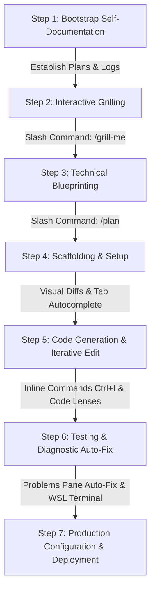

# Cross-Platform Development Workflow Guide: Idea to Production Deployment
*A step-by-step guide for non-developers - Building literally anything with Google Antigravity on Linux, macOS, and Windows*

> [!NOTE]
> **Hey, want to hear something terrifying?** Here is a recording of me reading this document. Is it me? Is it AI? How hard was this to do? Did you spend hours writing complex Python and Bash scripts to do this?
>
> <audio controls><source src="https://raw.githubusercontent.com/Richie086/scripts-public/main/projects/terminus/build-from-scratch/dev_workflow_guide.mp3" type="audio/mpeg">Your browser does not support the audio element.</audio>
> 
> Alternatively, you can [download/play the audio file directly](https://raw.githubusercontent.com/Richie086/scripts-public/main/projects/terminus/build-from-scratch/dev_workflow_guide.mp3).
>
> *This guide is a companion to the deep-dive technical article: [The Rise of the Agentic Architect: Building Full-Scale Operations Tooling via AI Cohorts on extremesarcasm.org](https://extremesarcasm.org/the-rise-of-the-agentic-architect-building-full-scale-operations-tooling-via-ai-cohorts).*

> [!IMPORTANT]
> **The Future of IT & Technology**: The integration of agentic planning commands like `/plan` and `/grill-me` represents a fundamental paradigm shift in software engineering. By partnering with an AI agent, non-developers can take any conceptual idea and translate it into a production-ready, highly optimized, and robust asset—whether it is a complex web application, a local bash script, a PowerShell automation, Python backend logic, Ruby scripts, Go binaries, or Terraform configurations. **With this workflow, literally anything is possible.**

---



---

## Step 1: Bootstrap Self-Documentation (Project Inception)

Before writing a single line of application code, establish a **self-documenting workflow**. In the agentic AI paradigm, documentation is not a chore done at the end—it is the active blueprint that directs the AI's operations and logs its progress.

### 1. Initialize Documentation Files
Ask the Antigravity agent in the **Sidebar Chat** to create two file templates at the root of your project:
- `implementation_plan.md`: The technical design document detailing requirements, changes, and verification.
- `walkthrough.md`: The ongoing log of what was tested, what succeeded, and how to operate the app.

### 2. Let the AI Self-Document
- **State Synchronization**: As you prompt the agent to write code, it will continuously update `walkthrough.md` with new features, test outcomes, and commands.
- **Why this matters**: This keeps a persistent "state log" of the project that both you and the AI can reference (`@walkthrough.md`) in future chat sessions, ensuring context is never lost.

---

## Step 2: Interactive Grilling (`/grill-me`)

The `/grill-me` command is your tool for refining raw, ambiguous ideas. It initiates an interactive interview where the AI challenges your assumptions, uncovers hidden edge cases, and aligns on constraints before code is generated.

### How to use `/grill-me`
1. Open the **Sidebar Chat** and run:
   `/grill-me "I want to build a network monitor called Terminus that does parallel sweeps in Python, but it must be zero-dependency."`
2. The AI will ask a series of targeted questions:
   - *How do we scale concurrency? (e.g. Subprocesses vs. raw socket ICMP?)*
   - *Where is state saved? (e.g. SQLite, JSON, or YAML?)*
   - *What security layers protect the admin settings?*
3. Answer these questions in the chat. The agent will compile your decisions and transition directly into the planning phase.

---

## Step 3: Technical Blueprinting (`/plan`)

Once the constraints are clear, the `/plan` command turns your answers into a concrete, executable engineering roadmap.

### How to use `/plan`
1. Type `/plan` in the chat panel:
   `/plan Generate the complete implementation plan including file pathways, Mermaid diagrams, Nginx/systemd configs, and verification scripts.`
2. The agent will write a detailed proposal inside your `implementation_plan.md` and present it in the **Auxiliary Pane** (or HTML pane) with a `Proceed` button.
3. Review the proposed changes. Once approved, the agent will execute the plan step-by-step, ensuring every file matches the spec.

---

## Step 4: Building the Scaffolding

Set up your repository structure. Open your project folder in the Antigravity IDE (`File > Open Folder...`).

> [!NOTE]
> **Cross-Platform Scaffolding Note**: If you are developing on Windows and targeting a local WSL environment, you can open the directory using the WSL network path (e.g., `\\wsl$\Ubuntu\home\username\projects\terminus`). On Linux and macOS, simply open the local workspace directory directly.

The agent will automatically configure the scaffolding files:
- `terminus.py` (CLI entry point, web server mapping, and TUI loop).
- `build.sh` (syntax compile checks).
- `.agents/rules.txt` (local project rule context).

---

## Step 5: Code Generation & Iterative Development

Use Antigravity's rich editing modalities to build out logic in your chosen language:

### 1. Visual Diff Overlays
When the agent writes logic, the editor will display code changes in red and green.
- **Diff Actions**: Hover over the visual diff overlay and click the checkmark button to accept or the cross button to reject. Keyboard shortcut: `Alt + A` (or `Option + A` on macOS) to accept, and `Alt + R` (or `Option + R` on macOS) to reject.

### 2. Inline Commands (`Ctrl + I` or `Cmd + I` on macOS)
Highlight any block of code and press `Ctrl + I` (`Cmd + I` on macOS) to make targeted changes.
- **Use Case (PowerShell/Python/Bash)**: Highlight a function and type: `Add standard logger.info hooks and trace exception blocks.`

### 3. Inline Code Lenses
Click **[Write Tests]** appearing directly above code symbols (classes, functions) to let the agent auto-generate unit tests.

### 4. Passive Autocomplete (Tab Completion)
- Press <kbd>Tab</kbd> to accept predictive autocomplete blocks.
- Press <kbd>Ctrl + →</kbd> (or <kbd>Cmd + →</kbd> on macOS) to accept predictions word-by-word.

---

## Step 6: Testing & Diagnostic Auto-Fix

Verify execution in your integrated terminal panel (accessible via <kbd>Ctrl + `</kbd> or <kbd>Cmd + `</kbd> on macOS).

### 1. Compile Checks
Run your validation scripts inside your shell (e.g. Bash on Linux/macOS/WSL, or PowerShell/cmd on Windows):
```bash
./build.sh
```

### 2. Diagnostic Auto-Fix
If any syntax, type-check, or test error occurs, it will appear in the IDE **Problems** pane.
- Click **Auto-Fix with Agent** next to the problem. The agent will inspect the code, consult the context, and apply a drop-in correction.

---

## Step 7: Production Configuration & Deployment

Deploy your tool directly to your local development environment or a target remote server.

### 1. Provisioning Services
The agent will write:
- **Service configurations** (e.g. Systemd units on Linux/WSL, or Launchd daemons on macOS) to run background sweeper daemons.
- **Nginx configuration blocks** mapping proxy locations and password protection.

### 2. Running the Deployment
In the terminal, run your deploy script:
```bash
./deploy.sh
```

### 3. Verification
1. Open a web browser.
2. Navigate to `http://localhost/` (public dashboard) and `http://localhost/admin` (which will trigger Nginx Basic Authentication prompts).

> [!NOTE]
> **Cross-Platform Verification Note**: If you are using a local VM or remote server, replace `localhost` with the server's IP address or domain name. If you are developing on Windows using WSL, WSL automatically forwards loopback bindings (`127.0.0.1`) so that `localhost` works natively in your Windows web browser.
3. Monitor your active processes directly inside the IDE's **Background Tasks** and **Auxiliary Pane** tabs.
4. Stream logs from the service unit to diagnose binding failures:
   ```bash
   sudo journalctl -u terminus-daemon -f
   ```
   If a crash occurs, you can mention the log directly in chat (`@terminal`) and let the agent fix it.
