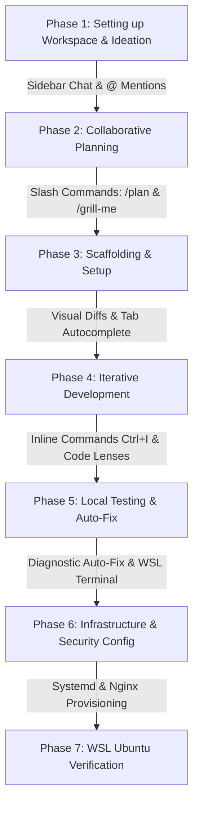

# Development Workflow Guide: Idea to WSL Ubuntu Deployment
*A Developer's Manual for Google Antigravity IDE on Windows*

This guide walks through the complete lifecycle of developing and deploying a standalone network monitor (**Terminus**) to a WSL Ubuntu environment. It is written specifically from the perspective of a developer working inside the **Google Antigravity IDE on Windows**, showing how to interact with the AI assistant at each stage.

---



---

## Phase 1: Setting up Workspace & Ideation

Before starting, map your development workspace so the Windows-based Antigravity IDE can communicate directly with your WSL Ubuntu subsystem.

### 1. Connect Windows IDE to WSL
1. Start your WSL Ubuntu instance on Windows.
2. Open **Antigravity IDE** on Windows.
3. Click **File > Open Folder...** and navigate to your WSL mount path (e.g. `\\wsl$\Ubuntu\home\username\projects\terminus`). 
4. The Antigravity IDE will load the folder. Since it's built on VS Code, it will automatically connect its terminal shell to the WSL Ubuntu bash instance.

### 2. Conceptualization in the Sidebar Chat
1. Open the **Sidebar Chat** on the left side of the IDE.
2. Formulate your concept and pass it to the agent.
3. **How to Interact**:
   - Ask: `"I want to build a standalone network monitor called Terminus that does parallel ping sweeps across environments. What architecture should we use?"`
   - Use **@ Mentions**: If you have reference scripts or rules, type `@` in the chat input. Select `@Files` and choose files from your workspace (e.g. `@README.md` or `@rules.txt`) to attach them directly as context.

---

## Phase 2: Collaborative Planning

Use Antigravity's structured planning workflows to map out components and file paths.

### 1. Trigger Planning Mode
1. In the Sidebar Chat, type `/plan` followed by your request:
   `/plan Outline the modules, configuration formats, and database-less storage we need for Terminus.`
2. The agent will analyze your workspace and generate an **Implementation Plan** as a markdown artifact (`implementation_plan.md`).
3. You can also type `/grill-me` if you want the agent to run an interactive interview to align on design decisions (e.g. choosing YAML over JSON, defining thread pools).

### 2. Reviewing the Artifact in the IDE
- The plan will render inside the IDE's **Auxiliary Pane** (or HTML pane).
- You can review the proposed file changes, mermaid diagrams, and step-by-step goals.
- Click **Proceed** or approve the plan in chat to unlock file creation permissions for the agent.

---

## Phase 3: Building the Scaffolding

Let the agent prepare the folder layout and basic scripting wrappers.

### 1. File Provisioning via Agent
The agent will automatically create the directories and files:
- `terminus.py` (empty script template with argument parser)
- `build.sh` (strict bash options syntax checker)
- `.agents/rules.txt` (local prompt variables for this workspace)

### 2. Reviewing File Changes
- As the agent creates files, the **Files Changed** section in the IDE sidebar will show the file list.
- Click on any file name to view the diff in the editor canvas.

---

## Phase 4: Iterative Development & AI Modalities

Work collaboratively with the AI to implement core logic. The Antigravity IDE provides multiple modalities to speed up coding:

### 1. Agent Mode (Sidebar) for Core Logic
Ask the sidebar agent to generate the main components:
- `"Implement the load_yaml and save_yaml functions using pyyaml."`
- `"Add the run_sweeper_daemon loop using ThreadPoolExecutor to run ping commands in parallel."`

As the agent writes code:
- **Visual Diff Overlays**: The IDE will show proposed code insertions in green and deletions in red.
- **Accepting Changes**: Hover over the diff in the editor canvas and click the **Checkmark (Accept)** button to merge, or **X (Reject)** to revert.

### 2. Inline Commands (`Ctrl` + `I` on Windows)
For quick, local edits, highlight a block of code and press `Ctrl` + `I`.
- **Use Case**: Highlight a function and type: `Add error handling for socket.gaierror and log it.`
- A floating window will open at your cursor, apply the change, and present a diff inline for immediate review.

### 3. Inline Code Lenses
- Look at the top of your classes or functions. Action lenses like **[Refactor]**, **[Write Tests]**, and **[Explain]** will appear.
- Click **[Write Tests]** above your helper functions to let the agent auto-generate unit tests in a test file.

### 4. Passive Autocomplete (Tab Completion)
- While typing inside `terminus.py`, Antigravity will suggest code blocks in grey text.
- Press <kbd>Tab</kbd> to accept the suggestion.
- Press <kbd>Ctrl</kbd> + <kbd>→</kbd> to accept suggestions word-by-word.
- If you use a new module (like `import yaml`), the IDE will prompt **Tab to Import** to automatically insert the import statement at the top of the file.

---

## Phase 5: Local Testing & Auto-Fix

Run verification steps inside WSL Ubuntu and let the IDE resolve any errors.

### 1. Integrated Terminal
1. Press <kbd>Ctrl</kbd> + <kbd>`</kbd> to open the integrated WSL Ubuntu terminal panel in the IDE.
2. Execute the validation script:
   ```bash
   ./build.sh
   ```

### 2. Diagnostic Auto-Fix
- If there are syntax or compiler errors, they will appear in the **Problems** tab at the bottom of the IDE.
- Antigravity places an **Auto-Fix with Agent** action next to each error.
- Click the button; the agent will inspect the warning and automatically generate a code fix, presenting a diff overlay.

---

## Phase 6: Infrastructure & Security Configuration

Configure the Ubuntu services and Nginx reverse proxy.

### 1. Declaring Services
Instruct the agent to write configuration templates:
- `"Generate the systemd service files for our daemon and web server."`
- `"Generate the Nginx default site configuration with Basic Auth for admin paths."`

### 2. Generating Authentication Hash
In the terminal, compile the credentials database. Antigravity can assist with generating the hash securely without writing cleartext passwords to logs.

---

## Phase 7: WSL Ubuntu Verification

Run the automated installer and verify execution from your Windows environment.

### 1. Run the Installer in WSL
In the IDE terminal, execute the deployment script:
```bash
./deploy.sh
```
- This will prompt you for an Admin username/password (which gets hashed via openssl).
- It will copy files, configure Nginx, and activate the Systemd units on your WSL instance.

### 2. Cross-Subsystem Verification
1. Since WSL Ubuntu forwards its loopback ports to Windows, open a web browser on Windows.
2. Navigate to `http://localhost/` to view the public dashboard.
3. Navigate to `http://localhost/admin`. Ensure the browser prompts you for Nginx Basic Authentication. Input the username and password you defined in `deploy.sh`.
4. Navigate to `http://localhost/nginx_status` and verify Nginx metric parsing.

### 3. Monitoring Processes in the IDE
- You can monitor the background tasks in the **Background Tasks** section of the Antigravity Auxiliary Pane.
- If the sweeper daemon encounters issues, run `journalctl -u terminus-daemon -f` in the integrated terminal to stream live logs.
- You can mention the log output to the agent (`@terminal`) and ask: `"Why is this service failing to bind?"` to get an instant diagnostic fix.
