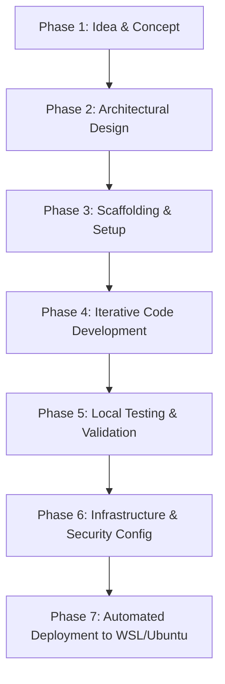

# Software Development Workflow Guide: Idea to WSL Ubuntu Deployment
*Case Study: Terminus Network Operations Monitor*

This guide walks a developer through the entire software development lifecycle—from a raw concept to an automated, production-grade deployment on a WSL Ubuntu or Linux server. We will use the **Terminus Network Operations Monitor** (a zero-dependency, parallel ping sweeper with a TUI, Web Dashboard, and Admin settings) as our blueprint.

---



---

## Phase 1: Conceptualization & Ideation

Before writing any code, clearly define **what** you are building, **who** it is for, and **why** it needs to exist. 

### 1. Identify the Problem
System administrators need to monitor network devices (servers, routers, switches) across multiple network environments (e.g. Tenants/VLANs) without installing heavy agent-based software or setting up complex enterprise suites like Prometheus/Grafana.

### 2. Define Features & Design Goals
- **Zero-Dependency**: Run on a standard Python 3 interpreter without requiring external PyPI packages.
- **Multimodal Interface**:
  - **Daemon**: Runs constantly in the background doing fast sweeps.
  - **TUI (Terminal User Interface)**: For sysadmins working inside ssh consoles.
  - **Web Dashboard**: A styled operations GUI accessible via browser.
- **Decoupled Architecture**: Let the background daemon write logs to disk, and the web/TUI interfaces read logs independently. This prevents web page loads from blocking pings.

---

## Phase 2: Architectural Design & Planning

Plan your technical layers, data models, IPC (inter-process communication), and security configurations.

### 1. Data Models & Serialization
Where and how will node configuration and status be saved?
- **Configuration (`config.yaml`)**: Save parameters (tab names, sweep speeds, device lists) in YAML.
- **Status Files (`.status`)**: Track ping success. Use a simple, space-efficient, flat text file:
  `NodeID | Status (UP/DOWN) | Avg RTT | Down Since Time | 24-Point History Sparkline`
  Example: `1|UP|4.2 ms||.......................1`

### 2. Inter-Process Communication (IPC)
Since we want the Web UI, TUI, and Daemon to run as separate processes without an active database:
- State is synchronized purely through **filesystem files** (`~/.config/terminus/`).
- To make updates safe, write status updates to `.tmp` files first, then execute an atomic rename (`os.replace()`) to avoid reading partially written data.
- Manage service lifecycles via flat `.pid` files (`daemon.pid`, `web.pid`).

### 3. Concurrency
Pinging dozens of hosts sequentially is slow. We must run pings concurrently using a Python `ThreadPoolExecutor` targeting a pool of workers.

---

## Phase 3: Building the Scaffolding

Set up your repository structure. Scaffolding ensures your project starts organized and provides immediate syntactical feedback.

### 1. Directory Scaffolding
Create the directory structure:
```bash
mkdir -p my-app/{projects,scripts,docs}
cd my-app
```

### 2. Entrypoint Skeleton (`terminus.py`)
Start with a skeletal Python script that parses flags:
```python
#!/usr/bin/env python3
import sys

def run_daemon():
    print("Running sweeper daemon...")

def run_web():
    print("Running web server...")

def run_tui():
    print("Running interactive TUI...")

if __name__ == "__main__":
    if len(sys.argv) > 1:
        arg = sys.argv[1]
        if arg == "--daemon": run_daemon()
        elif arg == "--web": run_web()
        else: print("Unknown argument.")
    else:
        run_tui()
```

### 3. Validation Scaffolding (`build.sh`)
Create a validation script to compile the syntax and set execution rights:
```bash
#!/usr/bin/env bash
# Strict shell rules
set -euo pipefail

echo "Checking Python syntax..."
python3 -m py_compile terminus.py
chmod +x terminus.py
```

---

## Phase 4: Iterative Code Development

Build the components in logical, dependency-first order.

### Step 1: Storage Layer
Write functions to read/write `config.yaml` and the flat status log files. Always provide default fallbacks if configuration files do not exist or are corrupted.

### Step 2: The Sweeper Daemon
Implement the background pinger loop.
1. Run a loop that fetches settings (ping count, frequency).
2. Execute a standard OS shell ping via `subprocess.run(["ping", "-c", "5", ...], capture_output=True)`.
3. Use regular expressions to extract the average latency from the stdout.
4. Read the previous status history string, shift it left, append `1` (success) or `0` (failure), and write the updated state.
5. Sleep for the configured interval.

### Step 3: The HTML Web Server
Implement the HTTP server using Python's built-in `http.server.BaseHTTPRequestHandler`.
1. **Routing**: Parse `self.path`. Bind `/` to the public dashboard, `/admin` to settings, and `/add`/`/delete` to settings updates.
2. **HTML Templates**: Return multi-line f-strings containing HTML/CSS.
3. **Dracula/Nord Theme**: Style using rich CSS variables directly inside `<style>` tags. Avoid raw standard browser components. Use rounded corners, beveled panels, and custom statuses badges.
4. **Sparkline rendering**: Iterate over the 24-character status history string and output colored blocks (`■` for green/online, `■` for red/alert) using inline styles.

### Step 4: The Terminal User Interface (TUI)
Create a console TUI without external dependencies like `curses` to keep it pure and lightweight.
1. **ANSI Escape Codes**: Use `\033[H\033[J` to clear the terminal and position the cursor. Use escape codes for coloring.
2. **Raw Keyboard Input**: Use `termios` and `tty` to configure standard input to raw mode, and check keys with `select.select([sys.stdin], ...)` to read arrow keys and keystrokes instantly without needing the Enter key.
3. **Layout Rendering**: Draw boxes and borders using block line characters. Display dynamic host metrics pulled directly from `/proc/cpuinfo` and `/proc/meminfo`.

---

## Phase 5: Local Testing & Validation

Test components incrementally on your local development machine (e.g. WSL Ubuntu shell).

### 1. Syntactic Verification
Run the compiler validator:
```bash
./build.sh
```

### 2. Manual CLI Verification
Test adding and deleting nodes directly from the CLI shell:
```bash
./terminus.py --add "Tenant A" "Web Gateway" "127.0.0.1" "Gateway"
./terminus.py --daemon
# Verify that status files are written to ~/.config/terminus/status/
```

### 3. Interactive TUI Execution
Launch the program in your shell:
```bash
./terminus.py
```
- Verify that Tab cycles active tabs.
- Verify that the selection bar responds to Arrow Keys.
- Exit using `Q`. Check that the background processes spawned are cleaned up.

---

## Phase 6: Infrastructure & Security Configuration

To run the application reliably in production, you must declare how the hosting environment configures proxy traffic, access control, and background processes.

### 1. Reverse Proxy Configuration (Nginx)
Configure Nginx as a front-end server to receive traffic on standard web port 80 and forward it to Python's internal port `8085`.
- **Public access**: Allow standard GET requests on the root path `/` to see the dashboard.
- **Access control (Basic Auth)**: Restrict paths like `/admin`, `/add`, and `/delete` using an `.htpasswd` credential list so public users cannot tamper with your target configurations.
- **Nginx performance page**: Expose Nginx metrics locally on `/nginx_status_raw` for our Python server to query.

*Example Nginx Server Configuration:*
```nginx
server {
    listen 80;
    server_name _;

    location ~ ^/(admin|delete|add) {
        auth_basic "Restricted Access";
        auth_basic_user_file /etc/nginx/.terminus_htpasswd;
        proxy_pass http://127.0.0.1:8085;
    }

    location / {
        proxy_pass http://127.0.0.1:8085;
    }
}
```

### 2. System Service Configuration (Systemd)
To ensure the Web dashboard and Sweeper daemon recover from system reboots or script crashes, declare them as systemd units.
- Create `/etc/systemd/system/terminus-daemon.service` to boot the sweeper.
- Create `/etc/systemd/system/terminus-web.service` to boot the web server.

---

## Phase 7: Automated Deployment to WSL/Ubuntu

Automate the installation. Write a bash script (`deploy.sh`) to provision files, secure passwords, configure Nginx, and manage services.

### 1. Deployment Script Layout (`deploy.sh`)
Your deployment script should be automated and handle the following:
```bash
#!/usr/bin/env bash
set -euo pipefail

# 1. local checks
./build.sh

# 2. Setup remote / target directories
sudo mkdir -p /home/webserver/terminus
sudo chown -R webserver:webserver /home/webserver/terminus

# 3. Securely generate Basic Auth credentials if missing
if [ ! -f /etc/nginx/.terminus_htpasswd ]; then
    read -p "Create Admin Username: " ADMIN_USER
    read -s -p "Create Admin Password: " ADMIN_PASS
    PASS_HASH=$(openssl passwd -apr1 "${ADMIN_PASS}")
    echo "${ADMIN_USER}:${PASS_HASH}" | sudo tee /etc/nginx/.terminus_htpasswd > /dev/null
    sudo chmod 640 /etc/nginx/.terminus_htpasswd
fi

# 4. Copy Nginx block configs
sudo cp nginx_default_config /etc/nginx/sites-available/default
sudo nginx -t
sudo systemctl reload nginx

# 5. Copy Systemd services and reboot daemon
sudo cp terminus-*.service /etc/systemd/system/
sudo systemctl daemon-reload
sudo systemctl enable terminus-daemon terminus-web
sudo systemctl restart terminus-daemon terminus-web
```

### 2. Troubleshooting & Operations
Once deployed to WSL/Ubuntu, use standard Linux operations commands to monitor health:
```bash
# Check if services are active and running
sudo systemctl status terminus-daemon terminus-web

# Stream logs in real-time to debug errors
sudo journalctl -u terminus-web -f

# Force restart services after updating configurations
sudo systemctl restart terminus-daemon terminus-web
```
