# python

<!-- AUTO-GENERATED MERMAID START -->
<!-- This Mermaid diagram is auto-generated. Do not edit directly. -->

## Directory structure

```mermaid
graph TD
	root["python"]:::root --> n1["suggest_aliases.py"]:::file-py
	root["python"]:::root --> n2["publish_wordpress_post.py"]:::file-py
	root["python"]:::root --> n3["README.md"]:::file-md
	root["python"]:::root --> n4["update_commit_log.py"]:::file-py
	root["python"]:::root --> n5["test_suggest_aliases.py"]:::file-py
	root["python"]:::root --> n6["fetch_agent.py"]:::file-py
	root["python"]:::root --> n7["search_scripts.py"]:::file-py
	root["python"]:::root --> n8["extract_conv.py"]:::file-py
	root["python"]:::root --> n9["requirements.txt"]:::file-text
	root["python"]:::root --> n10["wikipedia_fact_checker.py"]:::file-py
	root["python"]:::root --> n11["manage_credentials.py"]:::file-py
	root["python"]:::root --> n12["verify_credentials.py"]:::file-py
	root["python"]:::root --> n13["generate_mermaid_readmes.py"]:::file-py
	root["python"]:::root --> n14["list_keys.py"]:::file-py
	root["python"]:::root --> n15["publish_social.py"]:::file-py
	root["python"]:::root --> n16["wordpress_taxonomy_suggest.py"]:::file-py
classDef root fill:#2563eb,stroke:#1e40af,stroke-width:2px,color:#ffffff;
classDef folder fill:#fbbf24,stroke:#d97706,stroke-width:1px,color:#451a03;
classDef file-md fill:#dbeafe,stroke:#3b82f6,stroke-width:1px,color:#1e3a8a;
classDef file-py fill:#dcfce7,stroke:#16a34a,stroke-width:1px,color:#14532d;
classDef file-text fill:#fafafa,stroke:#a3a3a3,stroke-width:1px,color:#404040;
```

Show directory tree diagram for `python`

<!-- AUTO-GENERATED MERMAID END -->

Auto-generated directory structure for this folder.
