# wordpress

<!-- AUTO-GENERATED MERMAID START -->
<!-- This Mermaid diagram and inventory are auto-generated. Do not edit directly. -->

## Directory structure

```mermaid
flowchart TD
    n0["wordpress"]
    n0 --> n1["about.md"]
    n0 --> n2["ai-automation.md"]
    n0 --> n3["antigravity_blog_post.md"]
    n0 --> n4["automating-wordpress-antigravity.md"]
    n0 --> n5["aws-ec2-antigravity-blog.md"]
    n0 --> n6["blog_post_wordpress.md"]
    n0 --> n7["directory_stats.md"]
    n0 --> n8["how-to-fix-duplicate-widgets-in-terminal-wordpress-theme.md"]
    n0 --> n9["how-to-update-rust-desk-pro-self-hosted-docker.md"]
    n0 --> n10["how_to_use_antigravity.md"]
    n0 --> n11["installing-vscode.html"]
    n0 --> n12["installing-vscode.md"]
    n0 --> n13["mermaid-examples"]
    n13 --> n14["flowchart.md"]
    n13 --> n15["gantt.md"]
    n13 --> n16["README.md"]
    n13 --> n17["sequence.md"]
    n13 --> n18["state.md"]
    n0 --> n19["mermaid-markup-language-guide.md"]
    n0 --> n20["openssl-bash-wrapper.md"]
    n0 --> n21["README.md"]
    n0 --> n22["scripts_catalog.md"]
    n0 --> n23["technical-writing.md"]
    n0 --> n24["test_post.md"]
    n0 --> n25["ultimate-guide-to-bitwarden-securing-your-digital-life-across-every-device.md"]
```

Show directory tree diagram for `wordpress`

## Files and folders

- about.md — text/config file (2992 bytes)
- ai-automation.md — text/config file (2431 bytes)
- antigravity_blog_post.md — text/config file (9658 bytes)
- automating-wordpress-antigravity.md — text/config file (4236 bytes)
- aws-ec2-antigravity-blog.md — text/config file (9332 bytes)
- blog_post_wordpress.md — text/config file (11312 bytes)
- directory_stats.md — text/config file (359 bytes)
- how-to-fix-duplicate-widgets-in-terminal-wordpress-theme.md — text/config file (2182 bytes)
- how-to-update-rust-desk-pro-self-hosted-docker.md — text/config file (1635 bytes)
- how_to_use_antigravity.md — text/config file (1955 bytes)
- installing-vscode.html — text/config file (14564 bytes)
- installing-vscode.md — text/config file (7312 bytes)
- mermaid-examples/ — Directory with 5 items
  - flowchart.md — text/config file (446 bytes)
  - gantt.md — text/config file (760 bytes)
  - README.md — text/config file (475 bytes)
  - sequence.md — text/config file (762 bytes)
  - state.md — text/config file (491 bytes)
- mermaid-markup-language-guide.md — text/config file (7883 bytes)
- openssl-bash-wrapper.md — text/config file (5433 bytes)
- README.md — text/config file (1089 bytes)
- scripts_catalog.md — text/config file (5915 bytes)
- technical-writing.md — text/config file (7001 bytes)
- test_post.md — text/config file (475 bytes)
- ultimate-guide-to-bitwarden-securing-your-digital-life-across-every-device.md — text/config file (7386 bytes)

<!-- AUTO-GENERATED MERMAID END -->

Auto-generated directory structure for this folder.
