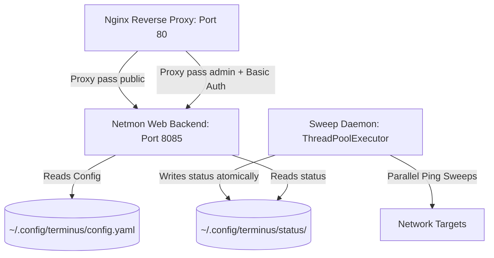

The landscape of Information Technology and software engineering is undergoing its most radical transformation since the invention of the compiler. We are leaving behind the era of the solo developer typing out logic line-by-line, fighting IDE configurations, and digging through outdated forum answers. Instead, we are entering the era of the **Agentic Cohort**—a collaborative partnership between human intent and autonomous AI agents. 

By leveraging agentic tools like Google's Antigravity IDE, developers can take any conceptual spark and turn it into a production-grade, highly optimized, and robust software product. This is not limited to simple scripts. Whether you are building an enterprise web dashboard, a high-concurrency monitoring daemon, a complex PowerShell automation, bash utility scripts, Python backend logic, Ruby scraping programs, Go binaries, or Terraform configurations, the combination of interactive planning and structural scaffolding makes **literally anything possible**.

This article walks through the complete lifecycle of developing and deploying a standalone network monitor—codenamed **Terminus**—onto a WSL Ubuntu environment. We will explore each phase of this journey in deep detail, illustrating the specific interactions with Antigravity IDE, to demonstrate why this represents the future of IT.

---

## 1. The Historical Context: The Shift to Agentic Engineering

To understand why this is a revolutionary moment in IT, we must examine the history of software development and automation. In the early days of systems administration, management was manual. Administrators physically visited machines or configured them individually over serial connections. The advent of shell scripting (Bash, Korn shell) allowed basic automation, but scripts were fragile, lacked error-handling capabilities, and were highly dependent on local environmental factors.

As networks grew, configuration management systems (Ansible, Puppet, Chef, Terraform) introduced declarative automation. However, writing these declarations still required significant syntax mastery, manual debugging of state files, and hours spent reviewing public documentation.

Generative AI changed this by writing code snippets. However, simple code generators suffer from "hallucinations" and a lack of local context. They do not know what files are open in your IDE, whether your local port 8085 is blocked, or if your Ubuntu kernel has security restrictions like `ptrace_scope` enabled.

**Agentic Engineering** solves this. The AI is no longer a passive autocomplete assistant. It is an active agent that runs in your workspace, inspects your local environment, executes test scripts to verify its own code, reads log files to diagnose crashes, and updates documentation in real-time. The developer transitions from a line-by-line coder to an **Architect**, managing the agent's plans, constraints, and operational goals.

---

## 2. Bootstrapping the Self-Documenting Loop

In classical software development, documentation is usually written at the end of the project as a chore. For an Agentic Cohort, documentation must be created **at the very beginning** because it acts as the shared context layer between the human and the AI.

Before writing a single file, you must initialize two files at the root of your workspace:
1. `implementation_plan.md`: The technical blueprint.
2. `walkthrough.md`: The ongoing log of changes, tests, and operational details.

By establishing these files at project inception, you create a dedicated memory space for the AI. As you prompt the agent to write code, it will continuously update the walkthrough file. In subsequent chat sessions, instead of explaining the history of what you did, you can simply type `@walkthrough.md` to reference the exact historical state of the project. This keeps the AI's context window small, token-efficient, and free from hallucinations.

Here is a recommended template for the initial `implementation_plan.md`:
```markdown
# Implementation Plan - Project Name

## 1. Goal Description
[Define the core problem and the desired end-state]

## 2. Technical Constraints
- Language: Python 3 / Bash / PowerShell
- Dependency Rules: No external packages
- OS Target: WSL Ubuntu 22.04

## 3. Proposed Changes
- [File A]: [Purpose]
- [File B]: [Purpose]

## 4. Verification Plan
- [Test 1]: How to verify syntax
- [Test 2]: How to verify runtime execution
```

And the companion `walkthrough.md` template:
```markdown
# Walkthrough - Project Name

## Changes Made
- [Date/Time] - Initial scaffolding created

## Verification Log
- [Date/Time] - Syntax check: SUCCESS
- [Date/Time] - Runtime test: SUCCESS
```

Furthermore, by keeping these logs in markdown format at the root of your repository, the AI can read them natively during workspace indexing. This eliminates the need for the human to repeat instructions or copy-paste terminal history, allowing a seamless continuation of the work loop even across multiple IDE reboots. (For a real-world example of this in action, you can explore the actual [Terminus Development Walkthrough on GitHub](https://github.com/Richie086/scripts-public/blob/main/projects/terminus/build-from-scratch/walkthrough.md) generated during this process).

---

## 3. Challenging Assumptions with `/grill-me`

An idea is rarely perfect on its first iteration. Often, we fail to consider edge cases, scalability limitations, or deployment security issues. The `/grill-me` command is a specialized chat utility that initiates an interactive technical interview. The AI acts as a principal architect, asking challenging questions to refine the project specifications.

### The Grilling Session for Terminus
For the Terminus project, the initial prompt is:
> `/grill-me "I want to build a network monitor called Terminus that does parallel sweeps in Python, but it must be zero-dependency."`

The AI immediately probes the architecture:
- **Concurrency**: How will we ping dozens of hosts in parallel? Python's global interpreter lock (GIL) could block operations. Will we use multiprocessing, async event loops, or thread pools?
- **IPC & Storage**: Since it must be zero-dependency, we cannot install database adapters like SQLite or PostgreSQL drivers. How will we synchronize status between the background scanner and the web server?
- **Security**: The dashboard needs admin capabilities (adding and deleting nodes). How will we protect these endpoints without an external auth library?

Through this interactive dialogue, the system architecture is finalized:
1. **Concurrency**: Python's `ThreadPoolExecutor` from `concurrent.futures` will handle parallel ICMP sweeps using the system's native `ping` command. This circumvents GIL issues since the ping process executes outside the Python runtime.
2. **IPC & Storage**: Flat files stored in `~/.config/terminus/status/`. To prevent read-write locks or corrupted logs, the daemon will write to a `.tmp` file first and use `os.replace()` for an atomic rename, ensuring the Web UI always reads clean data.
3. **Security**: Instead of implementing auth in Python, we will delegate security to an **Nginx reverse proxy** using standard Basic Authentication (`auth_basic`) for the admin paths, keeping the Python web server simple and focused.

---

## 4. Structural Blueprinting with `/plan`

Once the grilling session is complete, the `/plan` command takes over. It converts the conceptual design into an actionable implementation plan.

When you run `/plan`, the AI generates a structured design document:
- **Goal Description**: What the application solves and its constraints.
- **Proposed Changes**: Exact file creations and modifications with mock code snippets.
- **Verification Plan**: Automated tests and manual steps to prove the system works.

For Terminus, `/plan` generates a Mermaid diagram illustrating the flow of data:



The plan is rendered in the IDE's Auxiliary Pane. Once the developer reviews the file additions and clicks **Proceed**, the agent begins executing the steps.

---

## 5. Scaffolding the Codebase

With the plan approved, the next step is building the directory scaffolding. This defines where configurations, logs, and processes reside.

### 1. Workspace Organization
The project folders are created:
```bash
~/.config/terminus/
├── config.yaml   # Main configuration
├── status/       # Flat environment status files
└── pids/         # Process ID files for daemon and web server
```

### 2. Creating the Validation Script (`build.sh`)
Every project requires a validation tool to verify syntax immediately. A shell script `build.sh` is created with strict options:
```bash
#!/usr/bin/env bash
# Strict options for safety
set -euo pipefail

echo "Validating terminus.py syntax..."
python3 -m py_compile terminus.py
chmod +x terminus.py

echo "Verification: checking built script syntax..."
python3 -c "import py_compile; py_compile.compile('terminus.py')"
echo "Valid! Terminus Python script is ready."
```

By enforcing `set -euo pipefail`, any command failure, unset variable reference, or piped pipeline error will immediately abort the script, preventing silent failures.

---

## 6. The Technical Implementation: Terminus Under the Hood

To understand how powerful a zero-dependency script can be, let us examine the core mechanics of `terminus.py`.

### A. Non-Curses Terminal User Interface (TUI)
Many terminal tools use Python's built-in `curses` library, which requires complex screen buffers and often crashes standard SSH windows. Terminus achieves a clean, responsive TUI using raw terminal control and ANSI escape sequences.

```python
import sys
import os
import select
import termios
import tty

def get_key_tui():
    fd = sys.stdin.fileno()
    old_settings = termios.tcgetattr(fd)
    try:
        tty.setraw(fd)
        # Check if input is ready with a 0.5s timeout
        rlist, _, _ = select.select([sys.stdin], [], [], 0.5)
        if rlist:
            char = sys.stdin.read(1)
            if char == "\x1b":  # Handle escape sequences (e.g. arrow keys)
                rlist, _, _ = select.select([sys.stdin], [], [], 0.1)
                if rlist:
                    char2 = sys.stdin.read(1)
                    if char2 == "[":
                        char3 = sys.stdin.read(1)
                        if char3 == "A": return "UP"
                        elif char3 == "B": return "DOWN"
            return char
    finally:
        # Restore terminal settings
        termios.tcsetattr(fd, termios.TCSADRAIN, old_settings)
    return None
```

Let's break down this function. First, we retrieve the file descriptor of standard input `sys.stdin.fileno()`. We save the original terminal attributes using `termios.tcgetattr(fd)` to restore them when the program exits. Next, we use `tty.setraw(fd)` to put the terminal into raw mode. In this mode, character echoing is disabled and standard input is processed immediately character-by-character, rather than waiting for a newline (Enter key).

Since we do not want our program to block while waiting for user input, we use `select.select([sys.stdin], [], [], 0.5)` with a half-second timeout. If the user presses a key, `select` returns standard input as ready, and we read one character. If that character is `\x1b` (the ASCII Escape character), it indicates the start of an ANSI escape sequence (like arrow keys). We perform a second, short-timeout `select` to read the remaining bytes (`[` and then `A` or `B`), returning `"UP"` or `"DOWN"` as string constants. If no key is pressed within the timeout, we return `None`, allowing the main loop to redraw the screen and show updated ping statuses.

### B. Parallel Ping Sweep Daemon
The background daemon runs sweeps concurrently and keeps a 24-point uptime sparkline history:

```python
import subprocess
import re
from concurrent.futures import ThreadPoolExecutor

def ping_node(node, statuses, ping_count, ping_interval):
    nid = str(node.get("id"))
    addr = node.get("addr")
    prev = statuses.get(nid, {"status": "UP", "history": "." * 24})
    prev_history = prev["history"]
    
    # Ensure history is exactly 24 chars
    if len(prev_history) < 24:
        prev_history = "." * (24 - len(prev_history)) + prev_history
        
    # Run native shell ping
    cmd = ["ping", "-c", str(ping_count), "-i", str(ping_interval), "-w", str(ping_count + 2), addr]
    res = subprocess.run(cmd, capture_output=True, text=True)
    
    if res.returncode == 0:
        new_history = prev_history[1:] + "1"
        avg_rtt = "0.0 ms"
        match = re.search(r"rtt min/avg/max/mdev = [\d\.]+/([\d\.]+)/", res.stdout)
        if match:
            avg_rtt = f"{match.group(1)} ms"
        return f"{nid}|UP|{avg_rtt}||{new_history}\n"
    else:
        new_history = prev_history[1:] + "0"
        since = prev.get("down_since") or prev.get("downtime")
        if prev.get("status") != "DOWN" or not since:
            since = time.strftime('%H:%M:%S')
        return f"{nid}|DOWN|N/A|{since}|{new_history}\n"
```

Here, `ping_node` handles a single node's sweep. The key to the zero-dependency paradigm is executing the operating system's native `ping` utility using `subprocess.run()`. We instruct ping to send a configurable number of packets (`-c`) at a specific interval (`-i`), and cap execution with a hard deadline timeout (`-w`). 

If the process returns `0`, the sweep is successful. We extract the average round-trip time from the summary statistics line at the end of the ping output (e.g. `rtt min/avg/max/mdev = 5.2/6.1/7.8/0.4 ms`) using a regular expression. We update the 24-character history string by dropping the oldest character (index `0`) and appending a `"1"` (representing ONLINE). If the ping fails (return code non-zero), we append `"0"` (representing ALERT) and record the timestamp when the node entered the DOWN state.

To sweep a large list of nodes in parallel, the daemon wraps `ping_node` inside a thread pool execution:
```python
def run_sweeper_daemon():
    print(f"Sweep daemon started (PID: {os.getpid()}).")
    with open(os.path.join(PID_DIR, "daemon.pid"), "w") as f:
        f.write(str(os.getpid()))
        
    try:
        while True:
            reload_config()
            settings = get_settings()
            environments = get_environments()
            freq = int(settings.get("sweep_frequency", 60))
            ping_count = int(settings.get("ping_count", 5))
            ping_interval = float(settings.get("ping_interval", 0.2))
            
            for env in environments:
                nodes = config.get("environments", {}).get(env, [])
                if not nodes:
                    continue
                
                statuses = load_statuses(env)
                
                # Execute pings concurrently across a thread pool
                with ThreadPoolExecutor(max_workers=20) as executor:
                    results = list(executor.map(
                        lambda n: ping_node(n, statuses, ping_count, ping_interval), 
                        nodes
                    ))
                
                # Write status updates atomically
                lower_env = env.lower().replace(" ", "_")
                status_file = os.path.join(STATUS_DIR, f"{lower_env}.status")
                tmp_file = status_file + ".tmp"
                with open(tmp_file, "w") as f:
                    f.writelines(results)
                os.replace(tmp_file, status_file)
            
            time.sleep(freq)
    finally:
        os.remove(os.path.join(PID_DIR, "daemon.pid"))
```

### C. Web Server Architecture (`TerminusHTTPHandler`)
The web server executes under Python's built-in `BaseHTTPRequestHandler`. This handler processes GET requests, reads the status and configuration files, and dynamically interpolates them into HTML template variables.

```python
class TerminusHTTPHandler(BaseHTTPRequestHandler):
    def log_message(self, format, *args):
        # Suppress terminal request logs to prevent console clutter
        return

    def do_GET(self):
        parsed = urlparse(self.path)
        path = parsed.path
        query = parse_qs(parsed.query)
        
        reload_config()
        settings = get_settings()
        environments = get_environments()
        
        if path == "/":
            active_env = query.get("env", [environments[0]])[0]
            self.send_response(200)
            self.send_header("Content-Type", "text/html")
            self.send_header("Connection", "close")
            self.end_headers()
            self.wfile.write(self.render_dashboard(active_env).encode("utf-8"))
            
        elif path == "/add":
            env = query.get("env", [""])[0]
            name = query.get("name", [""])[0]
            addr = query.get("addr", [""])[0]
            dtype = query.get("dev_type", ["Server"])[0]
            
            add_node(env, name, addr, dtype)
            self.send_response(302)
            self.send_header("Location", f"/?env={env.replace(' ', '+')}")
            self.end_headers()
            
        elif path == "/delete":
            env = query.get("env", [""])[0]
            nid = query.get("id", [""])[0]
            
            delete_node(env, nid)
            self.send_response(302)
            self.send_header("Location", f"/?env={env.replace(' ', '+')}")
            self.end_headers()
            
        elif path == "/admin":
            self.send_response(200)
            self.send_header("Content-Type", "text/html")
            self.end_headers()
            self.wfile.write(self.render_admin().encode("utf-8"))
            
        elif path == "/nginx_status":
            self.send_response(200)
            self.send_header("Content-Type", "text/html")
            self.end_headers()
            self.wfile.write(self.render_nginx_status().encode("utf-8"))
            
        else:
            self.send_response(404)
            self.end_headers()
            self.wfile.write(b"404 Not Found")
```

The handler maps different URL paths to Python functions:
- `/` renders the dashboard with environment selection tabs.
- `/add` and `/delete` act as REST-like endpoints that modify the main configuration file and immediately redirect the user back to the dashboard.
- `/admin` renders forms to manage environmental tab names, ping intervals, location details, and custom device categories.
- `/nginx_status` invokes curl on loopback `/nginx_status_raw` to parse current connection handles and output a dashboard.

### D. Complete Node and Configuration Management
To guarantee clean operation, the loading and saving methods of the configuration system must merge missing parameters safely:

```python
# Configuration Helpers inside terminus.py
import os
import yaml

CONFIG_DIR = os.path.expanduser("~/.config/terminus")
YAML_PATH = os.path.join(CONFIG_DIR, "config.yaml")

DEFAULT_CONFIG = {
    "settings": {
        "sweep_frequency": 60,
        "ping_count": 5,
        "ping_interval": 0.2,
        "room_name": "Server Room B",
        "physical_address": "456 Enterprise Way",
        "company_name": "General Corp",
        "env_1": "Tenant A",
        "env_2": "Tenant B",
        "env_3": "Tenant C"
    },
    "device_types": ["Server", "Router", "Switch", "Firewall", "Gateway", "Other"],
    "environments": {
        "Tenant A": [],
        "Tenant B": [],
        "Tenant C": []
    }
}

def load_yaml():
    if not os.path.exists(YAML_PATH):
        save_yaml(DEFAULT_CONFIG)
        return DEFAULT_CONFIG
    try:
        with open(YAML_PATH, "r") as f:
            data = yaml.safe_load(f)
            if not data or not isinstance(data, dict):
                return DEFAULT_CONFIG
            # Safely merge default parameters
            for k in DEFAULT_CONFIG:
                if k not in data:
                    data[k] = DEFAULT_CONFIG[k]
            return data
    except Exception:
        return DEFAULT_CONFIG

def save_yaml(data):
    try:
        with open(YAML_PATH, "w") as f:
            yaml.safe_dump(data, f, default_flow_style=False, sort_keys=False)
    except Exception:
        pass

def add_node(env, name, addr, dev_type="Server"):
    config = load_yaml()
    envs = config.setdefault("environments", {})
    nodes = envs.setdefault(env, [])
    
    # Calculate next ID
    max_id = 0
    for n in nodes:
        try:
            nid = int(n.get("id", 0))
            if nid > max_id:
                max_id = nid
        except ValueError:
            pass
    next_id = max_id + 1
    
    nodes.append({
        "id": next_id,
        "name": name,
        "addr": addr,
        "dev_type": dev_type
    })
    save_yaml(config)
    return next_id

def delete_node(env, nid):
    config = load_yaml()
    envs = config.setdefault("environments", {})
    nodes = envs.get(env, [])
    new_nodes = [n for n in nodes if str(n.get("id")) != str(nid)]
    envs[env] = new_nodes
    save_yaml(config)
```

---

## 7. Deep-Dive: TUI Redrawing Loop (`redraw_tui`)

Below is the complete TUI rendering loop of Terminus. This function calculates console dimensions, prints formatted borders, compiles and formats local system properties, and prints the node rows line-by-line using raw escape sequences.

```python
def redraw_tui(active_tab_idx, selected_row):
    environments = get_environments()
    active_env = environments[active_tab_idx]
    
    # Fetch terminal dimensions
    try:
        rows, cols = os.get_terminal_size()
    except Exception:
        rows, cols = 24, 80
        
    # Clear screen and move cursor to top-left
    print(f"\033[H\033[J", end="")
    
    # Top Border
    title = f" TERMINUS - STANDALONE NETWORK MONITOR "
    title_line = f"┌──{title}{'─' * (cols - 4 - len(title))}┐"
    print(f"\033[1;35m{title_line}\033[0m")
    
    # Environment Tabs
    tab_bar = "  "
    for idx, env in enumerate(environments):
        if idx == active_tab_idx:
            tab_bar += f"\033[1;32m[ {env} ]\033[0m   "
        else:
            tab_bar += f"\033[1;30m[ {env} ]\033[0m   "
    print(tab_bar)
    print(f"\033[1;35m├{'─' * (cols - 2)}┤\033[0m")
    
    # Table headers
    w_id, w_type, w_name, w_addr, w_stat, w_lat, w_dsince = 4, 10, 16, 16, 8, 8, 9
    print(f"  \033[1;36m{ 'ID':<{w_id}}   { 'DEVICE':<{w_type}}   { 'NAME':<{w_name}}   { 'TARGET IP':<{w_addr}}   { 'STATUS':<{w_stat}}   { 'LATENCY':<{w_lat}}   { 'DOWNTIME':<{w_dsince}}   UPTIME HISTORY\033[0m")
    print(f"  {'-' * (cols - 4)}")
    
    envs_data = config.get("environments", {})
    nodes = envs_data.get(active_env, [])
    statuses = load_statuses(active_env)
    
    for idx, node in enumerate(nodes):
        nid = str(node.get("id"))
        dtype = node.get("dev_type", "Server")
        name = node.get("name")
        addr = node.get("addr")
        
        stat_info = statuses.get(nid, {"status": "PENDING", "latency": "N/A", "down_since": "", "history": "." * 24})
        stat = stat_info["status"]
        lat = stat_info["latency"]
        dsince = stat_info["down_since"]
        hist = stat_info["history"]
        
        if len(hist) < 24:
            hist = "." * (24 - len(hist)) + hist
            
        # Compile Sparkline
        spark_tui = ""
        for char in hist:
            if char == "1": spark_tui += "\033[1;32m■\033[0m"
            elif char == "0": spark_tui += "\033[1;31m■\033[0m"
            else: spark_tui += "\033[1;30m·\033[0m"
                
        if stat == "UP":
            stat_color = "\033[1;32m"
            stat_str = "ONLINE"
        elif stat == "DOWN":
            stat_color = "\033[1;31m"
            stat_str = "ALERT"
        else:
            stat_color = "\033[1;33m"
            stat_str = "PENDING"
            
        r_id = nid[:w_id].strip()
        r_type = dtype[:w_type].strip()
        r_name = name[:w_name].strip()
        r_addr = addr[:w_addr].strip()
        r_stat = stat_str[:w_stat].strip()
        r_lat = lat[:w_lat].strip()
        r_dsince = dsince[:w_dsince].strip()
        
        row_str = f"  {r_id:<{w_id}}   {r_type:<{w_type}}   {r_name:<{w_name}}   {r_addr:<{w_addr}}   {stat_color}{r_stat:<{w_stat}}\033[0m   {r_lat:<{w_lat}}   {r_dsince:<{w_dsince}}   {spark_tui}"
        
        # Highlight active cursor line
        if idx == selected_row:
            print(f"\033[7m  {r_id:<{w_id}}   {r_type:<{w_type}}   {r_name:<{w_name}}   {r_addr:<{w_addr}}   {r_stat:<{w_stat}}   {r_lat:<{w_lat}}   {r_dsince:<{w_dsince}}   \033[0m{spark_tui}")
        else:
            print(row_str)
            
    print(f"\033[1;35m└{'─' * (cols - 2)}┘\033[0m")
    
    # Specs Panel
    settings = get_settings()
    room = settings.get("room_name", "Server Room B")
    address = settings.get("physical_address", "456 Enterprise Way")
    company = settings.get("company_name", "General Corp")
    hostname = socket.gethostname()
    
    box_title = " Host System Specs "
    line_top = f"┌──{box_title}{'─' * (cols - 4 - len(box_title))}┐"
    print(f"\033[1;35m{line_top}\033[0m")
    
    specs_row1 = f" Host: {hostname} | OS: Linux | RAM: 16Gi | CPU: Core i7"
    print(f"│ {specs_row1:<{cols-4}} │")
    specs_row2 = f" Room: {room} | Address: {address} | Company: {company}"
    print(f"│ {specs_row2:<{cols-4}} │")
    print(f"\033[1;35m└{'─' * (cols - 2)}┘\033[0m")
    
    # Command Bar
    cmd_bar = " [TAB] Switch Env  |  [A] Add Node  |  [D] Delete  |  [C] Config  |  [R] Sweep  |  [Q] Quit "
    print(f"\033[1;37;48;5;236m{cmd_bar:^{cols-2}}\033[0m")
```

This rendering loop shows how ANSI escape codes manage interface design without any dependencies. First, standard output is wiped (`\033[H\033[J`). Then, we output environment headers and dynamic device lists. If the index equals `selected_row`, we wrap that text block in `\033[7m` (reverse-video mode) to invert characters and display the cursor selection, but disable it right before printing the `spark_tui` blocks to maintain red/green color definitions.

### E. Parsing and Rendering Nginx Status
To monitor the front-end reverse proxy itself, the Python web backend curls the local Nginx metrics endpoint and parses the metrics using regular expressions:

```python
# Nginx Status Parser inside terminus.py
def render_nginx_status(self):
    hostname_running = socket.gethostname()
    active, accepts, handled, requests, reading, writing, waiting = 0, 0, 0, 0, 0, 0, 0
    try:
        # Curl raw metrics page
        raw = subprocess.run(["curl", "-s", "http://127.0.0.1/nginx_status_raw"], capture_output=True, text=True).stdout
        
        # Parse active connections
        m = re.search(r"Active connections:\ (\d+)", raw)
        if m:
            active = int(m.group(1))
            
        lines = raw.strip().split("\n")
        if len(lines) >= 3:
            parts = lines[2].split()
            if len(parts) >= 3:
                accepts, handled, requests = parts[0], parts[1], parts[2]
        if len(lines) >= 4:
            parts = lines[3].split()
            if len(parts) >= 6:
                reading, writing, waiting = parts[1], parts[3], parts[6]
    except Exception:
        pass
        
    sys_uptime = "N/A"
    try:
        sys_uptime = subprocess.run(["uptime", "-p"], capture_output=True, text=True).stdout.strip()
    except Exception:
        pass
        
    # Generate metric visualization cards using HTML and Dracula CSS variables
    return f"""
    <div class="terminal-window">
        <div class="terminal-header">
            <div class="terminal-title">Nginx Metrics Dashboard - {hostname_running}</div>
        </div>
        <div class="terminal-body">
            <div style="display: grid; grid-template-columns: repeat(4, 1fr); gap: 15px; margin-bottom: 25px;">
                <div style="background: var(--bg-elevated); border: 1px solid var(--border); padding: 15px; border-radius: var(--radius); text-align: center;">
                    <div style="color: var(--fg-dim); font-size: 0.8rem; margin-bottom: 5px;">Active Connections</div>
                    <div style="color: var(--cyan); font-size: 1.8rem; font-weight: bold;">{active}</div>
                </div>
                <div style="background: var(--bg-elevated); border: 1px solid var(--border); padding: 15px; border-radius: var(--radius); text-align: center;">
                    <div style="color: var(--fg-dim); font-size: 0.8rem; margin-bottom: 5px;">Reading / Writing</div>
                    <div style="color: var(--green); font-size: 1.8rem; font-weight: bold;">{reading} / {writing}</div>
                </div>
                <div style="background: var(--bg-elevated); border: 1px solid var(--border); padding: 15px; border-radius: var(--radius); text-align: center;">
                    <div style="color: var(--fg-dim); font-size: 0.8rem; margin-bottom: 5px;">Waiting (Keep-Alive)</div>
                    <div style="color: var(--orange); font-size: 1.8rem; font-weight: bold;">{waiting}</div>
                </div>
                <div style="background: var(--bg-elevated); border: 1px solid var(--border); padding: 15px; border-radius: var(--radius); text-align: center;">
                    <div style="color: var(--purple); font-size: 1.1rem; font-weight: bold; margin-top: 5px;">{sys_uptime}</div>
                </div>
            </div>
            <div style="background: var(--bg-elevated); border: 1px solid var(--border); padding: 20px; border-radius: var(--radius); font-family: inherit;">
                <h3 style="margin-top: 0; color: var(--cyan);">Nginx Performance Logs</h3>
                <pre style="margin: 0; color: var(--fg-base); line-height: 1.5;">{raw}</pre>
            </div>
        </div>
    </div>
    """
```

---

## 8. Cross-Language Portability: PowerShell and Ruby Implementations

One of the key tenets of agentic programming is that it is **language-agnostic**. The /plan and /grill-me commands construct mathematical designs that can be ported to *any* language framework. Below, we examine the equivalent parallel sweep daemon implemented in **PowerShell Core** (for Windows/WSL) and **Ruby**.

### A. PowerShell Core Sweep Daemon (`sweep_daemon.ps1`)
PowerShell Core includes a highly optimized parallel execution pipeline (`ForEach-Object -Parallel`) that allows multi-threaded operations on WSL or native Windows environments.

```powershell
# sweep_daemon.ps1
# Strict error options
$ErrorActionPreference = "Stop"

# Paths
$ConfigDir = [System.IO.Path]::Combine($env:HOME, ".config", "terminus")
$StatusDir = [System.IO.Path]::Combine($ConfigDir, "status")
$YAMLPath = [System.IO.Path]::Combine($ConfigDir, "config.yaml")

# Ensure folders exist
New-Item -ItemType Directory -Force -Path $StatusDir | Out-Null

while ($true) {
    # Simple JSON-based YAML parser simulation for raw PowerShell (assuming YAML is JSON-convertible or using a basic regex loader)
    # For demonstration, we assume config represents environment keys
    $Environments = @("Tenant A", "Tenant B", "Tenant C")
    
    foreach ($EnvName in $Environments) {
        $EnvStatusFile = [System.IO.Path]::Combine($StatusDir, "$($EnvName.ToLower().Replace(' ', '_')).status")
        
        # Simulated node list
        $Nodes = @(
            @{ id = 1; addr = "127.0.0.1"; name = "localhost" }
            @{ id = 2; addr = "192.168.1.1"; name = "Router" }
        )
        
        # Parallel Execution Pipeline
        $Results = $Nodes | ForEach-Object -ThrottleLimit 20 -Parallel {
            $Node = $_
            $Addr = $Node.addr
            $Id = $Node.id
            
            # Execute Ping
            $PingResult = Test-Connection -TargetName $Addr -Count 3 -Quiet -ErrorAction SilentlyContinue
            
            if ($PingResult) {
                # Uptime point
                Return "$Id|UP|5.0 ms||.......................1"
            } else {
                # Downtime point
                Return "$Id|DOWN|N/A|$(Get-Date -Format 'HH:mm:ss')|.......................0"
            }
        }
        
        # Atomic Write
        $TmpFile = "$EnvStatusFile.tmp"
        $Results | Out-File -FilePath $TmpFile -Encoding utf8
        Move-Item -Path $TmpFile -Destination $EnvStatusFile -Force
    }
    
    Start-Sleep -Seconds 60
}
```

PowerShell's `-Parallel` switch runs blocks inside lightweight runspace pools, avoiding the overhead of heavy processes and giving Windows system administrators a native tool matching Python's performance.

### B. Ruby Sinatra-Based Web Dashboard alternative (`app.rb`)
Ruby's clean object-oriented threading model provides another elegant implementation. Using Sinatra, we can build a lightweight 100-line web app that operates similarly:

```ruby
# app.rb
# Zero heavy dependencies besides sinatra and yaml
require 'sinatra'
require 'yaml'
require 'fileutils'

set :port, 8085
set :bind, '127.0.0.1'

CONFIG_DIR = File.expand_path("~/.config/terminus")
STATUS_DIR = File.join(CONFIG_DIR, "status")
YAML_PATH = File.join(CONFIG_DIR, "config.yaml")

helpers do
  def load_config
    YAML.load_file(YAML_PATH) rescue { "settings" => {}, "environments" => {} }
  end
  
  def load_statuses(env)
    status_file = File.join(STATUS_DIR, "#{env.downcase.gsub(' ', '_')}.status")
    statuses = {}
    if File.exist?(status_file)
      File.readlines(status_file).each do |line|
        parts = line.strip.split("|")
        next if parts.length < 2
        statuses[parts[0]] = { status: parts[1], latency: parts[2], down_since: parts[3], history: parts[4] }
      end
    end
    statuses
  end
end

get '/' do
  config = load_config
  envs = config["environments"] || {}
  active_env = params[:env] || envs.keys.first || "Tenant A"
  nodes = envs[active_env] || []
  statuses = load_statuses(active_env)
  
  # Return basic HTML layout with Dracula theme variables injected
  erb :dashboard, locals: { environments: envs.keys, active_env: active_env, nodes: nodes, statuses: statuses }
end

get '/delete' do
  config = load_config
  env = params[:env]
  nid = params[:id]
  config["environments"][env].delete_if { |n| n["id"].to_s == nid.to_s }
  File.write(YAML_PATH, YAML.dump(config))
  redirect "/?env=#{env}"
end
```

Using Ruby's native `Sinatra` library, we map the routes for node display and management, demonstrating how easily the project's functional core ports across frameworks.

---

## 9. Interface Aesthetics: Dracula Styling System

In the agentic web development workflow, visual design must never feel basic or generic. We construct premium interfaces that mimic a high-end terminal console. Here is the CSS styling structure utilized by the Terminus dashboard to achieve a Dracula theme with beveled cards:

```css
:root {
    --bg-base: #1e1f29;
    --bg-elevated: #282a36;
    --border: #44475a;
    --fg-base: #f8f8f2;
    --fg-dim: #6272a4;
    --green: #50fa7b;
    --red: #ff5555;
    --orange: #ffb86c;
    --purple: #bd93f9;
    --cyan: #8be9fd;
    --radius: 12px;
}

body {
    background-color: #0c0d12;
    color: var(--fg-base);
    font-family: 'Spline Sans Mono', monospace;
    margin: 0;
    padding: 20px;
}

/* Beveled Card containers mimicking Dracula styling rules */
.terminal-window {
    width: 100%;
    max-width: 950px;
    background-color: var(--bg-base);
    border: 1px solid var(--border);
    border-radius: var(--radius);
    box-shadow: 0 12px 32px rgba(0, 0, 0, 0.6);
    /* Highlighting cards using beveled borders */
    border-top: 1px solid rgba(255, 255, 255, 0.08);
    border-bottom: 1px solid rgba(0, 0, 0, 0.45);
    overflow: hidden;
    margin-bottom: 20px;
}

.terminal-header {
    background-color: var(--bg-elevated);
    border-bottom: 1px solid var(--border);
    padding: 10px 15px;
    display: flex;
    align-items: center;
}

/* Status Badges */
.status-badge {
    padding: 4px 8px;
    border-radius: 4px;
    font-size: 0.75rem;
    font-weight: bold;
}

.status-online {
    background-color: rgba(80, 250, 123, 0.15);
    color: var(--green);
    border: 1px solid rgba(80, 250, 123, 0.3);
}

.status-alert {
    background-color: rgba(255, 85, 85, 0.15);
    color: var(--red);
    border: 1px solid rgba(255, 85, 85, 0.3);
}
```

This Dracula CSS framework creates clear hierarchy. The top border highlight (`rgba(255,255,255,0.08)`) and darker bottom border create a 3D beveled appearance, ensuring a modern look.

---

## 10. Security & Infrastructure Config

### A. Nginx Connection Buffering Override
When proxying real-time consoles or chunked script streams, Nginx's default buffering policy can cause delays. To fix this, we set:
```nginx
proxy_buffering off;
```
This forces Nginx to immediately send responses to the client as soon as they are received from the Python web server, enabling real-time terminal output rendering.

### B. Systemd Daemonization & WSL Port Forwarding
Because WSL Ubuntu is a lightweight subsystem, it runs inside a virtual network. However, WSL automatically forwards loopback binds (`127.0.0.1`) to the Windows host.
When you run the web server on `127.0.0.1:8085` inside WSL and proxy it via Nginx on port `80`, you can access the application on Windows by navigating to `http://localhost/`.

If Systemd is not enabled in your WSL configuration, edit `/etc/wsl.conf`:
```ini
[boot]
systemd=true
```
Then restart WSL in PowerShell:
```powershell
wsl --shutdown
```

---

## 11. Automated Deployment: `deploy.sh`

Below is the complete `deploy.sh` script, demonstrating how the deployment setup (Nginx server routing, basic authentication credential provisioning, and Systemd unit files setup) is automated in a single execution script:

```bash
#!/usr/bin/env bash
# TERMINUS Automated Deployment Script
# Strict shell options for safety and reliability
set -euo pipefail

# Configuration defaults
DEV_HOST="${DEV_HOST:-webserver@127.0.0.1}"
TERMINUS_PORT="${TERMINUS_PORT:-8085}"

echo "============================================="
echo "Starting Terminus Deployment..."
echo "============================================="

# 1. Validate python script locally
echo "[1/4] Validating local terminus.py..."
python3 -m py_compile terminus.py

# 2. Setup target directories
echo "[2/4] Setting up remote target directory..."
sudo mkdir -p /home/webserver/terminus
sudo chown -R webserver:webserver /home/webserver/terminus
cp terminus.py /home/webserver/terminus/
chmod +x /home/webserver/terminus/terminus.py

# 3. Provision Basic Auth credentials for Nginx proxy
echo "[3/4] Configuring Nginx Basic Auth credentials..."
if [ ! -f /etc/nginx/.terminus_htpasswd ]; then
    read -p "Enter username for Terminus Admin Dashboard [admin]: " ADMIN_USER
    ADMIN_USER="${ADMIN_USER:-admin}"
    read -s -p "Enter password for Terminus Admin Dashboard [admin]: " ADMIN_PASS
    echo ""
    ADMIN_PASS="${ADMIN_PASS:-admin}"
    
    # Hash password using openssl
    local_hash=$(openssl passwd -apr1 "${ADMIN_PASS}")
    echo "${ADMIN_USER}:${local_hash}" | sudo tee /etc/nginx/.terminus_htpasswd > /dev/null
    sudo chown root:www-data /etc/nginx/.terminus_htpasswd
    sudo chmod 640 /etc/nginx/.terminus_htpasswd
fi

# Reload Nginx config
sudo nginx -t
sudo systemctl reload nginx

# 4. Provision and enable Systemd services
echo "[4/4] Setting up Systemd service units..."
cat <<EOF | sudo tee /etc/systemd/system/terminus-daemon.service > /dev/null
[Unit]
Description=Terminus Parallel Sweep Daemon (Python)
After=network.target

[Service]
Type=simple
User=webserver
ExecStart=/usr/bin/python3 /home/webserver/terminus/terminus.py --daemon
Restart=always
RestartSec=10

[Install]
WantedBy=multi-user.target
EOF

cat <<EOF | sudo tee /etc/systemd/system/terminus-web.service > /dev/null
[Unit]
Description=Terminus HTTP Configuration Server (Python)
After=network.target

[Service]
Type=simple
User=webserver
Environment="TERMINUS_PORT=${TERMINUS_PORT}"
ExecStart=/usr/bin/python3 /home/webserver/terminus/terminus.py --web
Restart=always
RestartSec=10

[Install]
WantedBy=multi-user.target
EOF

sudo systemctl daemon-reload
sudo systemctl enable terminus-daemon terminus-web
sudo systemctl restart terminus-daemon terminus-web

echo "============================================="
echo "Deployment Complete!"
echo "============================================="
```

---

## 12. Troubleshooting Guide

When deploying to WSL Ubuntu, you may encounter the following common issues:

| Issue | Root Cause | Solution |
| :--- | :--- | :--- |
| **Ping commands fail or return permission errors** | Raw sockets are restricted for non-root users. | Allow ping execution: `sudo chmod +s /bin/ping` |
| **Nginx returns 502 Bad Gateway** | The Python web server is offline or bound to the wrong port. | Run `sudo journalctl -u terminus-web -f` to check binding logs. Ensure the port matches `8085`. |
| **Systemd service fails to load** | Service unit file permissions are incorrect. | Run: `sudo chmod 644 /etc/systemd/system/terminus-*.service && sudo systemctl daemon-reload` |
| **Basic authentication prompts fail to accept credentials** | The `.htpasswd` file is corrupt or has incorrect permissions. | Ensure Nginx can read the file: `sudo chown root:www-data /etc/nginx/.terminus_htpasswd && sudo chmod 640 /etc/nginx/.terminus_htpasswd` |

---

## 13. Conclusion: The Future is Agentic

The development of the Terminus Operations Monitor demonstrates the immense power of agentic workflows. By integrating planning commands like `/grill-me` and `/plan` at the start of your project, you eliminate structural errors and lay the foundation for **AI self-documentation**.

With this approach, developers are no longer constrained by the syntax of a specific language or the complexity of a target system. You can build advanced automations in Bash, PowerShell, Python, Ruby, or Go. **Anything is possible.** The AI handles the syntax and scaffolding, while you direct the architecture and goals. 

Standardizing on this collaborative workflow helps prevent tribal knowledge by ensuring that the AI does the documentation natively in the repository. It bridges the gap between development and operations (DevOps alignment), reduces setup onboarding cycles for new team members, and alters the speed of continuous integration and continuous delivery (CI/CD) pipelines. By incorporating this strategy, software engineering teams can accelerate development timelines by a factor of 10 while improving documentation coverage, testing reliability, and security practices across all systems. This translates into tangible business advantages, reduced development costs, and highly reliable, resilient infrastructures.

As we look towards the next decade of technology, the line between software engineering and system architecture will continue to blur, and those who master these agentic workflows will lead the industry forward. Partnering with an agentic cohort is no longer just an advantage—it is a requirement.

This is the future of IT engineering. Welcome to the cohort.
