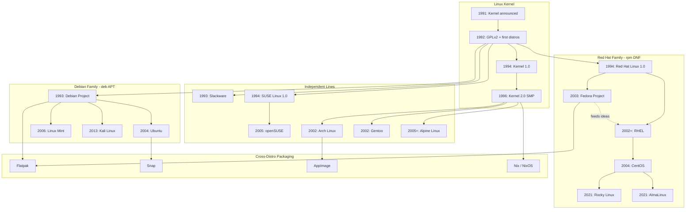

# Part 2: Distributions and Package Managers (Beyond the Wikipedia Page)

The Wikipedia history ends around chronology, lawsuits, and desktop drama. It does not explain why your `apt upgrade` just held 47 packages hostage. That is this section.

## What a Distribution Actually Is

A **distribution** is what happens when someone says:

> We will choose a kernel version, a userspace, an installer, a default desktop (or none), a release cadence, a package format, a set of repositories, a security update policy, and a community vibe — then we will name it something mythological, geographical, or aggressively lowercase.

Distributions exist because the raw kernel is not a product. Humans need installers, curated packages, update policies, and someone to blame when audio breaks after an upgrade.

The wiki chronology gives us the origin beats:

- **1992:** first distributions
- **1993:** **Slackware** (oldest still-existing distro) and **Debian**
- **1994:** **Red Hat** and **SUSE** publish 1.0
- **2005:** **openSUSE** community distribution
- **2007:** Dell ships **Ubuntu** laptops

Everything after that is forks, enterprise suits, and packaging theology.

## Distribution Family Tree and Release Timeline

![Linux Distribution Family Tree](https://mermaid.ink/img/eyJjb2RlIjogImZsb3djaGFydCBUQlxuICAgIHN1YmdyYXBoIEtlcm5lbExpbmVbXCJMaW51eCBLZXJuZWxcIl1cbiAgICAgICAgSzE5OTFbXCIxOTkxOiBLZXJuZWwgYW5ub3VuY2VkXCJdXG4gICAgICAgIEsxOTkyW1wiMTk5MjogR1BMdjIgKyBmaXJzdCBkaXN0cm9zXCJdXG4gICAgICAgIEsxOTk0W1wiMTk5NDogS2VybmVsIDEuMFwiXVxuICAgICAgICBLMTk5NltcIjE5OTY6IEtlcm5lbCAyLjAgU01QXCJdXG4gICAgICAgIEsxOTkxIC0tPiBLMTk5MiAtLT4gSzE5OTQgLS0-IEsxOTk2XG4gICAgZW5kXG5cbiAgICBzdWJncmFwaCBEZWJpYW5GYW1pbHlbXCJEZWJpYW4gRmFtaWx5IC0gZGViIEFQVFwiXVxuICAgICAgICBEZWJbXCIxOTkzOiBEZWJpYW4gUHJvamVjdFwiXVxuICAgICAgICBVYltcIjIwMDQ6IFVidW50dVwiXVxuICAgICAgICBNaW50W1wiMjAwNjogTGludXggTWludFwiXVxuICAgICAgICBLYWxpW1wiMjAxMzogS2FsaSBMaW51eFwiXVxuICAgICAgICBEZWIgLS0-IFViXG4gICAgICAgIERlYiAtLT4gTWludFxuICAgICAgICBEZWIgLS0-IEthbGlcbiAgICBlbmRcblxuICAgIHN1YmdyYXBoIFJlZEhhdEZhbWlseVtcIlJlZCBIYXQgRmFtaWx5IC0gcnBtIERORlwiXVxuICAgICAgICBSSFtcIjE5OTQ6IFJlZCBIYXQgTGludXggMS4wXCJdXG4gICAgICAgIFJIRUxbXCIyMDAyKzogUkhFTFwiXVxuICAgICAgICBGZWRvcmFbXCIyMDAzOiBGZWRvcmEgUHJvamVjdFwiXVxuICAgICAgICBDZW50T1NbXCIyMDA0OiBDZW50T1NcIl1cbiAgICAgICAgUm9ja3lbXCIyMDIxOiBSb2NreSBMaW51eFwiXVxuICAgICAgICBBbG1hW1wiMjAyMTogQWxtYUxpbnV4XCJdXG4gICAgICAgIFJIIC0tPiBSSEVMXG4gICAgICAgIFJIIC0tPiBGZWRvcmFcbiAgICAgICAgUkhFTCAtLT4gQ2VudE9TXG4gICAgICAgIENlbnRPUyAtLT4gUm9ja3lcbiAgICAgICAgQ2VudE9TIC0tPiBBbG1hXG4gICAgICAgIEZlZG9yYSAtLi0-fFwiZmVlZHMgaWRlYXNcInwgUkhFTFxuICAgIGVuZFxuXG4gICAgc3ViZ3JhcGggSW5kZXBlbmRlbnRbXCJJbmRlcGVuZGVudCBMaW5lc1wiXVxuICAgICAgICBTbGFja1tcIjE5OTM6IFNsYWNrd2FyZVwiXVxuICAgICAgICBTVVNFW1wiMTk5NDogU1VTRSBMaW51eCAxLjBcIl1cbiAgICAgICAgb3BlblNVU0VbXCIyMDA1OiBvcGVuU1VTRVwiXVxuICAgICAgICBBcmNoW1wiMjAwMjogQXJjaCBMaW51eFwiXVxuICAgICAgICBHZW50b29bXCIyMDAyOiBHZW50b29cIl1cbiAgICAgICAgQWxwaW5lW1wiMjAwNSs6IEFscGluZSBMaW51eFwiXVxuICAgICAgICBTVVNFIC0tPiBvcGVuU1VTRVxuICAgIGVuZFxuXG4gICAgc3ViZ3JhcGggVW5pdmVyc2FsW1wiQ3Jvc3MtRGlzdHJvIFBhY2thZ2luZ1wiXVxuICAgICAgICBGbGF0cGFrW1wiRmxhdHBha1wiXVxuICAgICAgICBTbmFwW1wiU25hcFwiXVxuICAgICAgICBBcHBJbWFnZVtcIkFwcEltYWdlXCJdXG4gICAgICAgIE5peFtcIk5peCAvIE5peE9TXCJdXG4gICAgZW5kXG5cbiAgICBLMTk5MiAtLT4gU2xhY2tcbiAgICBLMTk5MiAtLT4gRGViXG4gICAgSzE5OTIgLS0-IFJIXG4gICAgSzE5OTIgLS0-IFNVU0VcbiAgICBLMTk5NiAtLT4gQXJjaFxuICAgIEsxOTk2IC0tPiBHZW50b29cbiAgICBLMTk5NiAtLT4gQWxwaW5lXG4gICAgRGViIC0tPiBGbGF0cGFrXG4gICAgRmVkb3JhIC0tPiBGbGF0cGFrXG4gICAgVWIgLS0-IFNuYXBcbiAgICBBcmNoIC0tPiBBcHBJbWFnZVxuICAgIEsxOTk2IC0tPiBOaXgiLCAibWVybWFpZCI6IHsidGhlbWUiOiAiZGVmYXVsdCJ9fQ)

*Rendered diagram for WordPress and browsers that do not execute Mermaid. Source below for GitHub, VS Code, and other Mermaid-capable viewers.*



### The Big Families, Explained Like You’re Choosing a Religion

#### Debian and Friends: Stability Theater with Actual Stability

**Debian** (1993, [Ian Murdock](https://en.wikipedia.org/wiki/Ian_Murdock)) became the “do it properly” distribution — community governance, careful packaging, policy documents dense enough to stop a tank. Today it is the largest community distribution.

**Ubuntu** (2004, Canonical) took Debian’s `.deb` excellence and added predictable releases, desktop focus, and marketing that reached humans who did not want to read a constitution first.

**Linux Mint**, **Kali**, and countless remixes live in Debian’s blast radius.

#### Red Hat / Fedora / RHEL: Enterprise Cosplay That Became Enterprise Reality

**Red Hat Linux 1.0** shipped in **1994**. **RHEL** became the business suit. **Fedora** (2003) became the upstream playground. **CentOS** (2004) was “RHEL without the invoice” until the **CentOS Stream** pivot, after which **Rocky Linux** and **AlmaLinux** (2021) entered as community replacements.

**Oracle** released its own RHEL-based distribution in **2006**, because enterprise IT loves déjà vu with licensing.

#### Slackware: The Elder Scrolls

**Slackware** (1993) is the oldest surviving distro — old-school, simple package tools, no apologies. If Debian is a bureaucracy and Ubuntu is a product, Slackware is a workshop with labeled drawers.

#### SUSE / openSUSE

**SUSE Linux 1.0** arrived in **1994**. **openSUSE** (2005) became Novell’s community distribution. **zypper**, **YaST**, and German engineering thoroughness define the vibe.

#### Arch, Gentoo, Alpine: For People Who Chose Violence

- **Arch** (2002): rolling release, `pacman`, wiki-as-sacred-text
- **Gentoo** (2002): **Portage**, USE flags, compile your feelings
- **Alpine** (2005+): **apk**, **musl**, container darling

#### Wikipedia-Era Desktop Politics You Still Feel

The wiki’s desktop section is a graveyard of good intentions:

- **KDE** vs **GNOME** because Qt licensing scared people
- **KDE 4** and **GNOME 3** shipped rough transitions; users fled to calmer shores
- **Cinnamon** forked because GNOME 3 offended human beings with muscle memory
- **Unity** tried desktop/tablet convergence; Canonical canceled Touch in 2017 and returned to GNOME

None of this is the kernel’s fault. All of it becomes what users mean when they say “Linux on the desktop” — which is really “a distro plus a desktop plus whether the settings app crashes.”

---

## Release Models: Choose Your Fighter

| Model | Vibe | Examples | Your future |
|-------|------|----------|-------------|
| **Stable / point releases** | Change is scheduled | Debian Stable, Ubuntu LTS, RHEL | Predictability, older packages |
| **Rolling** | Change is a lifestyle | Arch, openSUSE Tumbleweed, Gentoo | Fresh software, educational breakage |
| **LTS** | Please do not surprise me | Ubuntu LTS, RHEL | Long support, conservative packages |
| **Immutable / image-based** | OS is a snapshot | Fedora Atomic, NixOS | Transactional updates, new muscle memory |

The “Year of the Linux Desktop” has been imminent since the invention of sarcasm. Meanwhile Linux won servers (2012: Linux server revenue exceeded other Unix), supercomputers (2017: all TOP500), and pockets (2013: Android 75% smartphone shipments).

### Supercomputers and Android: The Victories Wikipedia Actually Counts

Two chronology entries deserve extra sarcasm because they are not niche bragging — they are market structure:

**2017 — All TOP500 supercomputers run Linux.** At that point, arguing about desktop share while every serious HPC cluster runs your kernel is like debating paint colors on a battleship.

**2013 — Android claims 75% of smartphone shipments.** Android is not “a Linux desktop,” but it is the Linux **kernel** in billions of pockets. If your uncle says “I don’t use Linux,” his phone disagrees on a technicality he will not enjoy hearing at Thanksgiving.

**2012 — Linux server revenue exceeds the rest of the Unix market.** The datacenter had already picked a side. Everything since has been consolidation, containers, and licensing theater.

---

## Package Managers: The Real Final Boss

You can survive without knowing scheduler internals. You cannot survive long without a package manager unless you enjoy compiling software like it’s 1997 and bandwidth is a rumor.

### What Problem Are Package Managers Solving?

Software is binaries, libraries, config files, man pages nobody reads until 3 a.m., and dependencies that depend on dependencies last updated during a previous presidency.

A package manager fetches the right versions, verifies them, installs cleanly, tracks what it touched, and ideally removes them without turning `/usr` into modern art.

When it works: invisible magic. When it fails: a dependency conflict so personal it feels like the computer is judging your life choices.

### How Package Managers Work (Shared Machinery)

Despite every distro pretending its approach is uniquely enlightened, most traditional package managers share the same skeleton:

#### 3. Dependency Resolution: The Sudoku Nobody Asked For

The **depsolver** looks at what you want, what you have, and what the universe requires. It tries to satisfy dependencies, avoid conflicts, and prefer acceptable versions under distro policy.

When it fails, you get classics like:

- `Unable to correct problems, you have held broken packages`
- `nothing provides libfoo.so.3`
- `Error: Transaction check error`
- Arch’s spiritual equivalent: silence, then a forum post from 2011 that still applies

Dependency hell is not a myth. It is a scheduling problem where every package author assumed they were the main character.

#### 4. Trust: Signatures, Hashes, and Bad Life Choices

Sane systems verify HTTPS transport, repository signing keys, and package hashes against metadata. Disabling `gpgcheck` or `AllowUnauthenticated` because “it was blocking me” is how you turn your server into a malware pen pal program.

#### 5. Transaction: Download, Verify, Unpack, Configure, Regret

Typical install flow:

1. Resolve dependencies
2. Download packages
3. Verify integrity
4. Unpack onto filesystem
5. Run maintainer scripts (`postinst`, `%post`, install hooks)
6. Update local package database
7. Discover a service restart at the worst possible moment

#### 6. Local Database: Memory of Sins Past

Package managers track installed packages and owned files. This enables clean removal — and makes manual `rm -rf /usr/lib/something` a haunted-house generator.

#### 7. Upgrades and Removals

Upgrades change SONAMEs, spawn `.dpkg-dist` / `.rpmnew` config siblings, restart services, and leave kernel updates waiting for a reboot you will postpone until guilt wins.

`autoremove` cleans orphaned dependencies. Or you keep them forever as archaeological evidence.

### Binary vs Source vs Universal Packages

| Approach | What you get | Cost |
|----------|--------------|------|
| **Distro binaries** | Fast, integrated installs | Versions tied to release policy |
| **Source builds (Portage)** | Customization | Time, heat, responsibility |
| **Language managers (pip/npm)** | Dev ecosystem speed | System Python carnage |
| **Flatpak/Snap/AppImage** | Newer apps across distros | Duplication, sandbox debates |

Using `pip install` as root into system Python remains a top-ten way to make a sysadmin age in dog years.

---

## The Package Manager Catalog

### APT + dpkg (Debian, Ubuntu, and Infinite Remixes)

**`dpkg`** installs `.deb` files. **`apt`** is the civilized frontend.

```bash
sudo apt update
sudo apt install htop
sudo apt upgrade
```

`apt update` refreshes indexes. `apt install` resolves deps, fetches `.deb`s, hands them to `dpkg`. Debian’s packaging policy is bureaucracy until you realize it prevents random packages from overwriting `/etc` interpretively.

**PPAs**, **pinning**, and **backports** get newer software without yeeting your stable system into space — if you respect the blast radius.

Common APT footguns:

- `apt upgrade` vs `apt full-upgrade` — the latter will remove packages to resolve conflicts; read the prompt like it matters
- Stale PPAs after distro release upgrades — the graveyard of `apt update` errors
- `dpkg-reconfigure` — when a package’s postinst drama needs adult supervision

### RPM + YUM/DNF (Fedora, RHEL, Rocky, Alma)

**RPM** is format + low-level tool. **DNF** replaced **YUM** as the modern depsolver frontend.

```bash
sudo dnf install htop
sudo dnf upgrade
```

RPM ecosystems emphasize strong metadata, vendor repos, and enterprise update cadences that make change-management committees weep tears of joy (or boredom — hard to tell).

Useful RPM-era concepts:

- **Vendor repos** in `/etc/yum.repos.d/` — enable carefully
- **`rpm -qf /path/to/file`** — which package owns this file?
- **`dnf history`** — audit trail for “who installed this horror?”

If APT is a polite committee, DNF is a project manager with a spreadsheet and a deadline.

### pacman (Arch)

```bash
sudo pacman -Syu
sudo pacman -S htop
```

Arch's rolling release model means `pacman -Syu` is basically a trust fall. If you don't update for a month, running this command is a boss fight. You will inevitably hit a PGP keyring error, search the forums on your phone because your desktop won't boot, and manually run `pacman-key --refresh-keys` while questioning your life choices. The AUR (Arch User Repository) is amazing, but it is also a trust exercise. If you install an AUR package without reading the `PKGBUILD` file first, you are essentially eating raw fish from a gas station.

### zypper (openSUSE)

Zypper is openSUSE's tool. It uses "patterns" to bundle stuff and YaST if you like 90s-style graphical setup tools. It's fine, if you like green branding.

### Portage (Gentoo)

Gentoo's Portage compiles everything from source using USE flags. It is great if you want to optimize your compiler flags for a 1.2% speed increase or need to heat your apartment in the winter, but otherwise, you are just watching GCC logs scroll by.

### apk (Alpine)

```bash
apk add htop
```

Fast, minimal, container-native. **musl** means “it worked on Ubuntu” is not a legal guarantee.

Alpine’s quiet victory: minimal base images became default instinct. Then everyone layered 2GB of build tools back on top anyway, because CI pipelines are comedy.

### Nix and Guix

Functional package management: immutable store paths, reproducible environments, rollbacks as a feature. NixOS makes the entire OS declarative — paradise or hostage situation, depending on the day.

Think of Nix as answering: “What if `/usr` fights were replaced by precise store paths and generations you can roll back?” Think of traditional apt/dnf as answering: “What if we negotiated with a mirror at 2 a.m. and hoped?” Both are valid. Only one makes good conference talks.

### Flatpak, Snap, AppImage

- **Flatpak**: sandboxed apps + runtimes; **Flathub** as storefront
- **Snap**: Ubuntu-championed, `snapd` daemon, channels, philosophical debates
- **AppImage**: portable single-file apps; update hygiene varies

These exist because distro release cycles and app developer cycles are in a toxic relationship. Universal packages are couples therapy with residual resentment.

When to reach for universal packages:

- You need a newer app than your LTS repo will ship for months
- Upstream only officially supports Flatpak/Snap
- You want sandboxing for untrusted GUI apps

When to avoid them:

- You are managing servers and thought `snap install` on production was “modern”
- Disk is small and runtimes duplicate LibreOffice seventeen ways
- You need deep system integration (themes, portals, polkit quirks become your hobby)

---

## Repository Internals: What Happens Before `install` Works

Package managers feel like magic until you see the plumbing. Most distro repos publish:

- **Package index files** — compressed catalogs of available versions
- **Dependency metadata** — what each package needs and conflicts with
- **Signatures** — proof the index and packages came from the vendor you think they did

On Debian/Ubuntu, `apt update` pulls `InRelease`/`Release` files and `Packages` indexes. On Fedora, DNF reads repo XML metadata. On Arch, `pacman -Sy` syncs package databases from mirrors.

Mirrors exist because downloading everything from one server in Finland (historically very on-brand for Linux) does not scale. Your package manager picks a mirror, downloads indexes, then downloads actual packages only when you install.

This is why “just copy the `.deb` from a random forum” is a different sport from using signed repositories — one is package management, the other is trust fall with malware potential.

---

## Key People Woven Through the Wikipedia Story

History is not lone geniuses in caves. It is lone geniuses plus mailing lists plus lawyers plus people who name FTP folders without asking.

| Person | Role in the wiki narrative |
|--------|---------------------------|
| **Ken Thompson / Dennis Ritchie** | Created Unix; the ancestral debt |
| **Richard Stallman** | GNU Project, GPL, GNU/Linux naming crusade |
| **Andrew S. Tanenbaum** | MINIX, “Linux is obsolete,” refuted plagiarism claims |
| **Linus Torvalds** | Wrote the kernel, picked GPL, named Tux era, later Git |
| **Ari Lemmke** | Renamed Freax → Linux on FUNET FTP |
| **Orest Zborowski** | X11 port that made GUI Linux plausible |
| **Larry Ewing / James Hughes** | Tux artwork and naming |
| **Ian Murdock** | Founded Debian (1993) |
| **Eric S. Raymond** | Published Halloween documents; Cathedral & Bazaar |
| **[Greg Kroah-Hartman](https://en.wikipedia.org/wiki/Greg_Kroah-Hartman)** | Accepted Microsoft’s 2009 driver code as kernel maintainer |

The thousands of unnamed contributors remain the actual engine. The famous names are just the ones your conference badge printer knows.

---

## Comparison Table (When Your Brain Is Full)

| Manager | Distro world | Format | Superpower | Classic footgun |
|---------|--------------|--------|------------|-----------------|
| APT/dpkg | Debian/Ubuntu | `.deb` | Packaging culture | PPAs + partial upgrades |
| DNF/RPM | Fedora/RHEL | `.rpm` | Enterprise rigor | Repo/module confusion |
| pacman | Arch | `.pkg.tar.zst` | Simple rolling | Blind AUR installs |
| zypper | openSUSE | RPM | Patterns + solver | Ignoring vendor docs |
| Portage | Gentoo | ebuilds | Custom builds | Mis-set USE flags |
| apk | Alpine | `.apk` | Tiny images | musl surprises |
| Nix/Guix | NixOS+ | store paths | Reproducibility | Learning curve |
| Flatpak | Many | Flatpak | Fresh desktop apps | Disk duplication |
| Snap | Ubuntu+ | Snap | Easy channels | Daemon opinions |
| AppImage | Many | AppImage | Portable singles | Ad-hoc updates |

---

## Choosing a Distro (Really: Choosing a Packaging Culture)

People think they choose a distro for wallpaper. They actually choose:

1. Update temperament — surprise me vs schedule me
2. Package freshness vs stability
3. Commercial support needs
4. Whether they want to learn packaging or merely consume it

Cheat sheet:

- Servers with support contracts? **RHEL** or clones
- Desktops relatives might survive? **Ubuntu** or **Mint**
- Learn by breaking things? **Arch** or **Gentoo**
- Tiny containers? **Alpine**
- Reproducibility religion? **NixOS**
- Vintage comfort? **Slackware**

There is no universally correct answer. Only the answer matching your tolerance for chaos.

---

## Real-World Package Manager Scenarios (Where Theory Meets Pain)

### Scenario 1: The LTS Desktop That Wants Bleeding-Edge Software

You run Ubuntu LTS because you value stability. You also want the latest browser yesterday. Your options:

1. Wait for backports (virtuous, slow)
2. Add a PPA (powerful, fragile)
3. Install Flatpak/Snap (isolated, disk-hungry)
4. Compile from source (educational, unsustainable)

There is no cheat code. Only tradeoffs wearing different hats.

### Scenario 2: The Server That Mixed Repos Because Someone Was “Helpful”

Someone enabled EPEL, RPM Fusion, a random COPR, and a third-party MySQL repo on the same RHEL box. Now `dnf update` wants to replace half the universe. The fix is never “force it.” The fix is audit repos, remove the offender, restore vendor consistency, and schedule a therapy session for whoever `-y`’d through the warnings.

### Scenario 3: The Arch Machine Someone Didn’t Update for Six Months

`pacman -Syu` after six months of neglect is not an update. It is a boss fight. The wiki will tell you to read the news page. The news page will tell you about manual interventions. You will wish you had updated weekly like a responsible adult.

### Scenario 4: Alpine in Docker vs Alpine on a Host

`apk add` in a container is delightful until you copy binaries from a glibc Ubuntu image into an Alpine musl container and wonder why symbols are missing. Package managers work inside their ecosystem. libc choices are not cosmetic.

---

## Package Manager Survival Tips

1. Prefer your distro’s packages for system-level tools
2. Don’t mix incompatible repos into “Broken Boot: The Mixtape”
3. Read release notes before major upgrades
4. Keep `/etc` under version control if you value weekends
5. Reboot after kernel updates before declaring victory
6. Never `chmod 777` your way out of packaging problems
7. Containers relocate mystery; they do not eliminate it
8. Before forcing a dependency overwrite, ask: system or crime scene?

### Maintainer Scripts: The Part Nobody Admits Is Scary

Packages are not just files. They carry **pre/post install and removal scripts** that run as root. Most maintainers are careful. Some assume network, specific usernames, or running services. When a postinst fails halfway, you get the special joy of a package manager reporting “installed” while your service is spiritually elsewhere.

That is not a reason to avoid package managers. It is a reason to read logs, use `apt -s` / `dnf install --assumeno` dry-run habits, and snapshot VMs before heroic upgrades.

---

## Closing: Kernel, Commons, Package Database

Look, Linux is a mess. It's a miracle it works at all. You have a kernel written by a Finn, userland tools written by activists, cloud giants making billions on top, and you're just trying to install `git` at 2 a.m. without breaking your display manager. 

But it works, mostly. And when it doesn't, there is usually a forum thread from 2008 written by a guy named `TuxFan42` who solved your exact issue, or a package manager flag you will only memorize after it has hurt you personally. Welcome to Linux. Check your `/etc`, update your indexes, and try not to run arbitrary curl commands as root.

---

## Appendix A: Command Rosetta Stone

| Task | Debian/Ubuntu | Fedora/RHEL | Arch | Alpine |
|------|---------------|-------------|------|--------|
| Refresh indexes | `sudo apt update` | `sudo dnf check-update` | `sudo pacman -Sy` | `apk update` |
| Install package | `sudo apt install pkg` | `sudo dnf install pkg` | `sudo pacman -S pkg` | `apk add pkg` |
| Upgrade system | `sudo apt upgrade` | `sudo dnf upgrade` | `sudo pacman -Syu` | `apk upgrade` |
| Remove package | `sudo apt remove pkg` | `sudo dnf remove pkg` | `sudo pacman -R pkg` | `apk del pkg` |
| Search | `apt search keyword` | `dnf search keyword` | `pacman -Ss keyword` | `apk search keyword` |

---

## Appendix B: Glossary

- **Kernel**: Core program managing hardware and processes
- **Distro**: Complete OS built around the kernel with opinions attached
- **Package**: Versioned bundle of files, metadata, and scripts
- **Repository**: Hosted collection of packages and indexes
- **Dependency**: Software your software refuses to live without
- **LTS**: Long-term support; fewer features, more “please don’t explode”
- **Rolling release**: Continuous updates; excitement included free of charge
- **Userspace**: Everything outside the kernel where your work happens
- **Flame war**: Debate where nobody’s printer gets fixed but everyone feels heard

---

*If this article helped you understand Linux, great. If it only made you more sarcastic about package managers, also great — you’re ready.*

---

## References
1. [Debian - Wikipedia](https://en.wikipedia.org/wiki/Debian)
2. [Slackware - Wikipedia](https://en.wikipedia.org/wiki/Slackware)
3. [History of Linux - Wikipedia](https://en.wikipedia.org/wiki/History_of_Linux)
4. [Linux Distribution - Wikipedia](https://en.wikipedia.org/wiki/Linux_distribution)
5. [openSUSE - Wikipedia](https://en.wikipedia.org/wiki/OpenSUSE)
6. [Red Hat - Wikipedia](https://en.wikipedia.org/wiki/Red_Hat)
