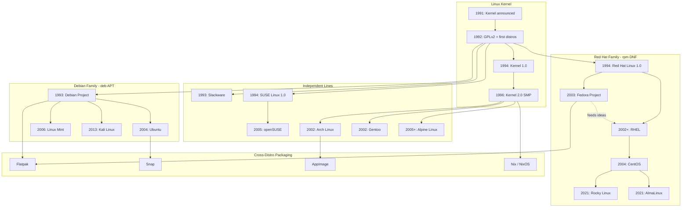

# Linux: A Love Story Featuring Finns, Free Software Zealots, and Package Managers That Will Ruin Your Weekend

Oh, Linux. What a time to be alive.

Somewhere between “I just want my printer to work” and “I recompiled my kernel because the internet dared me,” sits the operating system that powers most of the internet, most of the cloud, most of your phone’s cousin (Android), and approximately zero of the desktops your relatives will willingly touch without supervision.

This is the completely serious, not-at-all-bitter guide to where Linux came from, who made the mess, how distributions multiplied like rabbits on espresso, and why package managers exist to simultaneously save your life and destroy your afternoon.

**Historical beats in Part 1 are drawn from [Wikipedia’s History of Linux](https://en.wikipedia.org/wiki/History_of_Linux).** I paraphrased; I did not paste the article into your face. Part 2 covers distros and package managers — topics that wiki page does not really touch, because history pages love drama and hate dependency resolution.

If you wanted a short summary: a college student wrote a kernel, a free-software movement donated the furniture, corporations built empires on top, and then everybody argued for thirty years about which way to install `curl`.

The kernel itself tells the growth story in numbers Wikipedia loves to cite: from a small handful of C files in 1991 — originally under a license that **prohibited commercial distribution** — to **Linux 4.15 in 2018** with more than **23.3 million lines** of source code (comments excluded), under **GPLv2** with a syscall exception so user programs talking to the kernel via system calls are not automatically GPL’d themselves. That is not “a hobby that stayed small.” That is a hobby that ate the industry.

You’re welcome. Buckle up.

---

# Part 1: History (Wikipedia-Shaped, Sarcasm-Seasoned)

## What “Linux” Even Means (Because Apparently Words Are Optional)

Before we dive into the glorious historical dumpster fire, let’s clear up the vocabulary problem that has started more flame wars than any actual technical debate.

When people say **Linux**, they might mean:

1. **The Linux kernel** — the actual software Linus Torvalds started writing in 1991. It’s the traffic cop between hardware and everything else. Alone, it does about as much for you as a steering wheel without a car.
2. **A GNU/Linux system** — the kernel plus the GNU userland (compilers, shells, core utilities, libc, and the philosophical commitment to Freedom with a capital F). This is the “complete OS” argument Richard Stallman will remind you about until the heat death of the universe.
3. **A Linux distribution** — a curated pile of kernel + userland + installer + desktop environment + package repositories + opinions, wrapped in a logo and a Reddit community that will fight you about init systems.

Linus originally used “Linux” to mean the **kernel only**. The kernel was almost immediately paired with GNU software, which quickly became the most popular adoption of GNU’s work. Debian started calling its product **Debian GNU/Linux** in 1994. Stallman briefly pushed **Lignux** in Emacs 19.31 (May 1996) before settling on **GNU/Linux**. GNU and Debian still use that name. Everyone else says “Linux” and keeps walking.

So when your coworker says “I installed Linux,” what they usually mean is: “I installed Ubuntu, spent three hours fighting Secure Boot, and now I feel spiritually superior at coffee shops.”

Technically correct? Debatable. Emotionally accurate? Extremely.

---

## Events Leading to Creation (Or: The Universe Conspired to Make a Finnish Student Write C)

Linux did not appear in a vacuum. It appeared because Unix was influential, proprietary, expensive, and legally complicated — which is the software industry’s favorite recipe for rebellion.

### Unix: Elegant, Portable, and Not Yours

After AT&T dropped out of the **Multics** project, **Ken Thompson** and **Dennis Ritchie** at Bell Labs conceived and implemented **Unix** in 1969, first releasing it in 1970. They later rewrote it in **C** to make it portable. Unix spread through academia and business because portability and modularity were genuinely good ideas, not because vendors enjoyed sharing.

### BSD: The Cousin Who Got Sued at Thanksgiving

In 1977, UC Berkeley’s CSRG developed **BSD** (Berkeley Software Distribution), based on AT&T Unix code. Because BSD contained AT&T-owned Unix code, AT&T filed **USL v. BSDi** in the early 1990s against the University of California. That lawsuit strongly limited BSD development and adoption at exactly the wrong moment — right when the world needed a free, widely adopted kernel for cheap PCs.

### Commercial Unix Workstations and the IBM PC

**Onyx Systems** began selling microcomputer-based Unix workstations in 1980. **Sun Microsystems** — born from a Stanford student project — began selling Unix workstations in 1982. Sun machines were not commodity PC hardware, but they proved Unix could live on relatively affordable microcomputers in commercial settings.

In **1981**, **IBM** entered the personal computer market with the **IBM PC**, powered by Intel’s **8088** and built on open architecture with third-party peripherals. That open PC ecosystem would later become the hardware Linux was written for — not because IBM planned a revolution, but because “open architecture” accidentally created a platform explosion.

### GNU: Almost a Full OS, Minus the Part That Boots

In **1983**, **Richard Stallman** started the **GNU Project** to create a free UNIX-like operating system and wrote the **GNU General Public License (GPL)**. By the early 1990s, GNU had nearly enough software to assemble a complete OS. The GNU kernel, **Hurd**, had design and project-management problems. Progress slowed — especially after Linux showed up doing the one job GNU hadn’t finished.

### The 386, the Textbook, and MINIX

In **1985**, Intel released the **80386** — the first x86 CPU with a 32-bit instruction set, paging, and serious memory management. In **1986**, Maurice J. Bach published *The Design of the UNIX Operating System*, the definitive System V/BSD-era kernel description many students learned from.

In **1987**, **Andrew S. Tanenbaum** released **MINIX** for academic use alongside his textbook *Operating Systems: Design and Implementation*. MINIX source was available, but modification and redistribution were restricted. Its **16-bit design** was a poor fit for the increasingly cheap and popular **386** PCs. Commercial Unix for 386 machines was too expensive for private users.

### The Missing Kernel Problem

These factors — expensive commercial Unix, stalled Hurd, restricted MINIX, BSD tangled in lawsuits, and no widely adopted free kernel — created the vacuum Linus stepped into.

Torvalds later said that if **GNU Hurd** or **386BSD** had been ready when he started, he **probably would not have written his own kernel**. History’s response was to schedule those alternatives for “eventually” and ship Linux instead.

---

## The Creation of Linux (August 1991: A Kernel Walks Into a Newsgroup)

In **1991**, while studying computer science at the **University of Helsinki**, **Linus Torvalds** began a project that became the Linux kernel. He wrote it for his own **80386 PC** hardware because he wanted to use his new machine’s capabilities. Development happened on **MINIX** using the **GNU C Compiler**.

On **3 July 1991**, Linus posted to `comp.os.minix` trying to obtain POSIX standards documentation for implementing Unix system calls. He failed to find POSIX docs and instead pieced together system calls from **SunOS documentation** (for the university’s Sun server) and Tanenbaum’s MINIX course materials.

On **25 August 1991**, at age **21**, he announced the project to `comp.os.minix`:

> I'm doing a (free) operating system (just a hobby, won't be big and professional like gnu) for 386(486) AT clones… I've currently ported bash(1.08) and gcc(1.40), and things seem to work… Yes — it's free of any minix code… It is NOT portable (uses 386 task switching etc)…

Narrator voice: it became portable, professional-adjacent, and then the substrate under most of the professional world.

**Version 0.01** was released publicly on **17 September 1991**.

According to Torvalds, Linux began gaining real importance in **1992** after **Orest Zborowski** ported the **X Window System** to Linux — giving the kernel its first GUI path. Suddenly “hobby kernel” could mean “thing with windows,” which is how you recruit humans who do not enjoy reading `printk` output for fun.

### The POSIX Hunt and the SunOS Cheat Sheet

The July 1991 POSIX documentation hunt is a perfect origin detail: Linus was not inventing interfaces from vibes alone. He wanted standards-shaped behavior, failed to get the official docs, and did what every student since time immemorial has done — used whatever documentation the university already paid for. SunOS and MINIX course materials became the Rosetta Stone.

That is how real systems get built: ambition, hardware in your lap, incomplete standards paperwork, and the audacity to ship anyway.

---

## Naming: From “Freax” to “Linux” (Thanks, Ari Lemmke)

Linus wanted to call it **Freax** — a portmanteau of “free,” “freak,” and “x” (Unix homage). He stored files under “Freax” for about six months. He considered “Linux” but initially rejected it as too egotistical.

In **September 1991**, files went to FUNET’s FTP server (`ftp.funet.fi`). **Ari Lemmke**, a volunteer FTP admin at Helsinki University of Technology, thought “Freax” was a terrible name and renamed the project **Linux** on the server **without consulting Torvalds**. Linus later consented.

Torvalds also included an audio pronunciation guide with the kernel source, because even revolutionaries want you to say their invention correctly.

---

## Linux Under the GNU GPL (Or: How Licensing Became the Plot Twist)

### The Early “No Commercial Distribution” License

Torvalds first published Linux under his own license, which prohibited commercial distribution fees — including “handling” costs. Full source had to remain available. Copyright notices had to stay intact. The core requirement was reasonable. The commercial restriction was the part that would eventually collide with reality, because “free software” and “nobody can charge for copies” are related ideas that are not identical twins.

Here is the spirit of that early restriction, paraphrased from the original license text:

- Full source must be available (and free), on distribution or on request
- Copyright notices must remain intact
- You may not distribute the kernel for a fee — not even “handling” costs

That last bullet aged poorly in a world where companies would soon sell **support**, **certification**, and **someone to blame at 3 a.m.** instead of selling the tarball itself.

### Why the Kernel Needed GNU Software to Be Useful

Linux 0.01 shipped with a binary of GNU **Bash**. In his release notes, Torvalds wrote the line that still defines the ecosystem:

> Sadly, a kernel by itself gets you nowhere. To get a working system you need a shell, compilers, a library etc.

Most tools used with Linux were GNU software under GNU copyleft. The kernel was the missing piece; GNU was the furniture, plumbing, and kitchen appliances.

### GPLv2: The Best Decision He Ever Made

In **1992**, Torvalds proposed relicensing under the **GNU GPL**, announced in **Linux 0.12** release notes. GPL took effect **1 February 1992**. **Version 0.95** (7 March 1992) used GPL explicitly. Torvalds later said: **“making Linux GPLed was definitely the best thing I ever did.”**

Around **2000**, Torvalds clarified the kernel uses **GPLv2 only** — not “GPLv2 or later.” When **GPLv3** arrived in **2007**, Torvalds and most kernel developers rejected it. The kernel stayed on v2. The universe kept spinning, mostly.

Kernel developers’ GPLv3 objections (summarized from their 2006 position paper) included concerns about DRM clauses, additional restriction language, and patent provisions — not because they hate freedom, but because they believed v3 would balkanize the open-source universe they depended on. Torvalds later framed it as a split between FSF philosophy and Linux’s more pragmatic engineering culture.

---

## Tux: Because Every Serious Project Needs a Flightless Bird in Formalwear

In **1996**, Torvalds announced Linux would have a mascot: a **penguin**. Inspiration: he was bitten by a little penguin (*Eudyptula minor*) at the National Zoo & Aquarium in Canberra, Australia.

**Larry Ewing** drafted the famous Tux image. **James Hughes** suggested the name **Tux** — Torvalds’ UniX, plus tuxedo. Marketing had discovered cute flightless birds. The rest is sticker and conference swag history.

---

## “Linux Is Obsolete” (Tanenbaum’s Greatest Hit)

In **January 1992**, Andrew S. Tanenbaum posted **“LINUX is obsolete”** on `comp.os.minix`. Major criticisms:

- Linux’s **monolithic kernel** was old-fashioned
- **386-specific** design made portability “basically wrong”
- No single person strictly controlled source
- Features like multithreaded filesystems were “performance hacks”

Tanenbaum predicted Linux would be replaced within years by **GNU Hurd**, the modern microkernel future. Hurd is still not production-server stable. Linux was ported to essentially every major platform. Intel’s “weird” x86 line became ubiquitous.

The debate became legend. Academia got papers. Linux got the datacenter.

### The Samizdat Kerfuffle

In Kenneth Brown’s unpublished *Samizdat*, Brown claimed Torvalds illegally copied MINIX code. In **May 2004**, Tanenbaum refuted it directly: MINIX influenced Linux’s filesystem layout and source-tree naming, but **Linus wrote the kernel** and did not use Tanenbaum’s code. The book was never released and was delisted.

---

## Growth, Community, and Corporate Gravity

### The Community Does the Work (Often on Company Time)

Most Linux development is done by a global community sending improvements to maintainers. Companies contribute kernel work and auxiliary software. As of **February 2015**, over **80% of Linux kernel developers were paid**.

Linux ships through community projects like **Debian** and company-connected projects like **Fedora** and **openSUSE**. Conferences like **LinuxTag** in Germany draw thousands annually — proof that “free software” can still support an economy of hoodies, stickers, and hotel conference rooms.

### OSDL → Linux Foundation

The **Open Source Development Lab (OSDL)** was created in **2000** to optimize Linux for data centers and carriers. It sponsored workspace for **Linus Torvalds** and **Andrew Morton** (until Morton moved to Google in 2006).

On **22 January 2007**, OSDL merged with the Free Standards Group to form **The Linux Foundation**, focused on promoting Linux against Windows. Torvalds remained a Linux Foundation Fellow.

### Companies Profit From Free Software (Shocking, I Know)

Dell, IBM, HP, Red Hat (now part of IBM), SUSE, and others invest heavily in Linux — hardware donations, paid developers, enterprise distributions. **Digia** supported Linux through **Qt** (LGPL), enabling **KDE** and employing X/KDE developers.

Free kernel. Paid civilization around it. Capitalism, meet hydra.

### Eric S. Raymond and the Cathedral/Bazaar Moment

In **1998**, Raymond published **The Cathedral and the Bazaar** — first as essay, later as book. **Netscape** cited it when open-sourcing Navigator, which put Linux’s development model in front of the mainstream technical press. Whether you treat the essay as scripture or snackable mythology, it gave managers vocabulary to say “open collaboration” without admitting they still feared production `make menuconfig`.

---

## Desktop Environments: GUI Civil Wars as Documented by Wikipedia

**KDE 1.0** arrived July **1998** as the first advanced desktop environment — controversial because **Qt** was then proprietary. **GNOME** was created as a free alternative.

By **April 2007**, one journalist estimated KDE held ~65% market share vs ~26% for GNOME. **KDE 4** (January 2008) shipped prematurely and buggy, pushing some users toward GNOME. **GNOME 3** (April 2011) drew Linus Torvalds’ “**unholy mess**” verdict.

**Cinnamon** forked from GNOME 3, developed primarily by Linux Mint’s Clement LeFebvre, restoring a more traditional desktop.

**Ubuntu** released **Unity** in **June 2011** — radically different, criticized for flaws and poor configurability, intended for desktop/tablet convergence. Ubuntu Touch was unveiled January 2013. In **April 2017**, Canonical canceled Ubuntu Touch to focus on IoT (**Ubuntu Core**) and dropped Unity, switching Ubuntu to **GNOME** from **17.10** onward.

If you wanted one desktop to rule them all, Linux said: “Here are six, plus forks, plus Linus yelling at one of them.”

---

## Microsoft: From Halloween Documents to Azure Linux

Between **1997 and 2001**, Microsoft and Linux had antagonistic interactions. In **1998**, Eric S. Raymond publicized the first **Halloween document** — a Microsoft developer essay on free software threats and counter-strategies. Microsoft published **“Linux Myths”** comparisons in **October 1999**.

In **2004**, Microsoft’s **“Get the Facts”** campaign claimed Windows beat Linux on reliability, security, and TCO. **Novell** responded with **“Unbending the truth.”** **IBM** published competitive studies. **Red Hat** ran **“Truth Happens.”**

In **autumn 2006**, **Novell and Microsoft** announced interoperability and patent-protection cooperation — controversial because protection extended to non-commercial free software developers but not commercial or closed-source developers.

### The 2009 GPL Plot Twist

In **July 2009**, Microsoft submitted **22,000 lines** of Linux kernel code under **GPLv2** for Hyper-V guest support. Historic? Yes. Altruistic? No. **Stephen Hemminger** discovered Microsoft had violated GPL by statically linking GPL components into closed-source Hyper-V drivers. Microsoft contributed code to fix the violation, then tried to brand it charity.

Microsoft had previously called Linux a **“cancer”** and **“communist.”** By **2011**, Microsoft was the **17th-largest kernel contributor**. By **February 2015**, it was no longer in the top 30 sponsor contributors.

**Windows Azure** (2008, later **Microsoft Azure**) incorporated Linux. In **August 2018**, **SUSE** created an Azure-tuned kernel. Torvalds later told ZDNet the anti-Microsoft era was “sometimes funny as a joke, but not really,” and that Microsoft engineers now seemed happy working on Linux.

In **May 2023**, Microsoft publicly released **Azure Linux**.

The arc of history bends toward `./configure && make`.

### A Note on “Linux Is a Cancer”

Microsoft’s earlier rhetoric — Linux as **cancer**, **communist**, existential threat — did not age gracefully. What aged fine: GPL enforcement still works, enterprises still run Linux, and Microsoft now ships Linux kernels, contributes driver code, tunes Azure images with SUSE, and publishes **Azure Linux**. The Halloween documents were never love letters, but the ending is stranger than the fanfic.

---

## SCO: When Legal Theater Tried to Tax Reality

In **March 2003**, **SCO Group** accused **IBM** of violating Unix copyrights by transferring code to Linux. SCO sold Linux licenses to nervous users. **Novell** also claimed Unix copyrights and sued SCO.

In **2007**, SCO specified only **326 lines** of alleged infringement — not the million lines originally claimed. In **August 2007**, a court ruled SCO did **not** hold Unix copyrights. Appeals followed; a **30 March 2010** jury verdict favored **Novell**.

SCO filed for **bankruptcy**.

### Why SCO Mattered Even After It Lost

SCO was FUD-as-a-business-model: sell Linux licenses for code you could not prove was yours, sue IBM, hope the market flinches. Novell’s copyright win did not just end a lawsuit — it clarified that the Unix→Linux lineage argument was not going to be settled by vibes and press releases.

Every few years someone tries a similar playbook. The community response remains: lawyers, groklaw-style diligence (RIP), and continuing to ship software anyway.

---

## Trademark Wars: Linus Protects “Linux” From Trademark Trolls

In **1994–1995**, multiple parties tried to register **“Linux”** as a trademark and demanded royalties. **Linus Torvalds**, with **Linux International**, secured the trademark and transferred it to Linux International. Administration later moved to the nonprofit **Linux Mark Institute**.

In **June 2005**, LMI raised trademark sublicense fees from **$500 to $5,000**, citing legal costs. The community revolted. On **21 August 2005**, Torvalds explained in a mailing-list post that trademark protection exists so bad actors cannot squat the name — and that **he does not profit** from trademark fees; LMI historically **lost money** on legal work.

LMI later offered a **free, perpetual worldwide sublicense**.

You can still name your distro “MyLinux.” You probably should not name your scamware “Official Linux Enterprise Cloud Pro Max” without consequences.

---

## Chronology Highlights: The Wikipedia Bullet List, Narrated

Wikipedia’s chronology section is the spine of Part 1. Here is what those years actually mean in human terms — not just “kernel version went up,” but “the world rearranged itself again.”

| Year | What happened | Why it mattered |
|------|---------------|-----------------|
| **1991** | Kernel announced 25 Aug; 0.01 released 17 Sep | The starting gun |
| **1992** | GPL relicensing; first distros; X11 port | Legally compatible + installable + graphical |
| **1993** | 100+ kernel devs; Slackware + Debian | Scale + packaging culture begins |
| **1994** | Kernel 1.0; Red Hat + SUSE 1.0; XFree86 GUI | “Mature” kernel + commercial distro market |
| **1995** | Alpha + SPARC ports | Not just PC toy anymore |
| **1996** | Kernel 2.0 + SMP; Tux mascot | Serious server contender + branding |
| **1998** | IBM/Compaq/Oracle support; KDE; TOP500; Cathedral & Bazaar | Enterprise legitimacy + desktop race + cultural manifesto |
| **1999** | GNOME begins; kernel 2.2; IBM Linux push | Free desktop alternative to proprietary Qt era |
| **2000** | Dell full-line Linux; OSDL founded | Hardware OEMs + paid kernel infrastructure |
| **2001** | Kernel 2.4 | Major kernel era for years of production use |
| **2002** | “Microsoft killed Dell Linux” headlines | Platform politics as spectator sport |
| **2003** | Kernel 2.6; SCO lawsuit | Long-lived kernel branch + legal circus |
| **2004** | X.Org; Get the Facts; first distros mature further | Faster graphics stack + vendor FUD wars |
| **2005** | openSUSE; OpenDocument in OpenOffice 2.0 | Community SUSE + document standards side quest |
| **2006** | Oracle’s RHEL clone; Novell-Microsoft deal | Enterprise cloning + controversial peace treaty |
| **2007** | Linux Foundation; Dell Ubuntu laptops | Institutional home + consumer-ish OEM shipping |
| **2009** | Red Hat market cap ≈ Sun; MS kernel code | Symbolic economic shift + GPL enforcement win |
| **2011** | Kernel 3.0 | Version number theater with real engineering underneath |
| **2012** | Linux server revenue > rest of Unix | Economic victory lap in the datacenter |
| **2013** | Android 75% smartphone shipments | Linux kernel in pockets at scale |
| **2014** | Ubuntu claims 22M users | Desktop niche still loudly alive |
| **2015** | Kernel 4.0 | Continued evolution |
| **2017** | 100% TOP500; Unity dies | Supercomputer monopoly + Canonical UI retreat |
| **2019** | Kernel 5.0 | Still going |
| **2022** | Kernel 6.0 | Still going |
| **2023** | Azure Linux GA | Microsoft ships its own Linux distro anyway |
| **2026** | Kernel 7.0 | Wikipedia’s chronology marches on |

If you are reading this in the future and kernel 8.0 has already dropped while your LTS box is still compiling Firefox: welcome to the club.

---

## Major Milestones: Wikipedia Chronology, Rendered as Mermaid

Because nothing says “mature engineering culture” like compressing decades of drama into a diagram:

```mermaid
timeline
    title Linux History Milestones (from Wikipedia Chronology)
    1969-1970 : Unix conceived and released
               : Thompson and Ritchie at Bell Labs
    1977 : BSD developed at UC Berkeley
    1983 : GNU Project announced
         : Stallman writes GPL
    1985 : Intel 80386 released
    1987 : MINIX released by Tanenbaum
    1991 : 25 Aug kernel announced by Torvalds
         : 17 Sep version 0.01 released
    1992 : Kernel relicensed under GNU GPL
         : First Linux distributions created
         : X11 port brings first GUI
    1993 : 100+ kernel developers
         : Slackware and Debian established
    1994 : Linux kernel 1.0 released
         : Red Hat and SUSE publish v1.0 distros
    1995 : Ports to DEC Alpha and Sun SPARC
    1996 : Kernel 2.0 with SMP support
         : Tux mascot announced
    1998 : IBM Compaq Oracle back Linux
         : Cathedral and the Bazaar published
         : KDE development begins
         : Linux on TOP500 supercomputers
    1999 : GNOME development begins
         : Kernel 2.2 released
    2000 : Dell offers Linux across product line
         : OSDL created
    2001 : Kernel 2.4 released
    2003 : Kernel 2.6 released
         : SCO lawsuit begins
    2004 : X.Org Foundation formed
         : Microsoft Get the Facts campaign
    2005 : openSUSE community project begins
    2006 : Novell-Microsoft cooperation announced
    2007 : Linux Foundation formed
         : Dell ships Ubuntu laptops
    2009 : Red Hat market cap equals Sun
         : Microsoft contributes Hyper-V drivers
    2011 : Kernel 3.0 released
    2012 : Linux server revenue exceeds other Unix
    2013 : Android claims 75% smartphone shipments
    2014 : Ubuntu claims 22 million users
    2015 : Kernel 4.0 released
    2017 : All TOP500 supercomputers run Linux
         : Canonical drops Unity for GNOME
    2019 : Kernel 5.0 released
    2022 : Kernel 6.0 released
    2023 : Microsoft releases Azure Linux
    2026 : Kernel 7.0 released
```



If that timeline feels incomplete: good. Linux history is less a straight line and more a hydra that grows new heads whenever someone says “this packaging format will unify everyone.”

---

# Part 2: Distributions and Package Managers (Beyond the Wikipedia Page)

The Wikipedia history ends around chronology, lawsuits, and desktop drama. It does not explain why your `apt upgrade` just held 47 packages hostage. That is this section.

## What a Distribution Actually Is

A **distribution** is what happens when someone says:

> We will choose a kernel version, a userspace, an installer, a default desktop (or none), a release cadence, a package format, a set of repositories, a security update policy, and a community vibe — then we will name it something mythological, geographical, or aggressively lowercase.

Distributions exist because the raw kernel is not a product. Humans need installers, curated packages, update policies, and someone to blame when audio breaks after an upgrade.

The wiki chronology gives us the origin beats:

- **1992:** first distributions
- **1993:** **Slackware** (oldest still-existing distro) and **Debian**
- **1994:** **Red Hat** and **SUSE** publish 1.0
- **2005:** **openSUSE** community distribution
- **2007:** Dell ships **Ubuntu** laptops

Everything after that is forks, enterprise suits, and packaging theology.

## Distribution Family Tree and Release Timeline



### The Big Families, Explained Like You’re Choosing a Religion

#### Debian and Friends: Stability Theater with Actual Stability

**Debian** (1993, Ian Murdock) became the “do it properly” distribution — community governance, careful packaging, policy documents dense enough to stop a tank. Today it is the largest community distribution.

**Ubuntu** (2004, Canonical) took Debian’s `.deb` excellence and added predictable releases, desktop focus, and marketing that reached humans who did not want to read a constitution first.

**Linux Mint**, **Kali**, and countless remixes live in Debian’s blast radius.

#### Red Hat / Fedora / RHEL: Enterprise Cosplay That Became Enterprise Reality

**Red Hat Linux 1.0** shipped in **1994**. **RHEL** became the business suit. **Fedora** (2003) became the upstream playground. **CentOS** (2004) was “RHEL without the invoice” until the **CentOS Stream** pivot, after which **Rocky Linux** and **AlmaLinux** (2021) entered as community replacements.

**Oracle** released its own RHEL-based distribution in **2006**, because enterprise IT loves déjà vu with licensing.

#### Slackware: The Elder Scrolls

**Slackware** (1993) is the oldest surviving distro — old-school, simple package tools, no apologies. If Debian is a bureaucracy and Ubuntu is a product, Slackware is a workshop with labeled drawers.

#### SUSE / openSUSE

**SUSE Linux 1.0** arrived in **1994**. **openSUSE** (2005) became Novell’s community distribution. **zypper**, **YaST**, and German engineering thoroughness define the vibe.

#### Arch, Gentoo, Alpine: For People Who Chose Violence

- **Arch** (2002): rolling release, `pacman`, wiki-as-sacred-text
- **Gentoo** (2002): **Portage**, USE flags, compile your feelings
- **Alpine** (2005+): **apk**, **musl**, container darling

#### Wikipedia-Era Desktop Politics You Still Feel

The wiki’s desktop section is a graveyard of good intentions:

- **KDE** vs **GNOME** because Qt licensing scared people
- **KDE 4** and **GNOME 3** shipped rough transitions; users fled to calmer shores
- **Cinnamon** forked because GNOME 3 offended human beings with muscle memory
- **Unity** tried desktop/tablet convergence; Canonical canceled Touch in 2017 and returned to GNOME

None of this is the kernel’s fault. All of it becomes what users mean when they say “Linux on the desktop” — which is really “a distro plus a desktop plus whether the settings app crashes.”

---

## Release Models: Choose Your Fighter

| Model | Vibe | Examples | Your future |
|-------|------|----------|-------------|
| **Stable / point releases** | Change is scheduled | Debian Stable, Ubuntu LTS, RHEL | Predictability, older packages |
| **Rolling** | Change is a lifestyle | Arch, openSUSE Tumbleweed, Gentoo | Fresh software, educational breakage |
| **LTS** | Please do not surprise me | Ubuntu LTS, RHEL | Long support, conservative packages |
| **Immutable / image-based** | OS is a snapshot | Fedora Atomic, NixOS | Transactional updates, new muscle memory |

The “Year of the Linux Desktop” has been imminent since the invention of sarcasm. Meanwhile Linux won servers (2012: Linux server revenue exceeded other Unix), supercomputers (2017: all TOP500), and pockets (2013: Android 75% smartphone shipments).

### Supercomputers and Android: The Victories Wikipedia Actually Counts

Two chronology entries deserve extra sarcasm because they are not niche bragging — they are market structure:

**2017 — All TOP500 supercomputers run Linux.** At that point, arguing about desktop share while every serious HPC cluster runs your kernel is like debating paint colors on a battleship.

**2013 — Android claims 75% of smartphone shipments.** Android is not “a Linux desktop,” but it is the Linux **kernel** in billions of pockets. If your uncle says “I don’t use Linux,” his phone disagrees on a technicality he will not enjoy hearing at Thanksgiving.

**2012 — Linux server revenue exceeds the rest of the Unix market.** The datacenter had already picked a side. Everything since has been consolidation, containers, and licensing theater.

---

## Package Managers: The Real Final Boss

You can survive without knowing scheduler internals. You cannot survive long without a package manager unless you enjoy compiling software like it’s 1997 and bandwidth is a rumor.

### What Problem Are Package Managers Solving?

Software is binaries, libraries, config files, man pages nobody reads until 3 a.m., and dependencies that depend on dependencies last updated during a previous presidency.

A package manager fetches the right versions, verifies them, installs cleanly, tracks what it touched, and ideally removes them without turning `/usr` into modern art.

When it works: invisible magic. When it fails: a dependency conflict so personal it feels like the computer is judging your life choices.

### How Package Managers Work (Shared Machinery)

Despite every distro pretending its approach is uniquely enlightened, most traditional package managers share the same skeleton:

#### 3. Dependency Resolution: The Sudoku Nobody Asked For

The **depsolver** looks at what you want, what you have, and what the universe requires. It tries to satisfy dependencies, avoid conflicts, and prefer acceptable versions under distro policy.

When it fails, you get classics like:

- `Unable to correct problems, you have held broken packages`
- `nothing provides libfoo.so.3`
- `Error: Transaction check error`
- Arch’s spiritual equivalent: silence, then a forum post from 2011 that still applies

Dependency hell is not a myth. It is a scheduling problem where every package author assumed they were the main character.

#### 4. Trust: Signatures, Hashes, and Bad Life Choices

Sane systems verify HTTPS transport, repository signing keys, and package hashes against metadata. Disabling `gpgcheck` or `AllowUnauthenticated` because “it was blocking me” is how you turn your server into a malware pen pal program.

#### 5. Transaction: Download, Verify, Unpack, Configure, Regret

Typical install flow:

1. Resolve dependencies
2. Download packages
3. Verify integrity
4. Unpack onto filesystem
5. Run maintainer scripts (`postinst`, `%post`, install hooks)
6. Update local package database
7. Discover a service restart at the worst possible moment

#### 6. Local Database: Memory of Sins Past

Package managers track installed packages and owned files. This enables clean removal — and makes manual `rm -rf /usr/lib/something` a haunted-house generator.

#### 7. Upgrades and Removals

Upgrades change SONAMEs, spawn `.dpkg-dist` / `.rpmnew` config siblings, restart services, and leave kernel updates waiting for a reboot you will postpone until guilt wins.

`autoremove` cleans orphaned dependencies. Or you keep them forever as archaeological evidence.

### Binary vs Source vs Universal Packages

| Approach | What you get | Cost |
|----------|--------------|------|
| **Distro binaries** | Fast, integrated installs | Versions tied to release policy |
| **Source builds (Portage)** | Customization | Time, heat, responsibility |
| **Language managers (pip/npm)** | Dev ecosystem speed | System Python carnage |
| **Flatpak/Snap/AppImage** | Newer apps across distros | Duplication, sandbox debates |

Using `pip install` as root into system Python remains a top-ten way to make a sysadmin age in dog years.

---

## The Package Manager Catalog

### APT + dpkg (Debian, Ubuntu, and Infinite Remixes)

**`dpkg`** installs `.deb` files. **`apt`** is the civilized frontend.

```bash
sudo apt update
sudo apt install htop
sudo apt upgrade
```

`apt update` refreshes indexes. `apt install` resolves deps, fetches `.deb`s, hands them to `dpkg`. Debian’s packaging policy is bureaucracy until you realize it prevents random packages from overwriting `/etc` interpretively.

**PPAs**, **pinning**, and **backports** get newer software without yeeting your stable system into space — if you respect the blast radius.

Common APT footguns:

- `apt upgrade` vs `apt full-upgrade` — the latter will remove packages to resolve conflicts; read the prompt like it matters
- Stale PPAs after distro release upgrades — the graveyard of `apt update` errors
- `dpkg-reconfigure` — when a package’s postinst drama needs adult supervision

### RPM + YUM/DNF (Fedora, RHEL, Rocky, Alma)

**RPM** is format + low-level tool. **DNF** replaced **YUM** as the modern depsolver frontend.

```bash
sudo dnf install htop
sudo dnf upgrade
```

RPM ecosystems emphasize strong metadata, vendor repos, and enterprise update cadences that make change-management committees weep tears of joy (or boredom — hard to tell).

Useful RPM-era concepts:

- **Vendor repos** in `/etc/yum.repos.d/` — enable carefully
- **`rpm -qf /path/to/file`** — which package owns this file?
- **`dnf history`** — audit trail for “who installed this horror?”

If APT is a polite committee, DNF is a project manager with a spreadsheet and a deadline.

### pacman (Arch)

```bash
sudo pacman -Syu
sudo pacman -S htop
```

Rolling release means `-Syu` is “update everything” and “accept that today might be educational.” The **AUR** is incredible and a trust exercise — read the `PKGBUILD` or eat gas-station sushi.

Pacman tips:

- Always read `-Syu` output before pressing Enter
- `pacman -Qi pkg` shows why that package exists on your machine
- AUR helpers automate builds; they do not automate judgment

### zypper (openSUSE)

```bash
sudo zypper refresh
sudo zypper install htop
```

Patterns bundle related packages. YaST exists if you prefer clicking through destiny. openSUSE is what happens when a distro decides comprehensiveness is a feature, not a bug.

### Portage (Gentoo)

Builds from source with **USE flags**. Peak control, peak compile times, peak accountability.

Gentoo is what happens when you look at binary packages and say, “I would like to know exactly which compile-time features created this executable, and I would like to wait for it.” Respectful. Unhinged. Valid.

### apk (Alpine)

```bash
apk add htop
```

Fast, minimal, container-native. **musl** means “it worked on Ubuntu” is not a legal guarantee.

Alpine’s quiet victory: minimal base images became default instinct. Then everyone layered 2GB of build tools back on top anyway, because CI pipelines are comedy.

### Nix and Guix

Functional package management: immutable store paths, reproducible environments, rollbacks as a feature. NixOS makes the entire OS declarative — paradise or hostage situation, depending on the day.

Think of Nix as answering: “What if `/usr` fights were replaced by precise store paths and generations you can roll back?” Think of traditional apt/dnf as answering: “What if we negotiated with a mirror at 2 a.m. and hoped?” Both are valid. Only one makes good conference talks.

### Flatpak, Snap, AppImage

- **Flatpak**: sandboxed apps + runtimes; **Flathub** as storefront
- **Snap**: Ubuntu-championed, `snapd` daemon, channels, philosophical debates
- **AppImage**: portable single-file apps; update hygiene varies

These exist because distro release cycles and app developer cycles are in a toxic relationship. Universal packages are couples therapy with residual resentment.

When to reach for universal packages:

- You need a newer app than your LTS repo will ship for months
- Upstream only officially supports Flatpak/Snap
- You want sandboxing for untrusted GUI apps

When to avoid them:

- You are managing servers and thought `snap install` on production was “modern”
- Disk is small and runtimes duplicate LibreOffice seventeen ways
- You need deep system integration (themes, portals, polkit quirks become your hobby)

---

## Repository Internals: What Happens Before `install` Works

Package managers feel like magic until you see the plumbing. Most distro repos publish:

- **Package index files** — compressed catalogs of available versions
- **Dependency metadata** — what each package needs and conflicts with
- **Signatures** — proof the index and packages came from the vendor you think they did

On Debian/Ubuntu, `apt update` pulls `InRelease`/`Release` files and `Packages` indexes. On Fedora, DNF reads repo XML metadata. On Arch, `pacman -Sy` syncs package databases from mirrors.

Mirrors exist because downloading everything from one server in Finland (historically very on-brand for Linux) does not scale. Your package manager picks a mirror, downloads indexes, then downloads actual packages only when you install.

This is why “just copy the `.deb` from a random forum” is a different sport from using signed repositories — one is package management, the other is trust fall with malware potential.

---

## Key People Woven Through the Wikipedia Story

History is not lone geniuses in caves. It is lone geniuses plus mailing lists plus lawyers plus people who name FTP folders without asking.

| Person | Role in the wiki narrative |
|--------|---------------------------|
| **Ken Thompson / Dennis Ritchie** | Created Unix; the ancestral debt |
| **Richard Stallman** | GNU Project, GPL, GNU/Linux naming crusade |
| **Andrew S. Tanenbaum** | MINIX, “Linux is obsolete,” refuted plagiarism claims |
| **Linus Torvalds** | Wrote the kernel, picked GPL, named Tux era, later Git |
| **Ari Lemmke** | Renamed Freax → Linux on FUNET FTP |
| **Orest Zborowski** | X11 port that made GUI Linux plausible |
| **Larry Ewing / James Hughes** | Tux artwork and naming |
| **Ian Murdock** | Founded Debian (1993) |
| **Eric S. Raymond** | Published Halloween documents; Cathedral & Bazaar |
| **Greg Kroah-Hartman** | Accepted Microsoft’s 2009 driver code as kernel maintainer |

The thousands of unnamed contributors remain the actual engine. The famous names are just the ones your conference badge printer knows.

---

## Comparison Table (When Your Brain Is Full)

| Manager | Distro world | Format | Superpower | Classic footgun |
|---------|--------------|--------|------------|-----------------|
| APT/dpkg | Debian/Ubuntu | `.deb` | Packaging culture | PPAs + partial upgrades |
| DNF/RPM | Fedora/RHEL | `.rpm` | Enterprise rigor | Repo/module confusion |
| pacman | Arch | `.pkg.tar.zst` | Simple rolling | Blind AUR installs |
| zypper | openSUSE | RPM | Patterns + solver | Ignoring vendor docs |
| Portage | Gentoo | ebuilds | Custom builds | Mis-set USE flags |
| apk | Alpine | `.apk` | Tiny images | musl surprises |
| Nix/Guix | NixOS+ | store paths | Reproducibility | Learning curve |
| Flatpak | Many | Flatpak | Fresh desktop apps | Disk duplication |
| Snap | Ubuntu+ | Snap | Easy channels | Daemon opinions |
| AppImage | Many | AppImage | Portable singles | Ad-hoc updates |

---

## Choosing a Distro (Really: Choosing a Packaging Culture)

People think they choose a distro for wallpaper. They actually choose:

1. Update temperament — surprise me vs schedule me
2. Package freshness vs stability
3. Commercial support needs
4. Whether they want to learn packaging or merely consume it

Cheat sheet:

- Servers with support contracts? **RHEL** or clones
- Desktops relatives might survive? **Ubuntu** or **Mint**
- Learn by breaking things? **Arch** or **Gentoo**
- Tiny containers? **Alpine**
- Reproducibility religion? **NixOS**
- Vintage comfort? **Slackware**

There is no universally correct answer. Only the answer matching your tolerance for chaos.

---

## Real-World Package Manager Scenarios (Where Theory Meets Pain)

### Scenario 1: The LTS Desktop That Wants Bleeding-Edge Software

You run Ubuntu LTS because you value stability. You also want the latest browser yesterday. Your options:

1. Wait for backports (virtuous, slow)
2. Add a PPA (powerful, fragile)
3. Install Flatpak/Snap (isolated, disk-hungry)
4. Compile from source (educational, unsustainable)

There is no cheat code. Only tradeoffs wearing different hats.

### Scenario 2: The Server That Mixed Repos Because Someone Was “Helpful”

Someone enabled EPEL, RPM Fusion, a random COPR, and a third-party MySQL repo on the same RHEL box. Now `dnf update` wants to replace half the universe. The fix is never “force it.” The fix is audit repos, remove the offender, restore vendor consistency, and schedule a therapy session for whoever `-y`’d through the warnings.

### Scenario 3: The Arch Machine Someone Didn’t Update for Six Months

`pacman -Syu` after six months of neglect is not an update. It is a boss fight. The wiki will tell you to read the news page. The news page will tell you about manual interventions. You will wish you had updated weekly like a responsible adult.

### Scenario 4: Alpine in Docker vs Alpine on a Host

`apk add` in a container is delightful until you copy binaries from a glibc Ubuntu image into an Alpine musl container and wonder why symbols are missing. Package managers work inside their ecosystem. libc choices are not cosmetic.

---

## Package Manager Survival Tips

1. Prefer your distro’s packages for system-level tools
2. Don’t mix incompatible repos into “Broken Boot: The Mixtape”
3. Read release notes before major upgrades
4. Keep `/etc` under version control if you value weekends
5. Reboot after kernel updates before declaring victory
6. Never `chmod 777` your way out of packaging problems
7. Containers relocate mystery; they do not eliminate it
8. Before forcing a dependency overwrite, ask: system or crime scene?

### Maintainer Scripts: The Part Nobody Admits Is Scary

Packages are not just files. They carry **pre/post install and removal scripts** that run as root. Most maintainers are careful. Some assume network, specific usernames, or running services. When a postinst fails halfway, you get the special joy of a package manager reporting “installed” while your service is spiritually elsewhere.

That is not a reason to avoid package managers. It is a reason to read logs, use `apt -s` / `dnf install --assumeno` dry-run habits, and snapshot VMs before heroic upgrades.

---

## Closing: Kernel, Commons, Package Database

Linux began in **1991** as a Finnish student’s hobby kernel announcement. It grew from a handful of C files under a no-commercial-distribution license into tens of millions of lines under **GPLv2**, powering servers, supercomputers, clouds, and billions of Android devices.

The history matters: **Unix** and **BSD** lineages, **GNU**’s almost-complete OS, **MINIX**’s classroom influence, **Linus**’s 386 kernel, **GPL** adoption, **Tux**, the **Tanenbaum** debate, **KDE/GNOME/Unity** desktop wars, **Microsoft**’s journey from Halloween documents to **Azure Linux**, **SCO**’s legal collapse, and **trademark** protection keeping the name from becoming a free-for-all.

The distros matter: **Slackware** and **Debian** in 1993, **Red Hat** and **SUSE** in 1994, the enterprise and community forks that followed.

The package managers matter on ordinary Tuesdays — when you’re not writing history, just trying to install `git` without summoning dependency demons.

Linux is complicated. Distributions are legion. Package managers are simultaneously the best idea in Unix history and the reason your terminal is negotiating with a mirror in another hemisphere.

But it works.

Mostly.

And when it doesn’t, there’s a wiki, a man page, a forum post from 2007 that still applies, and a package manager flag you will memorize only after it has hurt you personally.

If you made it from **Multics** drama through **SCO** bankruptcy to **Flatpak** runtime obesity, you now understand Linux better than most people who tweet hot takes about it. You also understand why the community is simultaneously proud, exhausted, and weirdly still shipping.

Welcome to Linux. Check your `/etc`, update your indexes, and try not to install things as root from curated lists of vibes.

---

## Appendix A: Command Rosetta Stone

| Task | Debian/Ubuntu | Fedora/RHEL | Arch | Alpine |
|------|---------------|-------------|------|--------|
| Refresh indexes | `sudo apt update` | `sudo dnf check-update` | `sudo pacman -Sy` | `apk update` |
| Install package | `sudo apt install pkg` | `sudo dnf install pkg` | `sudo pacman -S pkg` | `apk add pkg` |
| Upgrade system | `sudo apt upgrade` | `sudo dnf upgrade` | `sudo pacman -Syu` | `apk upgrade` |
| Remove package | `sudo apt remove pkg` | `sudo dnf remove pkg` | `sudo pacman -R pkg` | `apk del pkg` |
| Search | `apt search keyword` | `dnf search keyword` | `pacman -Ss keyword` | `apk search keyword` |

---

## Appendix B: Glossary

- **Kernel**: Core program managing hardware and processes
- **Distro**: Complete OS built around the kernel with opinions attached
- **Package**: Versioned bundle of files, metadata, and scripts
- **Repository**: Hosted collection of packages and indexes
- **Dependency**: Software your software refuses to live without
- **LTS**: Long-term support; fewer features, more “please don’t explode”
- **Rolling release**: Continuous updates; excitement included free of charge
- **Userspace**: Everything outside the kernel where your work happens
- **Flame war**: Debate where nobody’s printer gets fixed but everyone feels heard

---

*If this article helped you understand Linux, great. If it only made you more sarcastic about package managers, also great — you’re ready.*
