Oh, Linux. What a time to be alive.

Somewhere between “I just want my printer to work” and “I recompiled my kernel because the internet dared me,” sits the operating system that powers most of the internet, most of the cloud, most of your phone’s cousin (Android), and approximately zero of the desktops your relatives will willingly touch without supervision.

This is the completely serious, not-at-all-bitter guide to where Linux came from, who made the mess, how distributions multiplied like rabbits on espresso, and why package managers exist to simultaneously save your life and destroy your afternoon.

**Historical beats in Part 1 are drawn from [Wikipedia’s History of Linux](https://en.wikipedia.org/wiki/History_of_Linux).** I paraphrased; I did not paste the article into your face. Part 2 covers distros and package managers — topics that wiki page does not really touch, because history pages love drama and hate dependency resolution.

If you wanted a short summary: a college student wrote a kernel, a free-software movement donated the furniture, corporations built empires on top, and then everybody argued for thirty years about which way to install `curl`.

The kernel itself tells the growth story in numbers Wikipedia loves to cite: from a small handful of C files in 1991 — originally under a license that **prohibited commercial distribution** — to **Linux 4.15 in 2018** with more than **23.3 million lines** of source code (comments excluded), under **GPLv2** with a syscall exception so user programs talking to the kernel via system calls are not automatically GPL’d themselves. That is not “a hobby that stayed small.” That is a hobby that ate the industry.

You’re welcome. Buckle up.

---

# Part 1: History (Wikipedia-Shaped, Sarcasm-Seasoned)

## What “Linux” Even Means (Because Apparently Words Are Optional)

Before we dive into the glorious historical dumpster fire, let’s clear up the vocabulary problem that has started more flame wars than any actual technical debate.

When people say **Linux**, they might mean:

1. **The Linux kernel** — the actual software Linus Torvalds started writing in 1991. It’s the traffic cop between hardware and everything else. Alone, it does about as much for you as a steering wheel without a car.
2. **A GNU/Linux system** — the kernel plus the GNU userland (compilers, shells, core utilities, libc, and the philosophical commitment to Freedom with a capital F). This is the “complete OS” argument [Richard Stallman](https://en.wikipedia.org/wiki/Richard_Stallman) will remind you about until the heat death of the universe.
3. **A Linux distribution** — a curated pile of kernel + userland + installer + desktop environment + package repositories + opinions, wrapped in a logo and a Reddit community that will fight you about init systems.

Linus originally used “Linux” to mean the **kernel only**. The kernel was almost immediately paired with GNU software, which quickly became the most popular adoption of GNU’s work. Debian started calling its product **Debian GNU/Linux** in 1994. Stallman briefly pushed **Lignux** in Emacs 19.31 (May 1996) before settling on **GNU/Linux**. GNU and Debian still use that name. Everyone else says “Linux” and keeps walking.

So when your coworker says “I installed Linux,” what they usually mean is: “I installed Ubuntu, spent three hours fighting Secure Boot, and now I feel spiritually superior at coffee shops.”

Technically correct? Debatable. Emotionally accurate? Extremely.

---

## Events Leading to Creation (Or: The Universe Conspired to Make a Finnish Student Write C)

Linux did not appear in a vacuum. It appeared because Unix was influential, proprietary, expensive, and legally complicated — which is the software industry’s favorite recipe for rebellion.

### Unix: Elegant, Portable, and Not Yours

After AT&T dropped out of the **[Multics](https://en.wikipedia.org/wiki/Multics)** project, **[Ken Thompson](https://en.wikipedia.org/wiki/Ken_Thompson)** and **[Dennis Ritchie](https://en.wikipedia.org/wiki/Dennis_Ritchie)** at Bell Labs conceived and implemented **Unix** in 1969, first releasing it in 1970. They later rewrote it in **C** to make it portable. Unix spread through academia and business because portability and modularity were genuinely good ideas, not because vendors enjoyed sharing.

### BSD: The Cousin Who Got Sued at Thanksgiving

In 1977, UC Berkeley’s CSRG developed **BSD** (Berkeley Software Distribution), based on AT&T Unix code. Because BSD contained AT&T-owned Unix code, AT&T filed **USL v. BSDi** in the early 1990s against the University of California. That lawsuit strongly limited BSD development and adoption at exactly the wrong moment — right when the world needed a free, widely adopted kernel for cheap PCs.

### Commercial Unix Workstations and the IBM PC

**Onyx Systems** began selling microcomputer-based Unix workstations in 1980. **Sun Microsystems** — born from a Stanford student project — began selling Unix workstations in 1982. Sun machines were not commodity PC hardware, but they proved Unix could live on relatively affordable microcomputers in commercial settings.

In **1981**, **IBM** entered the personal computer market with the **IBM PC**, powered by Intel’s **8088** and built on open architecture with third-party peripherals. That open PC ecosystem would later become the hardware Linux was written for — not because IBM planned a revolution, but because “open architecture” accidentally created a platform explosion.

### GNU: Almost a Full OS, Minus the Part That Boots

In **1983**, **Richard Stallman** started the **GNU Project** to create a free UNIX-like operating system and wrote the **GNU General Public License (GPL)**. By the early 1990s, GNU had nearly enough software to assemble a complete OS. The GNU kernel, **Hurd**, had design and project-management problems. Progress slowed — especially after Linux showed up doing the one job GNU hadn’t finished.

### The 386, the Textbook, and MINIX

In **1985**, Intel released the **[Intel 80386](https://en.wikipedia.org/wiki/Intel_80386)** — the first x86 CPU with a 32-bit instruction set, paging, and serious memory management. In **1986**, Maurice J. Bach published *The Design of the UNIX Operating System*, the definitive System V/BSD-era kernel description many students learned from.

In **1987**, **[Andrew S. Tanenbaum](https://en.wikipedia.org/wiki/Andrew_S._Tanenbaum)** released **MINIX** for academic use alongside his textbook *Operating Systems: Design and Implementation*. MINIX source was available, but modification and redistribution were restricted. Its **16-bit design** was a poor fit for the increasingly cheap and popular **386** PCs. Commercial Unix for 386 machines was too expensive for private users.

### The Missing Kernel Problem

These factors — expensive commercial Unix, stalled Hurd, restricted MINIX, BSD tangled in lawsuits, and no widely adopted free kernel — created the vacuum Linus stepped into.

Torvalds later said that if **GNU Hurd** or **386BSD** had been ready when he started, he **probably would not have written his own kernel**. History’s response was to schedule those alternatives for “eventually” and ship Linux instead.

---

## The Creation of Linux (August 1991: A Kernel Walks Into a Newsgroup)

In **1991**, while studying computer science at the **University of Helsinki**, **Linus Torvalds** began a project that became the Linux kernel. He wrote it for his own **80386 PC** hardware because he wanted to use his new machine’s capabilities. Development happened on **MINIX** using the **GNU C Compiler**.

On **3 July 1991**, Linus posted to `comp.os.minix` trying to obtain POSIX standards documentation for implementing Unix system calls. He failed to find POSIX docs and instead pieced together system calls from **SunOS documentation** (for the university’s Sun server) and Tanenbaum’s MINIX course materials.

On **25 August 1991**, at age **21**, he announced the project to `comp.os.minix`:

> I'm doing a (free) operating system (just a hobby, won't be big and professional like gnu) for 386(486) AT clones… I've currently ported bash(1.08) and gcc(1.40), and things seem to work… Yes — it's free of any minix code… It is NOT portable (uses 386 task switching etc)…

Narrator voice: it became portable, professional-adjacent, and then the substrate under most of the professional world.

**Version 0.01** was released publicly on **17 September 1991**.

According to Torvalds, Linux began gaining real importance in **1992** after **[Orest Zborowski](https://en.wikipedia.org/wiki/Orest_Zborowski)** ported the **X Window System** to Linux — giving the kernel its first GUI path. Suddenly “hobby kernel” could mean “thing with windows,” which is how you recruit humans who do not enjoy reading `printk` output for fun.

### The POSIX Hunt and the SunOS Cheat Sheet

The July 1991 standards hunt is my favorite part of this. Linus couldn't get the official POSIX docs because they were too expensive, so he just grabbed SunOS manuals and MINIX coursework that the university had already paid for. It's the classic student move: use whatever is free and figure the rest out as you go.

---

## Naming: From “Freax” to “Linux” (Thanks, [Ari Lemmke](https://en.wikipedia.org/wiki/Ari_Lemmke))

Linus wanted to call it **Freax** — a portmanteau of “free,” “freak,” and “x” (Unix homage). He stored files under “Freax” for about six months. He considered “Linux” but initially rejected it as too egotistical.

In **September 1991**, files went to FUNET’s FTP server (`ftp.funet.fi`). **Ari Lemmke**, a volunteer FTP admin at Helsinki University of Technology, thought “Freax” was a terrible name and renamed the project **Linux** on the server **without consulting Torvalds**. Linus later consented.

Torvalds also included an audio pronunciation guide with the kernel source, because even revolutionaries want you to say their invention correctly.

---

## Linux Under the GNU GPL (Or: How Licensing Became the Plot Twist)

### The Early “No Commercial Distribution” License

Torvalds first published Linux under his own license, which prohibited commercial distribution fees — including “handling” costs. Full source had to remain available. Copyright notices had to stay intact. The core requirement was reasonable. The commercial restriction was the part that would eventually collide with reality, because “free software” and “nobody can charge for copies” are related ideas that are not identical twins.

Here is the spirit of that early restriction, paraphrased from the original license text:

- Full source must be available (and free), on distribution or on request
- Copyright notices must remain intact
- You may not distribute the kernel for a fee — not even “handling” costs

That last bullet aged poorly in a world where companies would soon sell **support**, **certification**, and **someone to blame at 3 a.m.** instead of selling the tarball itself.

### Why the Kernel Needed GNU Software to Be Useful

Linux 0.01 shipped with a binary of GNU **Bash**. In his release notes, Torvalds wrote the line that still defines the ecosystem:

> Sadly, a kernel by itself gets you nowhere. To get a working system you need a shell, compilers, a library etc.

Most tools used with Linux were GNU software under GNU copyleft. The kernel was the missing piece; GNU was the furniture, plumbing, and kitchen appliances.

### GPLv2: The Best Decision He Ever Made

In **1992**, Torvalds proposed relicensing under the **GNU GPL**, announced in **Linux 0.12** release notes. GPL took effect **1 February 1992**. **Version 0.95** (7 March 1992) used GPL explicitly. Torvalds later said: **“making Linux GPLed was definitely the best thing I ever did.”**

Around **2000**, Torvalds clarified the kernel uses **GPLv2 only** — not “GPLv2 or later.” When **GPLv3** arrived in **2007**, Torvalds and most kernel developers rejected it. The kernel stayed on v2. The universe kept spinning, mostly.

Kernel developers’ GPLv3 objections (summarized from their 2006 position paper) included concerns about DRM clauses, additional restriction language, and patent provisions — not because they hate freedom, but because they believed v3 would balkanize the open-source universe they depended on. Torvalds later framed it as a split between FSF philosophy and Linux’s more pragmatic engineering culture.

---

## [Tux](https://en.wikipedia.org/wiki/Tux_(mascot)): Because Every Serious Project Needs a Flightless Bird in Formalwear

In **1996**, Torvalds announced Linux would have a mascot: a **penguin**. Inspiration: he was bitten by a little penguin (*Eudyptula minor*) at the National Zoo & Aquarium in Canberra, Australia.

**[Larry Ewing](https://en.wikipedia.org/wiki/Larry_Ewing)** drafted the famous Tux image. **[James Hughes](https://en.wikipedia.org/wiki/James_Hughes)** suggested the name **Tux** — Torvalds’ UniX, plus tuxedo. Marketing had discovered cute flightless birds. The rest is sticker and conference swag history.

---

## “Linux Is Obsolete” (Tanenbaum’s Greatest Hit)

In **January 1992**, Andrew S. Tanenbaum posted **“LINUX is obsolete”** on `comp.os.minix`. Major criticisms:

- Linux’s **monolithic kernel** was old-fashioned
- **386-specific** design made portability “basically wrong”
- No single person strictly controlled source
- Features like multithreaded filesystems were “performance hacks”

Tanenbaum predicted Linux would be replaced within years by **GNU Hurd**, the modern microkernel future. Hurd is still not production-server stable. Linux was ported to essentially every major platform. Intel’s “weird” x86 line became ubiquitous.

The debate became legend. Academia got papers. Linux got the datacenter.

### The Samizdat Kerfuffle

In Kenneth Brown’s unpublished *Samizdat*, Brown claimed Torvalds illegally copied MINIX code. In **May 2004**, Tanenbaum refuted it directly: MINIX influenced Linux’s filesystem layout and source-tree naming, but **Linus wrote the kernel** and did not use Tanenbaum’s code. The book was never released and was delisted.

---

## Growth, Community, and Corporate Gravity

### The Community Does the Work (Often on Company Time)

Most Linux development is done by a global community sending improvements to maintainers. Companies contribute kernel work and auxiliary software. As of **February 2015**, over **80% of Linux kernel developers were paid**.

Linux ships through community projects like **Debian** and company-connected projects like **Fedora** and **openSUSE**. Conferences like **LinuxTag** in Germany draw thousands annually — proof that “free software” can still support an economy of hoodies, stickers, and hotel conference rooms.

### OSDL → Linux Foundation

The **Open Source Development Lab (OSDL)** was created in **2000** to optimize Linux for data centers and carriers. It sponsored workspace for **Linus Torvalds** and **Andrew Morton** (until Morton moved to Google in 2006).

On **22 January 2007**, OSDL merged with the Free Standards Group to form **The Linux Foundation**, focused on promoting Linux against Windows. Torvalds remained a Linux Foundation Fellow.

### Companies Profit From Free Software (Shocking, I Know)

Dell, IBM, HP, Red Hat (now part of IBM), SUSE, and others invest heavily in Linux — hardware donations, paid developers, enterprise distributions. **Digia** supported Linux through **Qt** (LGPL), enabling **KDE** and employing X/KDE developers.

Free kernel. Paid civilization around it. Capitalism, meet hydra.

### [Eric S. Raymond](https://en.wikipedia.org/wiki/Eric_S._Raymond) and the Cathedral/Bazaar Moment

In **1998**, Raymond published **The Cathedral and the Bazaar** — first as essay, later as book. **Netscape** cited it when open-sourcing Navigator, which put Linux’s development model in front of the mainstream technical press. Whether you treat the essay as scripture or snackable mythology, it gave managers vocabulary to say “open collaboration” without admitting they still feared production `make menuconfig`.

---

## Desktop Environments: GUI Civil Wars as Documented by Wikipedia

**KDE 1.0** arrived July **1998** as the first advanced desktop environment — controversial because **Qt** was then proprietary. **GNOME** was created as a free alternative.

By **April 2007**, one journalist estimated KDE held ~65% market share vs ~26% for GNOME. **KDE 4** (January 2008) shipped prematurely and buggy, pushing some users toward GNOME. **GNOME 3** (April 2011) drew Linus Torvalds’ “**unholy mess**” verdict.

**Cinnamon** forked from GNOME 3, developed primarily by Linux Mint’s Clement LeFebvre, restoring a more traditional desktop.

**Ubuntu** released **Unity** in **June 2011** — radically different, criticized for flaws and poor configurability, intended for desktop/tablet convergence. Ubuntu Touch was unveiled January 2013. In **April 2017**, Canonical canceled Ubuntu Touch to focus on IoT (**Ubuntu Core**) and dropped Unity, switching Ubuntu to **GNOME** from **17.10** onward.

If you wanted one desktop to rule them all, Linux said: “Here are six, plus forks, plus Linus yelling at one of them.”

---

## Microsoft: From Halloween Documents to Azure Linux

Between **1997 and 2001**, Microsoft and Linux had antagonistic interactions. In **1998**, Eric S. Raymond publicized the first **[Halloween documents](https://en.wikipedia.org/wiki/Halloween_documents)** — a Microsoft developer essay on free software threats and counter-strategies. Microsoft published **“Linux Myths”** comparisons in **October 1999**.

In **2004**, Microsoft’s **“Get the Facts”** campaign claimed Windows beat Linux on reliability, security, and TCO. **Novell** responded with **“Unbending the truth.”** **IBM** published competitive studies. **Red Hat** ran **“Truth Happens.”**

In **autumn 2006**, **Novell and Microsoft** announced interoperability and patent-protection cooperation — controversial because protection extended to non-commercial free software developers but not commercial or closed-source developers.

### The 2009 GPL Plot Twist

In **July 2009**, Microsoft submitted **22,000 lines** of Linux kernel code under **GPLv2** for Hyper-V guest support. Historic? Yes. Altruistic? No. **Stephen Hemminger** discovered Microsoft had violated GPL by statically linking GPL components into closed-source Hyper-V drivers. Microsoft contributed code to fix the violation, then tried to brand it charity.

Microsoft had previously called Linux a **“cancer”** and **“communist.”** By **2011**, Microsoft was the **17th-largest kernel contributor**. By **February 2015**, it was no longer in the top 30 sponsor contributors.

**Windows Azure** (2008, later **Microsoft Azure**) incorporated Linux. In **August 2018**, **SUSE** created an Azure-tuned kernel. Torvalds later told ZDNet the anti-Microsoft era was “sometimes funny as a joke, but not really,” and that Microsoft engineers now seemed happy working on Linux.

In **May 2023**, Microsoft publicly released **Azure Linux**.

Anyway, Microsoft now ships its own Linux kernel because that is how the economics worked out. The Halloween documents are a fun historical footnote, but money talks.

---

## SCO: When Legal Theater Tried to Tax Reality

In **March 2003**, **[SCO Group](https://en.wikipedia.org/wiki/SCO_Group%2C_Inc._v._International_Business_Machines_Corp.)** accused **IBM** of violating Unix copyrights by transferring code to Linux. SCO sold Linux licenses to nervous users. **Novell** also claimed Unix copyrights and sued SCO.

In **2007**, SCO specified only **326 lines** of alleged infringement — not the million lines originally claimed. In **August 2007**, a court ruled SCO did **not** hold Unix copyrights. Appeals followed; a **30 March 2010** jury verdict favored **Novell**.

SCO filed for **bankruptcy**.

### Why SCO Mattered Even After It Lost

SCO was FUD-as-a-business-model: sell Linux licenses for code you could not prove was yours, sue IBM, hope the market flinches. Novell’s copyright win did not just end a lawsuit — it clarified that the Unix→Linux lineage argument was not going to be settled by vibes and press releases.

Every few years someone tries a similar playbook. The community response remains: lawyers, groklaw-style diligence (RIP), and continuing to ship software anyway.

---

## Trademark Wars: Linus Protects “Linux” From Trademark Trolls

In **1994–1995**, multiple parties tried to register **“Linux”** as a trademark and demanded royalties. **Linus Torvalds**, with **Linux International**, secured the trademark and transferred it to Linux International. Administration later moved to the nonprofit **Linux Mark Institute**.

In **June 2005**, LMI raised trademark sublicense fees from **$500 to $5,000**, citing legal costs. The community revolted. On **21 August 2005**, Torvalds explained in a mailing-list post that trademark protection exists so bad actors cannot squat the name — and that **he does not profit** from trademark fees; LMI historically **lost money** on legal work.

LMI later offered a **free, perpetual worldwide sublicense**.

You can still name your distro “MyLinux.” You probably should not name your scamware “Official Linux Enterprise Cloud Pro Max” without consequences.

---

Looking back at the timeline, the 90s were about survival and validation—getting X11 to run, porting to Alpha architectures, and adding SMP support. The 2000s were when the suits arrived: the Linux Foundation was formed, Dell started shipping Ubuntu laptops, and Microsoft launched its "Get the Facts" campaign. The 2010s were just about cloud domination and Android taking over mobile, while we all pretended the desktop wars were still the main event.

---

## Major Milestones: Wikipedia Chronology, Rendered as Mermaid

Because nothing says “mature engineering culture” like compressing decades of drama into a diagram:

```mermaid
timeline
    title Linux History Milestones (from Wikipedia Chronology)
    1969-1970 : Unix conceived and released
               : Thompson and Ritchie at Bell Labs
    1977 : BSD developed at UC Berkeley
    1983 : GNU Project announced
         : Stallman writes GPL
    1985 : Intel 80386 released
    1987 : MINIX released by Tanenbaum
    1991 : 25 Aug kernel announced by Torvalds
         : 17 Sep version 0.01 released
    1992 : Kernel relicensed under GNU GPL
         : First Linux distributions created
         : X11 port brings first GUI
    1993 : 100+ kernel developers
         : Slackware and Debian established
    1994 : Linux kernel 1.0 released
         : Red Hat and SUSE publish v1.0 distros
    1995 : Ports to DEC Alpha and Sun SPARC
    1996 : Kernel 2.0 with SMP support
         : Tux mascot announced
    1998 : IBM Compaq Oracle back Linux
         : Cathedral and the Bazaar published
         : KDE development begins
         : Linux on TOP500 supercomputers
    1999 : GNOME development begins
         : Kernel 2.2 released
    2000 : Dell offers Linux across product line
         : OSDL created
    2001 : Kernel 2.4 released
    2003 : Kernel 2.6 released
         : SCO lawsuit begins
    2004 : X.Org Foundation formed
         : Microsoft Get the Facts campaign
    2005 : openSUSE community project begins
    2006 : Novell-Microsoft cooperation announced
    2007 : Linux Foundation formed
         : Dell ships Ubuntu laptops
    2009 : Red Hat market cap equals Sun
         : Microsoft contributes Hyper-V drivers
    2011 : Kernel 3.0 released
    2012 : Linux server revenue exceeds other Unix
    2013 : Android claims 75% smartphone shipments
    2014 : Ubuntu claims 22 million users
    2015 : Kernel 4.0 released
    2017 : All TOP500 supercomputers run Linux
         : Canonical drops Unity for GNOME
    2019 : Kernel 5.0 released
    2022 : Kernel 6.0 released
    2023 : Microsoft releases Azure Linux
    2026 : Kernel 7.0 released
```

If that timeline feels incomplete: good. Linux history is less a straight line and more a hydra that grows new heads whenever someone says “this packaging format will unify everyone.”

---

---

## References
1. [Ken Thompson - Wikipedia](https://en.wikipedia.org/wiki/Ken_Thompson)
2. [Dennis Ritchie - Wikipedia](https://en.wikipedia.org/wiki/Dennis_Ritchie)
3. [Richard Stallman - Wikipedia](https://en.wikipedia.org/wiki/Richard_Stallman)
4. [History of Linux - Wikipedia](https://en.wikipedia.org/wiki/History_of_Linux)
5. [Berkeley Software Distribution (BSD) - Wikipedia](https://en.wikipedia.org/wiki/Berkeley_Software_Distribution)
6. [SCO-Linux Disputes - Wikipedia](https://en.wikipedia.org/wiki/SCO%E2%80%93Linux_disputes)
7. [Tanenbaum-Torvalds Debate - Wikipedia](https://en.wikipedia.org/wiki/Tanenbaum%E2%80%93Torvalds_debate)
8. [Tux Mascot - Wikipedia](https://en.wikipedia.org/wiki/Tux_(mascot))
9. [Intel 80386 - Wikipedia](https://en.wikipedia.org/wiki/Intel_80386)
10. [GNU Project - Wikipedia](https://en.wikipedia.org/wiki/GNU_Project)
