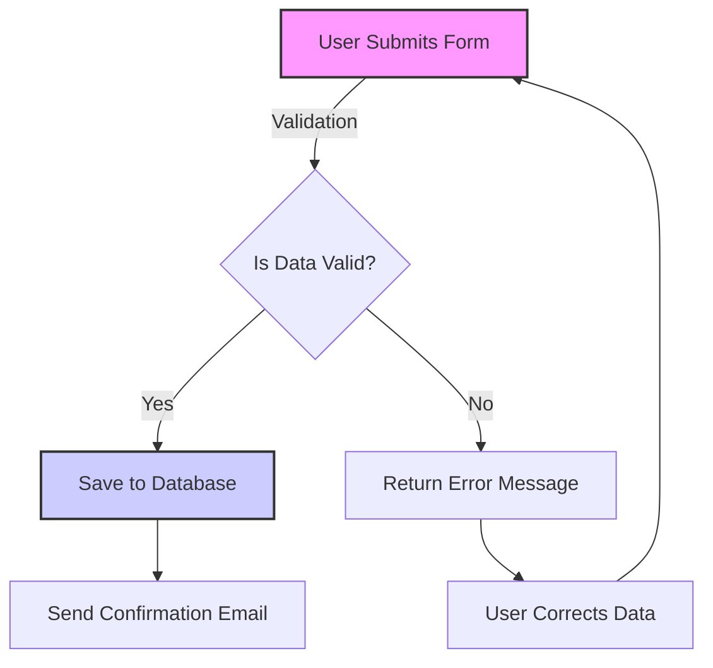
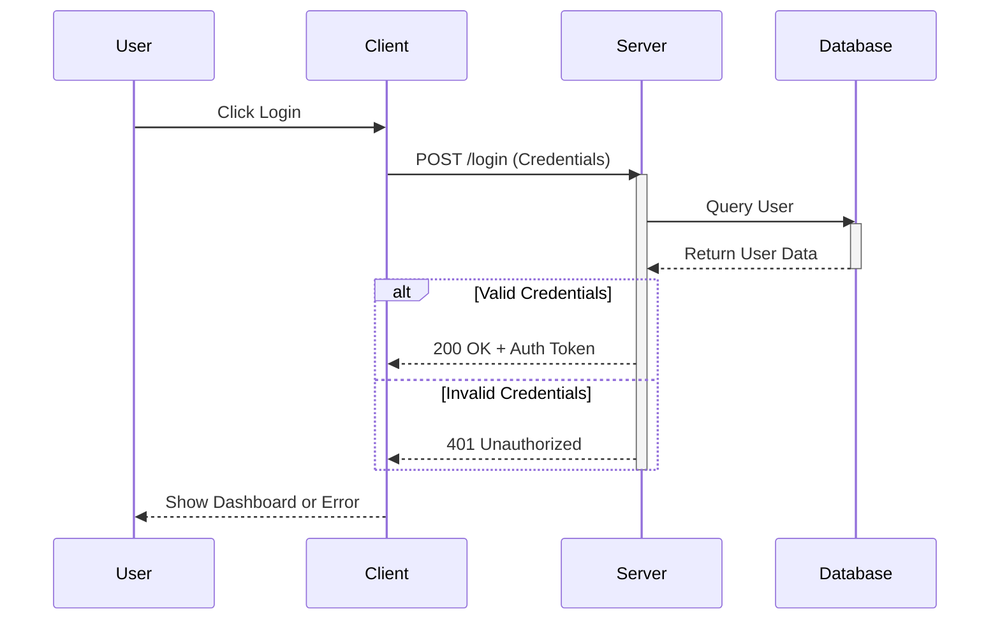
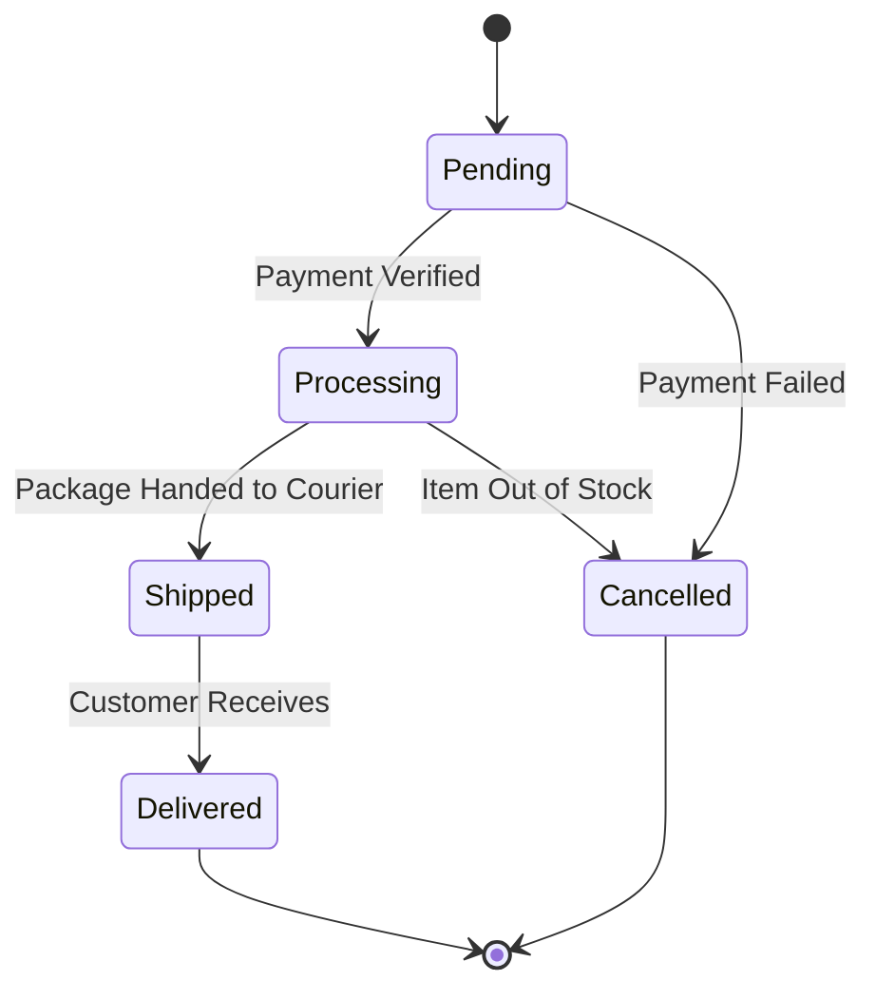
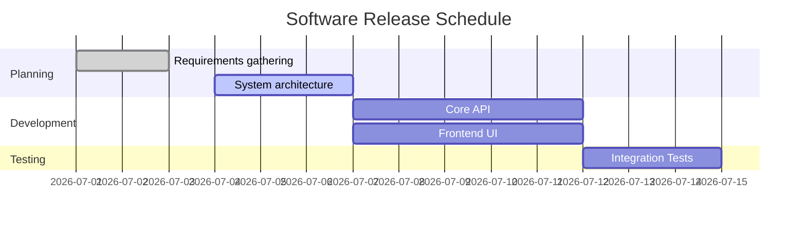

If you’ve ever found yourself struggling to maintain diagrams alongside your code, you’re not alone. Visio, Lucidchart, and other drag-and-drop tools are great, but they decouple your architecture from your repository. Enter **Mermaid** (often referred to as Mermaid Markup Language or Mermaid JS).

Mermaid is a JavaScript-based diagramming and charting tool that renders Markdown-inspired text definitions to create and modify diagrams dynamically. It treats diagrams as code, allowing you to version control your visualizations right next to your application logic.

In this article, we’ll explore what Mermaid is, how it works, how to set it up in Visual Studio Code (VS Code), and look at some process flows that showcase its capabilities.

---

## What is Mermaid and How Does it Work?

Mermaid allows you to generate diagrams and flowcharts from text in a similar manner as Markdown. It parses your text using a set of grammar rules and renders it as an SVG diagram in the browser or your IDE.

Because it’s plain text:
- **It’s version-controllable**: You can review diagram changes in standard Git pull requests.
- **It’s maintainable**: Updating a label or adding a step is as simple as typing a new line of text—no more aligning boxes with your mouse.
- **It’s accessible**: Many platforms natively support Mermaid, including GitHub, GitLab, Notion, and standard Markdown viewers.

---

## How to Use Mermaid in VS Code

Using Mermaid in Visual Studio Code is a seamless experience, especially if you take advantage of extensions.

### Step 1: Install a Mermaid Extension
While GitHub natively renders Mermaid in `.md` files, VS Code needs a little help to preview them live.
1. Open the Extensions view in VS Code (`Ctrl+Shift+X` or `Cmd+Shift+X`).
2. Search for **Markdown Preview Mermaid Support** (by Matt Bierner) or **Mermaid Preview** (by Vandeuren Glenn).
3. Install the extension.

### Step 2: Write Your First Diagram
1. Create a new Markdown file (`example.md`).
2. Create a standard Markdown code block, but use `mermaid` as the language identifier.
3. Open the Markdown preview pane (`Ctrl+Shift+V` or `Cmd+Shift+V`).

```markdown
    ```mermaid
    graph TD;
        A-->B;
        A-->C;
        B-->D;
        C-->D;
    ```
```

As you type, the preview pane will instantly update to show your diagram.

---

## Showcase: Mermaid Capabilities & Process Flows

Mermaid supports a wide variety of diagrams. Here are a few examples of what you can build, straight from text.

### 1. Complex Flowcharts
Flowcharts are the bread and butter of Mermaid. You can define node shapes, link styles, and even add styling classes.



**Rendered Output:**


### 2. Sequence Diagrams
Perfect for documenting API interactions, microservice communication, or authentication flows.



**Rendered Output:**


### 3. State Diagrams
Great for modeling the lifecycle of an object, like an order in an e-commerce system.



**Rendered Output:**


### 4. Gantt Charts
You can even track project schedules and dependencies.



**Rendered Output:**


---

## Further Reading

This just scratches the surface of what Mermaid can do. It also supports Pie Charts, Gitgraphs, Entity-Relationship Diagrams, Mindmaps, and more.

For a deep dive into the syntax and advanced features, check out the official documentation:
**[Mermaid Official Documentation](https://mermaid.js.org/intro/)**

Start embedding diagrams in your Markdown today, and say goodbye to outdated, unmaintained architecture images!
