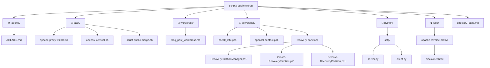

# Workspace Catalog: `scripts-public`

Welcome to the **scripts-public** interactive folder browser. This catalog provides an overview, quick-access links, and detailed functional descriptions of the automation utilities, network tools, and configuration wizards available in this workspace.

---

## 📁 Repository Architecture

---

## 🛠️ Complete Catalog of Scripts

| Category | File / Tool | Purpose | Requirements / Dependencies |
| :--- | :--- | :--- | :--- |
| **Configuration** | [AGENTS.md](file:///C:/Users/Richard%20Troiano/.gemini/antigravity/scratch/scripts-public/.agents/AGENTS.md) | Workspace-specific rules for code change documentation and pre-commit security verification checks. | None |
| **Linux Bash** | [apache-proxy-wizard.sh](file:///C:/Users/Richard%20Troiano/.gemini/antigravity/scratch/scripts-public/bash/apache-proxy-wizard.sh) | Interactive setup wizard to configure an Apache reverse proxy with manual SSL or automated Let's Encrypt integration. | **Root privileges**, Linux with `apt` package manager |
| **Linux Bash** | [openssl-certtool.sh](file:///C:/Users/Richard%20Troiano/.gemini/antigravity/scratch/scripts-public/bash/openssl-certtool.sh) | Interactive utility for generating, converting, and extracting OpenSSL certificates (e.g. PEM, PFX, P12, P7B). | OpenSSL, Bash environment |
| **Linux Bash** | [script-public-merge.sh](file:///C:/Users/Richard%20Troiano/.gemini/antigravity/scratch/scripts-public/bash/script-public-merge.sh) | Restructures the workspace directories and automatically appends common file ignores to `.gitignore`. | Git repository environment |
| **PowerShell** | [openssl-certtool.ps1](file:///C:/Users/Richard%20Troiano/.gemini/antigravity/scratch/scripts-public/powershell/openssl-certtool.ps1) | Windows PowerShell equivalent of the OpenSSL certificate utility for extracting keys and certificate chains. | PowerShell, OpenSSL in system PATH |
| **PowerShell** | [check_mtu.ps1](file:///C:/Users/Richard%20Troiano/.gemini/antigravity/scratch/scripts-public/powershell/check_mtu.ps1) | Diagnoses network Maximum Transmission Unit (MTU) sizes using target host ICMP pings. | PowerShell, network interface access |
| **PowerShell** | [recovery-partition/RecoveryPartitionManager.ps1](file:///C:/Users/Richard%20Troiano/.gemini/antigravity/scratch/scripts-public/powershell/recovery-partition/RecoveryPartitionManager.ps1) | High-level interactive manager to create, remove, and manage Windows Recovery Partitions. | **Administrator privileges** |
| **Python** | [stftp/server.py](file:///C:/Users/Richard%20Troiano/.gemini/antigravity/scratch/scripts-public/python/stftp/server.py) | A simple Secure Trivial File Transfer Protocol server using TLS wrapping over standard sockets. | Python 3, OpenSSL certificate file (`cert.pem`, `key.pem`) |
| **Python** | [stftp/client.py](file:///C:/Users/Richard%20Troiano/.gemini/antigravity/scratch/scripts-public/python/stftp/client.py) | Client logic for connection and message parsing for Secure TFTP. | Python 3 |
| **Writeup** | [wordpress/about.md](file:///C:/Users/Richard%20Troiano/.gemini/antigravity/scratch/scripts-public/wordpress/about.md) | The About page biography from Extreme Sarcasm. | None |
| **Writeup** | [wordpress/blog_post_wordpress.md](file:///C:/Users/Richard%20Troiano/.gemini/antigravity/scratch/scripts-public/wordpress/blog_post_wordpress.md) | WordPress-compatible Markdown blog post explaining directory analysis and pre-commit security verification. | None |
| **Writeup** | [wordpress/ultimate-guide-to-bitwarden-securing-your-digital-life-across-every-device.md](file:///C:/Users/Richard%20Troiano/.gemini/antigravity/scratch/scripts-public/wordpress/ultimate-guide-to-bitwarden-securing-your-digital-life-across-every-device.md) | Ultimate Guide to Bitwarden: Securing Your Digital Life Across Every Device. | None |
| **Report** | [wordpress/directory_stats.md](file:///C:/Users/Richard%20Troiano/.gemini/antigravity/scratch/scripts-public/wordpress/directory_stats.md) | Generated directory statistics report (e.g. file, folder counts, sizes). | None |

---

## 🔒 Security & Privileges

> [!WARNING]
> Running administration scripts like `RecoveryPartitionManager.ps1` or configuration scripts like `apache-proxy-wizard.sh` will prompt for elevation (Administrator / root). Always inspect code blocks and options before executing them.

> [!TIP]
> Make sure OpenSSL is added to your environment `PATH` on Windows to leverage [openssl-certtool.ps1](file:///C:/Users/Richard%20Troiano/.gemini/antigravity/scratch/scripts-public/powershell/openssl-certtool.ps1) properly.

---

## 🚀 Recommended Action

If you want to configure or restructure this repository, you can review the files directly using the links above, or let me know which script you would like to test or optimize first.
